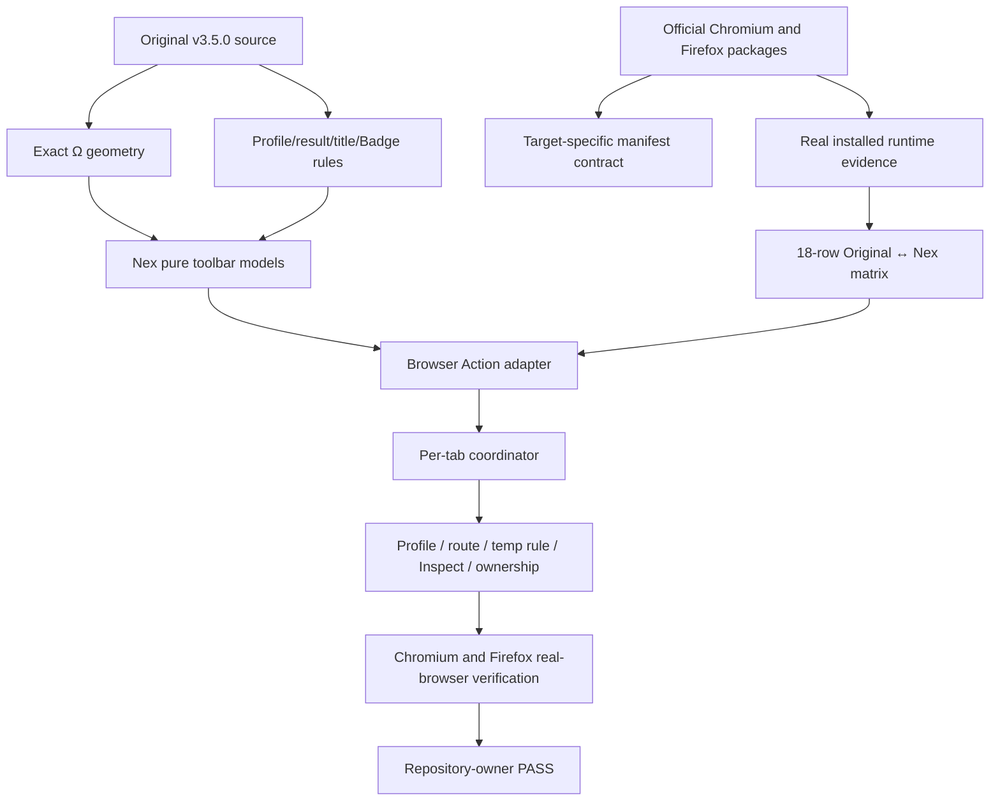
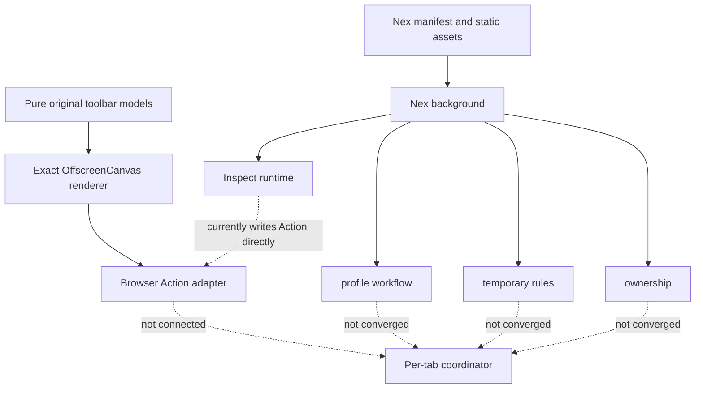

# Delivery Order 01 — Original-Compatible Toolbar State

## 0. Authority and current result

This document is the first executable child order of `ORIGINAL_NEX_DELIVERY_KNOWLEDGE_GRAPH.md`.

- Original authority: `zero-peak/ZeroOmega`, tag `v3.5.0`.
- Original source evidence: `AUDIT_EVIDENCE_01_ORIGINAL_TOOLBAR.md`.
- Official package evidence: `AUDIT_EVIDENCE_01_ORIGINAL_RELEASE.md`.
- Chromium runtime evidence: `AUDIT_EVIDENCE_01C_ORIGINAL_CHROMIUM_RUNTIME.md`.
- Firefox runtime evidence: `AUDIT_EVIDENCE_01D_ORIGINAL_FIREFOX_RUNTIME.md`.
- Nex audited branch: `feat/m8-profile-workflow`.
- Defect: `KG-ICON-001`.
- Current journey progress: 35%.
- Current delivery status: `FAILED`.
- Owner result: `FAIL` from the 2026-07-30 trial; corrected build `NOT RUN`.

The current Nex branch has source-derived pure models for original Ω geometry, icon color decisions, result Badge behavior and per-tab presentation composition. It now also has an isolated browser Action adapter and an exact original-compatible OffscreenCanvas renderer. These slices are tested but not connected to browser runtime state. The per-tab coordinator and complete runtime convergence remain absent.

No candidate may be generated from this order until the exact corrected build receives repository-owner `PASS`.

## 1. Original user contract

The original toolbar is a live view of the current profile, current tab URL and actual result profile. It is not a static launcher.

The observable contract includes:

1. original static fallback Ω assets and localized loading title;
2. profile-colored Ω rendering;
3. one-color rendering when selected and result profiles are equivalent;
4. two-color rendering when an inclusive profile resolves to another result;
5. per-tab icon, title and optional Badge state;
6. refresh on tab URL update and tab activation;
7. refresh of affected tabs when current profile changes;
8. Direct, System, Fixed, Switch, PAC and Virtual behavior;
9. attached Rule List and temporary-rule result details;
10. Inspect title and `#` Badge state;
11. external proxy/control state;
12. fallback and stale-state clearing on browser-internal or unsupported URLs;
13. Chromium/Firefox differences where the original packages behave differently.

An experienced original user reads active and result state directly from the toolbar. Nex must preserve that mental model without exposing Draft, Applied revision, snapshot or other rewrite-internal terminology.

## 2. Evidence graph

## 3. Captured original facts

### 3.1 Exact renderer and fallback

Source evidence fixes the normalized Ω renderer:

- center `(0.5, 0.5)`;
- outer center-line radius `0.375`;
- outer stroke width `0.25`;
- inner radius `0.25`;
- one-color state removes the inner circle with `destination-out`;
- two-color state fills the inner circle with the current-profile color while the outer ring uses result color;
- dynamic output sizes: 16, 19, 24, 32 and 38;
- dynamic draw failure falls back to original static action assets.

This geometry is no longer `UNKNOWN` and must not be redesigned.

### 3.2 Per-tab and transition contract

Original source proves:

- `tabs.onUpdated` and `tabs.onActivated` trigger recalculation;
- state is calculated per tab URL;
- icon, title and Badge are tab-specific;
- stale Badge state is cleared;
- unsupported/internal URLs restore default state;
- profile change clears icon cache and resets tabs;
- Inspect is tab-specific and uses `#` Badge plus result color;
- result-profile Badge names are localized for built-ins and truncated to four JavaScript code units.

### 3.3 Official package/runtime evidence

Exact official v3.5.0 packages and hashes are durable in `AUDIT_EVIDENCE_01_ORIGINAL_RELEASE.md`.

Basic runtime states have been captured independently in both targets:

- initial/System;
- Direct;
- second tab;
- inactive first tab;
- browser-internal page;
- installed Options;
- installed Popup.

Firefox evidence additionally proves that its manifest declares `popup/index.html`, while per-tab `action.getPopup()` returned `popup-iframe.html`. Nex must follow observed target behavior rather than flattening both targets into one inferred manifest contract.

## 4. Current Nex graph

Confirmed Nex gaps:

- manifest/static fallback still differs from the original contract;
- the Action adapter and renderer exist only as isolated tested boundaries and are not connected to `browser.action` runtime state;
- no per-tab coordinator exists;
- no unified result-input model connects route matching, temporary rules, Rule Lists, Virtual profiles, Inspect and ownership;
- Inspect directly mutates title/Badge and can conflict with normal state;
- tab URL, tab activation and profile-change refresh paths are not implemented against the original contract.

## 5. Original ↔ Nex state matrix

| ID       | Original observable state                                             | Original evidence                  | Current Nex                                                     | Current edge                                 | Closure requirement                                              |
| -------- | --------------------------------------------------------------------- | ---------------------------------- | --------------------------------------------------------------- | -------------------------------------------- | ---------------------------------------------------------------- |
| `TB-001` | Static fallback Ω assets and localized default title                  | source, packages                   | different fallback/manifest contract                            | `BROKEN_IN_NEX`                              | exact original-compatible assets/title and target manifest tests |
| `TB-002` | Toolbar click opens target-specific original Popup; shortcut exists   | packages, Chromium/Firefox runtime | Popup exists but complete target Action contract not integrated | `PARTIAL`                                    | verify click, Popup and shortcut in both targets                 |
| `TB-003` | Direct/System/Fixed static profile uses one color                     | source; Direct/System runtime      | pure color model only                                           | `PARTIAL`                                    | connect model to real Action and capture user Fixed state        |
| `TB-004` | Inclusive Switch/PAC default uses Direct/current two-color state      | source                             | pure color decision exists; runtime state uncaptured            | `PARTIAL` / `UNKNOWN`                        | capture original default and implement Action output             |
| `TB-005` | Current tab result equals current static profile: one-color result    | source                             | pure presentation model only                                    | `PARTIAL`                                    | two-browser tab-local Action verification                        |
| `TB-006` | Switch/PAC resolves to another profile: two-color result/current icon | source                             | no runtime coordinator                                          | `MISSING_IN_NEX`; original runtime `UNKNOWN` | capture two URLs/results, then implement exact transition        |
| `TB-007` | Direct result receives Direct color                                   | source; Direct runtime title       | pure Direct color state exists                                  | `PARTIAL`                                    | real icon/title verification in both targets                     |
| `TB-008` | Virtual shows Virtual name plus resolved target                       | source                             | route activation exists; toolbar mapping absent                 | `MISSING_IN_NEX`                             | capture original and implement nested effective target state     |
| `TB-009` | Attached Rule List contributes prefix/details                         | source                             | internal Rule List support; Action details absent               | `MISSING_IN_NEX`                             | capture original wording/state and integrate result trace        |
| `TB-010` | Temporary rule contributes prefix/details and result colors           | source                             | temporary-rule runtime exists; Action integration absent        | `MISSING_IN_NEX`                             | add/replace/remove rule with immediate tab-local transition      |
| `TB-011` | Optional localized result-profile Badge, max four code units          | source                             | pure Badge model exists                                         | `PARTIAL`                                    | import preference and verify visible Badge in both targets       |
| `TB-012` | Inspect sets tab-specific `#`, result color and Inspect title         | source                             | Inspect directly mutates Action with Nex fallback               | `BROKEN_IN_NEX`                              | make Inspect coordinator input; verify set/clear/isolation       |
| `TB-013` | External proxy state changes title/short title and Badge              | source; basic System runtime       | ownership blocker exists; complete Action state absent          | `MISSING_IN_NEX`                             | capture transitions and integrate without invented panels        |
| `TB-014` | Internal/unsupported URL clears result and uses default state         | source; basic runtime capture      | no coordinator                                                  | `MISSING_IN_NEX`                             | verify no stale state in both targets                            |
| `TB-015` | Tab URL update recalculates result                                    | source                             | no equivalent Action path                                       | `MISSING_IN_NEX`                             | same-tab navigation changes visible state                        |
| `TB-016` | Tab activation restores each tab’s own state                          | source; basic two-tab runtime      | no equivalent coordinator                                       | `MISSING_IN_NEX`                             | two result-different tabs retain isolation                       |
| `TB-017` | Profile change invalidates cache and resets tabs                      | source                             | activation does not drive unified toolbar refresh               | `MISSING_IN_NEX`                             | Popup/Options profile change refreshes all affected tabs         |
| `TB-018` | Dynamic drawing failure uses static fallback                          | source                             | dynamic renderer not connected                                  | `MISSING_IN_NEX`                             | forced failure preserves usable original-compatible fallback     |

No row is owner-complete. Pure unit tests and reference runtime captures do not close a row without Nex real-browser equivalence and owner acceptance.

## 6. Explicit remaining unknowns

The following remain `UNKNOWN` until captured:

1. headed toolbar pixels where source/package evidence cannot establish final rendering;
2. user-created Fixed profile runtime state;
3. Switch/PAC default and matched-result states;
4. Virtual and attached Rule List states;
5. temporary-rule state;
6. Inspect state and clearing sequence;
7. external-control transition sequence;
8. optional Badge enabled state after real original import;
9. Firefox 153+ audit navigation method after its Marionette restriction;
10. any modern-browser limitation that truly requires a minimized, owner-approved divergence.

Unknowns are blockers, not permission to invent simplified behavior.

## 7. Engineering work order and real progress

### `TO-01` — original source/package/basic runtime capture

Status: `PARTIAL`, substantially complete.

Completed:

- exact renderer geometry and static assets;
- locale/title/Badge source facts;
- official Chromium and Firefox packages/hashes;
- basic installed runtime states and UI surfaces.

Remaining:

- Fixed, Switch/PAC, Virtual, Rule List, temporary-rule, Inspect and external-control runtime states;
- optional Badge enabled state;
- headed pixel capture only where needed.

### `TO-02` — pure toolbar state model

Status: `PARTIAL`, source-certain slice implemented and tested.

Implemented:

- original icon geometry;
- static/inclusive/Direct color decisions;
- Badge preference/localization/truncation;
- pure per-tab presentation composition.

Remaining:

- additional source/runtime cases as they are captured;
- exact target-specific title/Popup differences where the pure model should represent them.

### `TO-03` — original-compatible Ω renderer

Status: `PARTIAL`.

Exact geometry, the original single `300 × 300` OffscreenCanvas pipeline, five-size ImageData generation, color-pair caching, first-error reporting and anti-fingerprinting fallback signal are implemented and tested. Browser Action integration and target-visible icon verification remain open.

### `TO-04` — browser Action adapter

Status: `PARTIAL`.

Implemented and tested:

- one browser-API boundary for `setIcon`, `setTitle`, `setBadgeText`, `setBadgeBackgroundColor` and `setPopup`;
- every application rewrites all tab-visible fields to clear stale state;
- rejected dynamic ImageData falls back to the supplied original static icon paths.

Remaining:

- bind the adapter to the real target-specific `browser.action` API;
- supply exact target Popup/default constants and original static assets;
- connect derived tab state, localization and rendered ImageData through the coordinator.

No browser API mutation occurs inside the pure state model.

### `TO-05` — per-tab coordinator

Status: `NOT STARTED`.

Required behavior:

- tab URL update and activation listeners;
- current-tab result calculation;
- dirty/stale state handling;
- internal URL fallback;
- tab-isolated result and Inspect state;
- profile-change invalidation and reset.

### `TO-06` — workflow/runtime integration

Status: `NOT STARTED`.

Inputs must include startup restoration, Options Apply, Popup activation, temporary rules, Inspect, ownership/external control, rollback and recovery.

### `TO-07` — acceptance automation and real browsers

Status: `NOT STARTED` for the corrected integrated subsystem.

Automation must assert visible browser Action state, not internal model output alone.

### `TO-08` — repository-owner acceptance

Status: `NOT RUN` for a corrected build.

Only owner `PASS` closes `KG-ICON-001`.

## 8. Verification checkpoint

Exact engineering checkpoint Head `326c49ac30efc76d3884e63791dce3bbfb69722a` passed:

- CI `30598899116`;
- Browser E2E `30598899117`, including Firefox `153.0` through BiDi extension-page navigation;
- Parity Documentation `30598899120`;
- Milestone 8 Visual Evidence `30598899111`.

This validates the isolated Action adapter, exact Canvas renderer and Firefox 153 E2E harness correction. It does not close a `TB-*` row because no product runtime integration or owner acceptance exists yet.

## 9. Current next action

1. Capture the exact original title/localization templates and target Popup/default constants; do not hard-code English.
2. Compose pure tab state → exact renderer → Action adapter in a runtime executor.
3. Implement `TO-05` per-tab coordinator.
4. Convert Inspect direct writes into coordinator input.
5. Verify two-target, two-tab and state-transition behavior.
6. Deliver the exact build for repository-owner review.

Overall status remains `FAILED`, release-blocking, with no candidate permitted.
