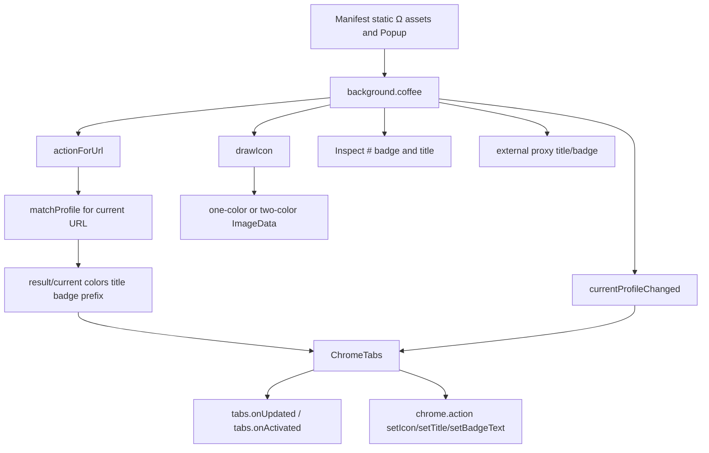
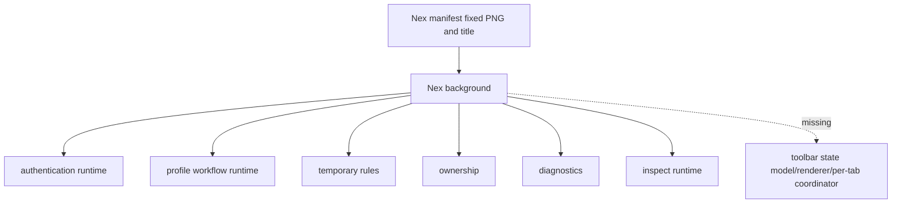

# Delivery Order 01 — Original-Compatible Toolbar State

## 0. Authority and current result

This document is the first executable child order of `ORIGINAL_NEX_DELIVERY_KNOWLEDGE_GRAPH.md`.

- Original authority: `zero-peak/ZeroOmega`, tag `v3.5.0`.
- Original manifest: `omega-target-chromium-extension/overlay/manifest.json`, blob `89fd202f597cbbd5a00ff24e78ae572a925492d6`.
- Original background state logic: `omega-target-chromium-extension/src/coffee/background.coffee`, blob `0b2f996210b75df9fe08535de380a6606ac20ac8`.
- Original per-tab coordinator: `omega-target-chromium-extension/src/module/tabs.coffee`, blob `698a5b105e20f8b730a0ec799add4a4f22eae686`.
- Nex audited branch: `feat/m8-profile-workflow`.
- Nex audited Head: `39be965734c5b5a74b38f0ac518f21baeab7585f`.
- Nex manifest source: `apps/extension/wxt.config.ts`, blob `c9d6604660ff79b822e8547450f276e7ed41899e`.
- Nex background source: `apps/extension/src/entrypoints/background.ts`, blob `0247e7e2b67ac4bac0c0b766e9744f4de44e4e48`.
- Defect: `KG-ICON-001`.
- Current delivery status: `FAILED`.
- Owner result: `FAIL` from the 2026-07-30 trial.

The current Nex implementation has fixed manifest icons and a fixed default action title, but no complete toolbar state controller. This is a missing original user-facing subsystem, not a cosmetic icon mismatch.

## 1. Original user contract

The original toolbar is a live view of the current profile, the current tab URL and the actual result profile. It is not a static launcher.

The observable contract includes:

1. a static fallback Ω asset before or when runtime drawing is unavailable;
2. profile-colored Ω rendering;
3. one-color rendering when the selected profile and actual result are equivalent;
4. two-color rendering when an inclusive profile resolves to another result;
5. per-tab icon, title and optional badge state;
6. automatic refresh when tabs update or become active;
7. automatic refresh of all tabs when the current profile changes;
8. Direct, System, Fixed, Switch, PAC and Virtual behavior;
9. attached Rule List and temporary-rule result details;
10. Inspect title and `#` badge state;
11. external proxy/control state;
12. fallback behavior for browser-internal or unsupported URLs.

An experienced original user reads active and result state directly from the toolbar. Nex must preserve that mental model.

## 2. Original source graph

### 2.1 Static manifest contract

The original v3.5.0 manifest provides:

- extension icons at 16, 24, 32, 48, 64 and 128 pixels;
- action icons at 16, 19, 24 and 32 pixels;
- a localized default action title;
- `popup-iframe.html` as the toolbar Popup;
- `Alt+Shift+O` as the suggested action shortcut;
- `tabs` permission for tab-aware state.

### 2.2 Dynamic renderer contract

`drawIcon(resultColor, profileColor)`:

- caches icons by both colors;
- uses `OffscreenCanvas`;
- generates 16, 19, 24, 32 and 38 pixel `ImageData`;
- draws a one-color Ω when only one color is supplied;
- draws a two-color Ω when result and current profile colors differ;
- falls back to the static icon if runtime drawing is blocked.

The exact vector/path implementation behind `drawOmega` is not yet captured in this order and remains `UNKNOWN`; it must not be approximated from memory.

### 2.3 URL/result-state contract

`actionForUrl(url)` evaluates the current URL through the original profile matcher and derives:

- current profile and localized name;
- resolved Virtual target;
- actual result profile;
- Direct result state;
- attached Rule List path/details;
- temporary-rule prefix/details;
- full title and short title;
- optional result-profile badge text, limited to four characters;
- result color and current-profile color;
- one-color or two-color icon.

### 2.4 Per-tab contract

`ChromeTabs`:

- watches `tabs.onUpdated`;
- watches `tabs.onActivated`;
- calculates toolbar state per URL and per tab;
- sets a tab-specific icon, title and badge;
- restores the default action for unsupported/internal URLs;
- clears stale badges;
- marks all tabs dirty and refreshes the active tab when global profile state changes.

### 2.5 Profile-change contract

`currentProfileChanged`:

- clears the icon cache;
- distinguishes external proxy changes;
- resolves Virtual display and target state;
- builds full and short titles;
- uses a single profile color for non-inclusive profiles;
- uses Direct/current two-color state for inclusive profiles before a tab result is evaluated;
- resets toolbar state across all tabs.

## 3. Current Nex graph

Current Nex evidence:

- manifest icons are fixed PNG files at 16, 32, 48 and 128 pixels;
- the action has a fixed default title and fixed default icon;
- the manifest does not currently declare the original `tabs` permission;
- the background initializes runtime services but does not call `browser.action.setIcon`, `setTitle`, `setBadgeText` or `setBadgeBackgroundColor`;
- there is no pure toolbar state model, original Ω renderer or per-tab toolbar coordinator.

Existing route, Popup, temporary-rule, Inspect and ownership modules may supply state inputs, but they do not currently converge into the original toolbar contract.

## 4. Original ↔ Nex state matrix

| ID | Original observable state | Original evidence | Current Nex | Edge | Required acceptance |
| --- | --- | --- | --- | --- | --- |
| `TB-001` | Static fallback Ω assets and localized default title | v3.5.0 manifest | Fixed Nex-branded PNG/title, artwork and dimensions not yet proven equivalent | `UNKNOWN` / `BROKEN_IN_NEX` | Compare original assets pixel/vector semantics and localized title; use exact or owner-approved equivalent assets. |
| `TB-002` | Toolbar click opens original Popup; suggested shortcut exists | v3.5.0 manifest | Popup entry exists in the build, but manifest/user contract and shortcut have not been mapped here | `UNKNOWN` | Prove click/Popup/shortcut behavior in Chromium and Firefox. |
| `TB-003` | Fixed/Direct/System static profile uses one profile color | `drawIcon`; `currentProfileChanged` | No runtime icon controller | `MISSING_IN_NEX` | Switching routes immediately updates the global and current-tab icon/title. |
| `TB-004` | Inclusive Switch/PAC default state uses Direct color plus current profile color | `currentProfileChanged` | No default inclusive icon state | `MISSING_IN_NEX` | Before tab-specific resolution, reproduce original two-color state. |
| `TB-005` | Current tab result equals current static profile: one-color result | `actionForUrl` | No per-tab calculation | `MISSING_IN_NEX` | Navigate/activate a tab and see the same single-color result as the original. |
| `TB-006` | Switch/PAC resolves to another profile: result/current two-color icon | `actionForUrl` | No per-tab result icon | `MISSING_IN_NEX` | Verify at least two URLs with different result profiles and exact tab-local transitions. |
| `TB-007` | Direct result receives Direct color while retaining result/current relationship | `actionForUrl` Direct branch | No toolbar Direct result state | `MISSING_IN_NEX` | A Direct-matching URL visibly differs from proxied result state exactly as the original contract. |
| `TB-008` | Virtual shows Virtual name plus resolved target; colors follow effective target/result | `actionForUrl`; `currentProfileChanged` | Route activation exists, toolbar mapping absent | `MISSING_IN_NEX` | Verify Virtual target, nested result and title/icon behavior without exposing internal IDs. |
| `TB-009` | Attached Rule List contributes result details/prefix | `actionForUrl` attached branch | Attached Rule Lists exist internally; toolbar details absent | `MISSING_IN_NEX` | Title/details identify attached-rule resolution with original wording and hierarchy. |
| `TB-010` | Temporary rule contributes prefix/details and result colors | `actionForUrl` temporary branch | Temporary-rule runtime exists; toolbar integration absent | `MISSING_IN_NEX` | Add, replace and remove a session rule and verify immediate toolbar transition. |
| `TB-011` | Optional result-profile badge text, localized for built-ins, max four characters | `actionForUrl` badge branch | No general result badge controller | `MISSING_IN_NEX` | Respect the imported/original setting and reproduce truncation/localization. |
| `TB-012` | Inspect sets tab-specific `#` badge with result color and inspect title | background Inspect branch; `ChromeTabs.setTabBadge` | Inspect runtime exists; complete original title/color/action integration unproven | `BROKEN_IN_NEX` / `UNKNOWN` | Real context-menu flow produces original-compatible `#`, color, title, clearing and tab isolation. |
| `TB-013` | External proxy state changes title/short title and badge | `currentProfileChanged` external branch | Ownership blocker exists; toolbar external state absent | `MISSING_IN_NEX` | Other-extension/policy/external configuration states are visible without showing invented normal-workflow panels. |
| `TB-014` | Browser-internal/unsupported URLs clear tab result and use default state | `ChromeTabs.processTab` | No per-tab coordinator | `MISSING_IN_NEX` | Chrome/Firefox internal pages do not retain stale site-result icon/badge/title. |
| `TB-015` | Tab URL update recalculates result | `tabs.onUpdated` | No equivalent listener/controller | `MISSING_IN_NEX` | Same tab navigation changes toolbar state after the same observable lifecycle as original. |
| `TB-016` | Tab activation refreshes dirty tab | `tabs.onActivated` | No equivalent listener/controller | `MISSING_IN_NEX` | Switching between two tabs restores each tab's own state without leakage. |
| `TB-017` | Profile change invalidates cache and resets all tabs | `currentProfileChanged` + `resetAll` | Apply/activate operations do not drive toolbar refresh | `MISSING_IN_NEX` | Direct Popup switch and Options Apply refresh all relevant toolbar states deterministically. |
| `TB-018` | Dynamic drawing failure falls back to static icon | `drawIcon` catch/fallback | No dynamic renderer | `MISSING_IN_NEX` | Forced renderer failure leaves a usable original-compatible static icon and records no user-facing invented workflow. |

No matrix row is complete. Successful unit tests for unrelated route or Popup code do not close these rows.

## 5. Explicit unknowns

The following remain open and must be captured before implementation is accepted:

1. exact `drawOmega` vector/path and color-composition geometry;
2. exact original static action assets and their visual relationship to generated icons;
3. exact localized strings for toolbar titles, prefixes and external-control states in en, zh-CN and zh-TW;
4. original runtime screenshots for every state above;
5. exact behavior of the optional result-profile Badge setting after import;
6. Firefox-specific differences in `action`, dynamic `ImageData`, tab permissions and internal URLs;
7. Popup dimensions/click contract as experienced in the original build;
8. whether any modern API limitation requires a minimized divergence.

Unknowns must remain visible. They are not permission to substitute a new icon design or simplified state model.

## 6. Engineering work order

### `TO-01` — finish original capture

- locate and record `drawOmega` source;
- download/inspect original static icon assets;
- capture locale keys and rendered strings;
- review the original UI evidence artifact and record screenshots;
- run/install v3.5.0 where necessary to reproduce the state matrix;
- record Chromium and Firefox differences separately.

Gate: every original matrix row has source plus runtime evidence, or an explicit remaining `UNKNOWN` blocker.

### `TO-02` — pure toolbar state model

Create a browser-independent state model that accepts only original-contract inputs:

- current selected route/profile;
- effective Virtual target;
- current tab URL;
- matched result profile and trace;
- Direct/System/external/ownership state;
- temporary-rule and attached-rule provenance;
- Inspect target;
- original Badge preference.

Output only original-facing toolbar state: colors, title, badge, prefix and fallback state. Internal Draft/snapshot terms must not appear.

Gate: table-driven tests use original source-derived cases, not invented examples alone.

### `TO-03` — original-compatible Ω renderer

- reproduce the original one-color/two-color geometry;
- generate the original size set required by target browsers;
- cache by observable color state;
- preserve static fallback behavior;
- verify rendered pixels or stable image hashes against original evidence where feasible.

Gate: owner-facing comparison shows no unapproved redesign.

### `TO-04` — browser action adapter

Implement target adapters for:

- setIcon;
- setTitle;
- setBadgeText;
- setBadgeBackgroundColor;
- clearing/restoring tab-specific state;
- static fallback.

Gate: no browser API mutation occurs inside the pure state model.

### `TO-05` — per-tab coordinator

- watch URL updates and tab activation;
- maintain dirty-tab semantics or an equivalent observable lifecycle;
- calculate current-tab state from Applied/runtime state;
- clear stale state on unsupported URLs;
- isolate Inspect and result badges by tab.

Gate: two tabs with different results retain independent toolbar states.

### `TO-06` — workflow/runtime integration

Trigger recalculation after:

- startup restoration;
- Options Apply;
- Popup route activation;
- Popup result-profile change;
- temporary-rule add/replace/remove;
- Inspect set/clear/expiry;
- ownership/external-proxy changes;
- rollback and recovery.

Gate: no user action requires extension reload to correct the icon.

### `TO-07` — acceptance automation and real browsers

Required tests:

- pure original-contract state matrix;
- renderer output/fallback;
- Chromium two-tab result switching;
- Firefox two-tab result switching;
- Direct/System/Fixed/Switch/PAC/Virtual transitions;
- temporary rule and attached Rule List;
- Inspect `#` badge;
- external ownership state;
- restart restoration;
- internal URL stale-state clearing;
- original-imported colors, route and Badge preference.

Automation must assert visible browser action state, not only internal model output.

### `TO-08` — repository-owner acceptance

Deliver:

- original/Nex side-by-side icon and title matrix;
- exact build identity;
- Chromium/Firefox versions;
- imported real original configuration used for the test;
- unresolved divergences;
- explicit owner `PASS`, `FAIL` or `NOT RUN`.

Only owner `PASS` closes `KG-ICON-001`.

## 7. Current checkpoint

- Original source model: `SOURCE_CAPTURED` for the core Chromium implementation.
- Original runtime/visual evidence: incomplete.
- Nex source model: `NEX_CAPTURED` for the current absence of a toolbar controller.
- Original ↔ Nex mapping: completed for the initial 18-row state matrix.
- Implementation: not started under this corrected contract.
- Automated contract verification: not started.
- Real-data verification: not started.
- Owner acceptance: `FAIL` for the failed candidate; future corrected build `NOT RUN`.
- Overall: `FAILED`, release-blocking.

The next action is `TO-01`, not a speculative toolbar code patch and not a new candidate build.
