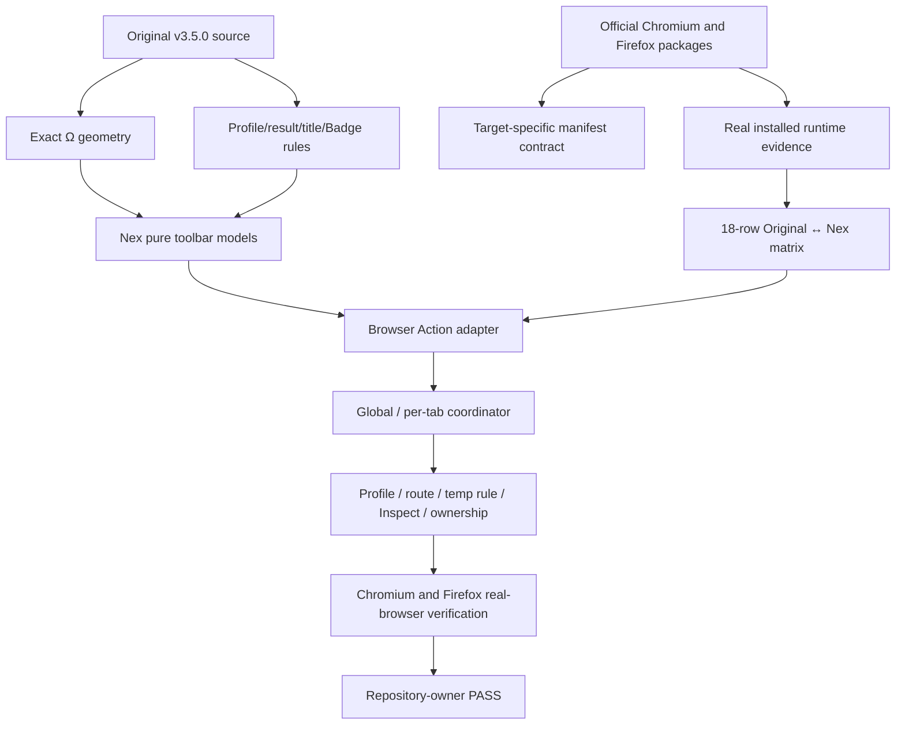
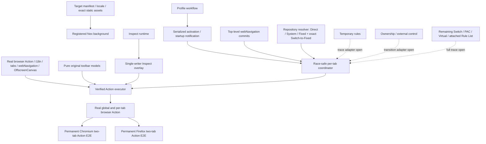

# Delivery Order 01 — Original-Compatible Toolbar State

## 0. Authority and current result

This document is the first executable child order of `ORIGINAL_NEX_DELIVERY_KNOWLEDGE_GRAPH.md`.

- Original authority: `zero-peak/ZeroOmega`, tag `v3.5.0`.
- Original source evidence: `AUDIT_EVIDENCE_01_ORIGINAL_TOOLBAR.md`.
- Official package evidence: `AUDIT_EVIDENCE_01_ORIGINAL_RELEASE.md`.
- Chromium runtime evidence: `AUDIT_EVIDENCE_01C_ORIGINAL_CHROMIUM_RUNTIME.md`.
- Firefox runtime evidence: `AUDIT_EVIDENCE_01D_ORIGINAL_FIREFOX_RUNTIME.md`.
- Compiled target constants: `AUDIT_EVIDENCE_01E_ORIGINAL_TARGET_CONSTANTS.md`.
- Nex audited branch: `feat/m8-profile-workflow`.
- Defect: `KG-ICON-001`.
- Current journey progress: 35%.
- Current delivery status: `FAILED`.
- Owner result: `FAIL` from the 2026-07-30 trial; corrected build `NOT RUN`.

The current Nex branch now registers one background owner for all real browser Action writes. The owner composes the repository-backed resolver, race-safe global/per-tab coordinator, exact renderer, runtime localization and Inspect overlay. Background startup proactively initializes a clean installation to the original System route, serializes concurrent workflow commands through activation and Action follow-up, repairs missing proxy runtime from the saved startup route and refreshes all tabs after successful activation or recovery. Tab creation/update/activation and top-level `webNavigation.onCommitted` remain coordinator inputs. Resolver coverage is verified for Direct, System, Fixed proxy, Fixed bypass and an exact no-attached-list Switch → Fixed proxy matched/default slice; Inspect no longer competes as a second title/Badge writer.

### Exact verified checkpoint — 2026-08-01

Clean Head `5ce5a21a865a569e327a78062d7d255fe0f76126` passed all permanent gates after the exact Switch-to-Fixed toolbar trace slice and temporary-file cleanup:

- CI `30672861182`;
- Browser E2E `30672861154`;
- Parity Documentation `30672861161`;
- Milestone 8 Visual Evidence `30672861171`.

The permanent Browser E2E run passed Chromium full/toolbar journeys, Firefox full/focused-toolbar journeys and native Chromium Inspect acceptance. Both targets now verify System, Direct, simultaneous Fixed proxy / Fixed bypass state, internal/default fallback, same-tab proxy ↔ bypass transitions and the exact Switch → Fixed matched/default slice. Native Inspect verifies tab-local set, current-page clear, base Action restoration and isolation. Dedicated transaction `30672598304` passed full verification, Chromium Switch Action acceptance and three consecutive focused Firefox Switch Action journeys.

The navigation listener only feeds the existing coordinator. Required `webNavigation` permission is exact-guarded in both manifests; no global host permission was added.

No candidate may be generated from this order

No candidate may be generated from this order until the exact corrected build receives repository-owner `PASS`.

## 1. Original user contract

The original toolbar is a live view of the current profile, current tab URL and actual result profile. It is not a static launcher.

The observable contract includes:

1. original static fallback Ω assets and localized loading title;
2. profile-colored Ω rendering;
3. one-color rendering when selected and result profiles are equivalent;
4. two-color rendering when an inclusive profile resolves to another result;
5. per-tab icon, title and optional Badge state;
6. refresh on tab URL update and tab activation;
7. refresh of affected tabs when current profile changes;
8. Direct, System, Fixed, Switch, PAC and Virtual behavior;
9. attached Rule List and temporary-rule result details;
10. Inspect title and `#` Badge state;
11. external proxy/control state;
12. fallback and stale-state clearing on browser-internal or unsupported URLs;
13. Chromium/Firefox differences where the original packages behave differently.

An experienced original user reads active and result state directly from the toolbar. Nex must preserve that mental model without exposing Draft, Applied revision, snapshot or other rewrite-internal terminology.

## 2. Evidence graph

## 3. Captured original facts

### 3.1 Exact renderer and fallback

Source evidence fixes the normalized Ω renderer:

- center `(0.5, 0.5)`;
- outer center-line radius `0.375`;
- outer stroke width `0.25`;
- inner radius `0.25`;
- one-color state removes the inner circle with `destination-out`;
- two-color state fills the inner circle with the current-profile color while the outer ring uses result color;
- dynamic output sizes: 16, 19, 24, 32 and 38;
- dynamic draw failure falls back to original static action assets.

This geometry is no longer `UNKNOWN` and must not be redesigned.

### 3.2 Per-tab and transition contract

Original source proves:

- `tabs.onUpdated` and `tabs.onActivated` trigger recalculation;
- state is calculated per tab URL;
- icon, title and Badge are tab-specific;
- stale Badge state is cleared;
- unsupported/internal URLs restore default state;
- profile change clears icon cache and resets tabs;
- Inspect is tab-specific and uses `#` Badge plus result color;
- result-profile Badge names are localized for built-ins and truncated to four JavaScript code units.

### 3.3 Official package/runtime evidence

Exact official v3.5.0 packages and hashes are durable in `AUDIT_EVIDENCE_01_ORIGINAL_RELEASE.md`.

Basic runtime states have been captured independently in both targets:

- initial/System;
- Direct;
- second tab;
- inactive first tab;
- browser-internal page;
- installed Options;
- installed Popup.

Firefox evidence additionally proves that its manifest declares `popup/index.html`, while per-tab `action.getPopup()` returned `popup-iframe.html`. Nex must follow observed target behavior rather than flattening both targets into one inferred manifest contract.

### 3.4 Exact `actionForUrl` result-trace contract

The original Chromium target source at tag `v3.5.0` proves that visible details are generated from the full `options.matchProfile(request)` result trace, not merely from the final route:

- a default transition appends localized `(default)` plus `=> <result profile>`;
- an empty Direct result appends the localized Direct-result detail and marks the result as Direct;
- a string trace appends `<source string> => <result>`;
- a condition trace appends `<condition pattern/string> => <result>`;
- temporary rules prepend the localized temporary-rule prefix;
- attached hidden Rule Lists prepend the localized attached-rule prefix;
- if no trace detail exists, the original prints the current profile itself;
- title substitutions remain current name, result name and the complete multiline details string.

Consequences for Nex:

1. final route equality is insufficient to reconstruct the original title;
2. Fixed bypass, Switch, attached Rule List, temporary-rule and Virtual traces must retain display-capable condition/source data;
3. unsupported trace shapes must return unresolved/default state rather than simplified invented wording;
4. current source-certain resolver coverage includes Direct, System, Fixed proxy/bypass and a strict Switch matched/default transition directly into one Fixed proxy; all other inclusive trace shapes remain unresolved/default.

## 4. Current Nex graph

Confirmed remaining gaps:

- Switch results into Direct/System, nested or attached Rule Lists, plus PAC, Virtual, temporary-rule and external-control states still need the complete original `matchProfile.results` display trace;
- Chromium and Firefox now have direct per-tab Action acceptance for System, Direct, Fixed proxy, Fixed bypass, browser-internal/default fallback and same-tab proxy ↔ bypass transitions; Chromium additionally verifies optional four-code-unit Badge truncation;
- exact headed toolbar pixels and forced dynamic-draw fallback remain open where source/unit evidence is insufficient;
- complete owner-facing Order 1 acceptance remains `NOT RUN`, so no row is owner-complete.

## 5. Original ↔ Nex state matrix

| ID       | Original observable state                                             | Original evidence                  | Current Nex                                                                                                                                                                                                | Current edge                                | Closure requirement                                                          |
| -------- | --------------------------------------------------------------------- | ---------------------------------- | ---------------------------------------------------------------------------------------------------------------------------------------------------------------------------------------------------------- | ------------------------------------------- | ---------------------------------------------------------------------------- |
| `TB-001` | Static fallback Ω assets and localized default title                  | source, packages                   | exact target assets/title/Popup/shortcut/permissions are active; clean startup reaches System and both targets verify internal-page System inheritance plus Fixed fallback to the localized default Action | `PARTIAL`                                   | verify headed fallback pixels where needed, then owner review                |
| `TB-002` | Toolbar click opens target-specific original Popup; shortcut exists   | packages, Chromium/Firefox runtime | target Popup contracts and per-tab `getPopup()` are verified across System, Direct and Fixed states in Chromium and Firefox                                                                                | `PARTIAL`                                   | verify real toolbar click and shortcut behavior                              |
| `TB-003` | Direct/System/Fixed static profile uses one color                     | source; Direct/System runtime      | one background owner applies Direct/System/Fixed states; Chromium and Firefox verify real titles, Badge clearing and Popup for all three routes                                                            | `PARTIAL`                                   | verify exact visible icon pixels and owner review                            |
| `TB-004` | Inclusive Switch/PAC default uses Direct/current two-color state      | source                             | pure color decision exists; runtime state uncaptured                                                                                                                                                       | `PARTIAL` / `UNKNOWN`                       | capture original default and implement Action output                         |
| `TB-005` | Current tab result equals current static profile: one-color result    | source                             | Chromium and Firefox real Action acceptance verify a Fixed proxy result on one tab while another tab resolves through Fixed bypass                                                                         | `PARTIAL`                                   | verify visible icon result and owner review                                  |
| `TB-006` | Switch/PAC resolves to another profile: two-color result/current icon | source                             | Chromium and Firefox now verify one exact Switch matched/default path directly into a Fixed proxy, including multiline title, result Badge, Popup and same-tab matched ↔ default transitions               | `PARTIAL`; original runtime still `UNKNOWN` | capture original runtime and extend Direct/System/nested/PAC results         |
| `TB-007` | Direct result receives Direct color                                   | source; Direct runtime title       | Direct is activated through the real workflow and reflected across two Chromium tabs; renderer/color contract remains source/unit-backed                                                                   | `PARTIAL`                                   | capture visible icon pixels or another browser-readable equivalent           |
| `TB-008` | Virtual shows Virtual name plus resolved target                       | source                             | route activation exists; toolbar mapping absent                                                                                                                                                            | `MISSING_IN_NEX`                            | capture original and implement nested effective target state                 |
| `TB-009` | Attached Rule List contributes prefix/details                         | source                             | internal Rule List support; Action details absent                                                                                                                                                          | `MISSING_IN_NEX`                            | capture original wording/state and integrate result trace                    |
| `TB-010` | Temporary rule contributes prefix/details and result colors           | source                             | temporary-rule runtime exists; Action integration absent                                                                                                                                                   | `MISSING_IN_NEX`                            | add/replace/remove rule with immediate tab-local transition                  |
| `TB-011` | Optional localized result-profile Badge, max four code units          | source                             | Chromium Fixed acceptance enables the preference and reads Badge `Tool` for `Toolbar Proxy`; Firefox verifies stale/empty Badge clearing                                                                   | `PARTIAL`                                   | verify imported preference and Firefox enabled-Badge truncation              |
| `TB-012` | Inspect sets tab-specific `#`, result color and Inspect title         | source                             | native Chromium E2E captures target-tab `#`/Inspect title, current-page clear, base Action restoration and unchanged isolation-tab state through the single writer                                         | `PARTIAL`                                   | verify exact visible icon/result color and owner review                      |
| `TB-013` | External proxy state changes title/short title and Badge              | source; basic System runtime       | ownership blocker exists; complete Action state absent                                                                                                                                                     | `MISSING_IN_NEX`                            | capture transitions and integrate without invented panels                    |
| `TB-014` | Internal/unsupported URL clears result and uses default state         | source; basic runtime capture      | Chromium `chrome://version/` and Firefox `about:blank` Action acceptance verify System inheritance and Fixed fallback to the localized default state                                                       | `PARTIAL`                                   | owner review and any necessary headed pixel evidence                         |
| `TB-015` | Tab URL update recalculates result                                    | source                             | both targets verify same-tab Fixed proxy ↔ bypass and Switch matched ↔ default transitions, reading the exact per-tab Action state after each committed URL                                                | `PARTIAL`                                   | extend the same transition proof to remaining inclusive/temp/external inputs |
| `TB-016` | Tab activation restores each tab’s own state                          | source; basic two-tab runtime      | Chromium and Firefox Action E2E verify simultaneous Fixed proxy and Fixed bypass state on two tab IDs                                                                                                      | `PARTIAL`                                   | run focused owner review                                                     |
| `TB-017` | Profile change invalidates cache and resets tabs                      | source                             | System → Direct → Fixed activation refreshes both Chromium tabs through the real successful-activation callback                                                                                            | `PARTIAL`                                   | cover import/temp-rule/external-control refresh inputs                       |
| `TB-018` | Dynamic drawing failure uses static fallback                          | source                             | exact renderer is connected to the real executor and fallback behavior is unit-tested                                                                                                                      | `PARTIAL`                                   | force a real browser draw failure and confirm original static fallback       |

No row is owner-complete. Pure unit tests and reference runtime captures do not close a row without Nex real-browser equivalence and owner acceptance.

## 6. Explicit remaining unknowns

The following remain `UNKNOWN` until captured:

1. headed toolbar pixels where source/package evidence cannot establish final rendering;
2. user-created Fixed profile runtime state;
3. Switch results into Direct/System/nested/attached profiles and PAC default/matched-result states;
4. Virtual and attached Rule List states;
5. temporary-rule state;
6. original-runtime Inspect sequence beyond source-certain behavior;
7. external-control transition sequence;
8. optional Badge enabled state after real original import;
9. any modern-browser limitation that truly requires a minimized, owner-approved divergence.

Unknowns are blockers, not permission to invent simplified behavior.

## 7. Engineering work order and real progress

### `TO-01` — original source/package/basic runtime capture

Status: `PARTIAL`, substantially complete.

Completed:

- exact renderer geometry and static assets;
- locale/title/Badge source facts;
- official Chromium and Firefox packages/hashes;
- basic installed runtime states and UI surfaces.

Remaining:

- Fixed, Switch/PAC, Virtual, Rule List, temporary-rule, Inspect and external-control runtime states;
- optional Badge enabled state;
- headed pixel capture only where needed.

### `TO-02` — pure toolbar state model

Status: `PARTIAL`, source-certain slice implemented and tested.

Implemented:

- original icon geometry;
- static/inclusive/Direct color decisions;
- Badge preference/localization/truncation;
- pure per-tab presentation composition.

Remaining:

- additional source/runtime cases as they are captured;
- exact target-specific title/Popup differences where the pure model should represent them.

### `TO-03` — original-compatible Ω renderer

Status: `PARTIAL`.

Exact geometry, the original single `300 × 300` OffscreenCanvas pipeline, five-size ImageData generation, color-pair caching, first-error reporting and anti-fingerprinting fallback signal are implemented and tested. Browser Action integration and target-visible icon verification remain open.

### `TO-04` — browser Action adapter

Status: `PARTIAL`, registered real browser owner with Chromium Action acceptance.

Implemented and verified:

- one browser-API boundary for icon, title, Badge/background and Popup;
- exact original localization, renderer, static fallback and manifest contract;
- one registered background executor as the sole real Action writer;
- Inspect requests are intercepted as overlays and reapplied by the same executor;
- permanent Chromium E2E reads real per-tab title, Badge and Popup for System, Direct, Fixed proxy/bypass and exact Switch → Fixed matched/default states.

Remaining:

- headed icon pixels and forced dynamic-render fallback evidence;
- Switch → Direct/System, nested/attached Rule List, PAC/Virtual/temp-rule/external-control states.

### `TO-05` — per-tab coordinator

Status: `PARTIAL`, registered and real-browser verified for the source-certain slice.

Implemented and verified:

- URL-update and tab-activation listeners, per-tab queues and stale-result suppression;
- all-tab refresh with icon-cache invalidation;
- repository-backed Direct, System, Fixed proxy/bypass and strict exact Switch → Fixed matched/default resolution;
- per-tab Fixed proxy/bypass isolation plus Switch matched/default and same-tab transitions in permanent Chromium and Firefox Action E2E;
- default fallback and resolver/Action error reporting.

Remaining:

- complete original multiline trace for Switch → Direct/System, nested/attached Rule Lists, PAC, Virtual and temporary rules;
- external-control transition input;
- equivalent transition inputs for inclusive profiles, temporary rules and external control.

### `TO-06` — workflow/runtime integration

Status: `PARTIAL`, real background integration complete for startup, activation and Inspect.

Implemented and verified:

- clean installations proactively initialize to the original System route without opening Popup or Options;
- concurrent initialization is deduplicated and existing state follows restore/recovery without duplicate activation;
- successful activation and startup recovery refresh all toolbar tabs;
- Inspect is a coordinator overlay rather than a competing Action writer;
- cross-document revision archives are isolated before current-document validation, preventing background initialization from breaking history reads.

Remaining inputs include temporary-rule transitions, ownership/external control and the unresolved inclusive-profile trace shapes outside the strict Switch → Fixed slice.

### `TO-07` — acceptance automation and real browsers

Status: `PARTIAL`, permanent real-browser automation covers the source-certain subsystem.

Automation now asserts visible Action title/Badge/Popup for System, Direct, Fixed proxy/bypass, strict Switch → Fixed matched/default, internal/default fallback, same-tab URL transitions and Inspect set/clear/isolation. Remaining inclusive traces, renderer failure and owner acceptance remain open.

### `TO-08` — repository-owner acceptance

Status: `NOT RUN` for a corrected build.

Only owner `PASS` closes `KG-ICON-001`.

## 8. Verification checkpoint

Exact clean engineering checkpoint Head `5ce5a21a865a569e327a78062d7d255fe0f76126` passed:

- CI `30672861182`;
- Browser E2E `30672861154`, including Chromium full/toolbar, Firefox full/focused-toolbar and native Inspect;
- Parity Documentation `30672861161`;
- Milestone 8 Visual Evidence `30672861171`.

Dedicated transaction `30672598304` passed full verification, Chromium exact Switch Action acceptance and three consecutive Firefox exact Switch Action journeys before the permanent files were committed. This checkpoint validates visible Action state for the mapped source-certain slice but does not close a `TB-*` row without owner acceptance.

## 9. Current next action

1. Preserve and integrate the remaining original `matchProfile.results` trace data for Switch → Direct/System, nested/attached Rule Lists, PAC/Virtual and temporary-rule details.
2. Keep PAC and target-dependent results unresolved until an exact source exists; unsupported trace shapes must fail closed.
3. Connect temporary-rule and external-control transitions as inputs to the existing single writer.
4. Force dynamic-render failure/static fallback where feasible and capture headed toolbar pixels only where browser-readable state is insufficient.
5. Run focused repository-owner review for startup/System, Direct, user Fixed, two-tab isolation, Popup and Inspect.

Overall status remains `FAILED`, release-blocking, with no candidate permitted.
