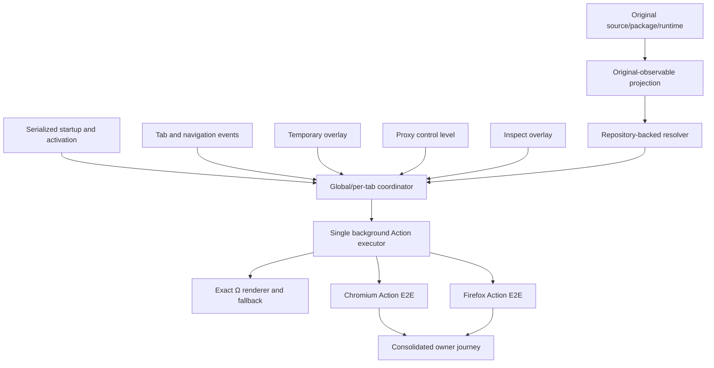

# Delivery Order 01 — Original-Compatible Toolbar State

## Authority and current result

`PRODUCT_CONSTITUTION.md` is authoritative. `ORIGINAL_NEX_DELIVERY_KNOWLEDGE_GRAPH.md` defines the dependency graph. This document is the executable Order 1 acceptance contract.

- Original authority: `zero-peak/ZeroOmega`, tag `v3.5.0`.
- Nex branch: `feat/m8-profile-workflow`.
- Defect node: `KG-ICON-001`.
- Journey progress: 80%.
- Delivery status: `FAILED` until one corrected exact build receives repository-owner `PASS`.
- Previous owner result: `FAIL` for `M8-OWNER-QC-1` on 2026-07-30.
- Corrected owner journey: `NOT RUN`.
- Active candidate: none.
- Merge, release and candidate generation: prohibited.

Exact moving Head and workflow conclusions are read from Draft PR #11 and GitHub Checks. They are intentionally not copied into this document.

## Original user contract

The original Toolbar is a live view of the applied profile, current tab URL and observable result profile. It is not a static launcher.

The required observable contract includes:

1. original static fallback Ω assets and localized loading title;
2. one-color and two-color Ω rendering;
3. per-tab title, Badge, icon inputs and Popup binding;
4. refresh after navigation, tab activation, profile activation and recovery;
5. Direct, System and Fixed proxy/bypass;
6. Switch, nested Switch and original-invalid target behavior;
7. Virtual, nested Virtual and captured mixed Virtual → Switch behavior;
8. attached Rule List prefixes, matched/default details and hidden attached identity;
9. URL-backed PAC static Toolbar state;
10. temporary-rule matched, unmatched and removed states;
11. external-control takeover and recovery;
12. Inspect set, clear, base restoration and tab isolation;
13. browser-internal/default fallback;
14. dynamic renderer failure and browser compatibility retry;
15. Chromium/Firefox differences supported by original evidence.

Nex must preserve this mental model without exposing Draft, revision, compile, snapshot or other rewrite-internal terminology in Toolbar output.

## Evidence boundary

Permanent original evidence is stored in:

- `AUDIT_EVIDENCE_01_ORIGINAL_TOOLBAR.md`;
- `AUDIT_EVIDENCE_01_ORIGINAL_RELEASE.md`;
- `AUDIT_EVIDENCE_01C_ORIGINAL_CHROMIUM_RUNTIME.md`;
- `AUDIT_EVIDENCE_01D_ORIGINAL_FIREFOX_RUNTIME.md`;
- `AUDIT_EVIDENCE_01E_ORIGINAL_TARGET_CONSTANTS.md`;
- `AUDIT_EVIDENCE_01F_ORIGINAL_SWITCH_RESULTS.md`;
- `AUDIT_EVIDENCE_01G_ORIGINAL_VIRTUAL_RESULTS.md`;
- `AUDIT_EVIDENCE_01H_ORIGINAL_ATTACHED_RULE_LIST_RESULTS.md`;
- `AUDIT_EVIDENCE_01I_ORIGINAL_NESTED_SWITCH_RESULTS.md`;
- `AUDIT_EVIDENCE_01J_ORIGINAL_NESTED_VIRTUAL_RESULTS.md`;
- `AUDIT_EVIDENCE_01K_ORIGINAL_PAC_RESULTS.md`;
- `AUDIT_EVIDENCE_01L_ORIGINAL_TEMPORARY_RULE_RESULTS.md`;
- `AUDIT_EVIDENCE_01M_ORIGINAL_EXTERNAL_CONTROL_RESULTS.md`;
- `AUDIT_EVIDENCE_01N_ORIGINAL_RENDERER_FALLBACK.md`;
- `AUDIT_EVIDENCE_01O_ORIGINAL_VIRTUAL_SWITCH_RESULTS.md`.

The read-only `Original Toolbar Evidence` workflow verifies the exact official v3.5.0 Chromium package and runs isolated scenarios through original runtime APIs and `_actionForUrl`. Pull requests run every registered scenario.

## Current Nex architecture

Verified architectural invariants:

- one background owner performs every real Action write;
- one browser-global baseline coexists with per-tab overrides;
- startup and profile-workflow commands are serialized through activation and Action refresh;
- clean installation initializes to System without opening Popup or Options;
- missing runtime is repaired from the saved startup route;
- Inspect uses the same executor and cannot compete as a second writer;
- temporary rules and external ownership refresh the existing coordinator;
- unknown trace shapes fail closed;
- no extension-side global request-time decision listener exists.

## Represented original-observable families

The current branch is `VERIFIED_AUTOMATION` for these bounded families:

- Direct and System;
- Fixed proxy and bypass;
- one-level Switch → Direct/Fixed;
- attached Rule List 01H;
- nested Switch 01I;
- immediate Virtual → Direct/Fixed proxy/bypass;
- nested Virtual 01J;
- URL-backed PAC static Toolbar state 01K;
- temporary-rule Toolbar state 01L;
- external-control Toolbar state 01M;
- renderer fallback 01N;
- mixed Virtual → Switch 01O;
- internal-page/default fallback;
- same-tab transitions;
- two-tab isolation;
- native Chromium Inspect;
- normal Chromium and Firefox restart with restored Applied ProfileSpec, active Fixed route, endpoint and Action state.

Switch → System is not missing: the original runtime rejects it.

## Original ↔ Nex state matrix

| ID       | Observable state                                   | Current verified boundary                                                                            | State before owner acceptance |
| -------- | -------------------------------------------------- | ---------------------------------------------------------------------------------------------------- | ----------------------------- |
| `TB-001` | Static fallback Ω and loading title                | Original assets are byte-identical; 01N verifies no-write fallback, retry and recovery               | `PARTIAL`                     |
| `TB-002` | Toolbar click opens target Popup; shortcut exists  | Target Popup binding is read through real Action APIs; physical click/shortcut remains owner-facing  | `PARTIAL`                     |
| `TB-003` | Direct/System/Fixed one-color state                | Chromium and Firefox verify title, Badge clearing, Popup and icon inputs                             | `PARTIAL`                     |
| `TB-004` | Inclusive default result and two-color state       | Switch, attached Rule List, nested Switch, nested Virtual and Virtual → Switch captured subsets pass | `PARTIAL`                     |
| `TB-005` | Static profile result equals current profile       | Fixed proxy and bypass states pass on separate and same tabs                                         | `PARTIAL`                     |
| `TB-006` | Inclusive profile resolves to another result       | Represented Switch/Virtual/Rule List families preserve multiline result traces                       | `PARTIAL`                     |
| `TB-007` | Direct result uses Direct result color             | Direct and represented inclusive-to-Direct paths pass both browsers                                  | `PARTIAL`                     |
| `TB-008` | Virtual shows original current/target relationship | Immediate, nested and 01O mixed subsets pass exact naming/detail/color rules                         | `PARTIAL`                     |
| `TB-009` | Attached Rule List prefix/default/result detail    | 01H passes deterministic and real Chromium/Firefox Action E2E                                        | `PARTIAL`                     |
| `TB-010` | Temporary rule prefix, colors and hidden overlay   | 01L matched/unmatched/removed states pass; complete Popup lifecycle belongs to Order 3               | `PARTIAL`                     |
| `TB-011` | Optional localized result Badge, four code units   | Built-in and profile Badge rules are automated; imported preference remains Order 2 evidence         | `PARTIAL`                     |
| `TB-012` | Inspect `#`, title, color and isolation            | Native Chromium set/clear/base restoration/isolation passes                                          | `PARTIAL`                     |
| `TB-013` | External proxy takeover and recovery               | 01M baseline/takeover/release/reapply and warning-color latch pass                                   | `PARTIAL`                     |
| `TB-014` | Internal/unsupported URL restores default state    | Chromium and Firefox internal-page fallback passes                                                   | `PARTIAL`                     |
| `TB-015` | URL update recalculates per-tab state              | Fixed and represented inclusive/temp transitions pass                                                | `PARTIAL`                     |
| `TB-016` | Tab activation restores each tab state             | Simultaneous proxy/bypass and isolation states pass both browsers                                    | `PARTIAL`                     |
| `TB-017` | Profile/control mutation refreshes affected tabs   | Activation, recovery, temporary mutation and ownership change feed the single coordinator            | `PARTIAL`                     |
| `TB-018` | Dynamic drawing failure preserves static fallback  | 01N verifies repeated failure, no dynamic write, five-size recovery and `19`/`38` retry              | `PARTIAL`                     |

No row is `OWNER_ACCEPTED`. Automation closes engineering evidence, not the user journey.

## Remaining unknowns and deferred shapes

These remain fail-closed and do not independently block the first Order 1 owner journey unless that journey exposes them:

- nested Switch beyond 01I;
- nested Virtual beyond 01J;
- Virtual → Switch beyond 01O, including deeper Switch, bypass and attached/mixed targets;
- attached Rule List beyond 01H;
- PAC lifecycle beyond 01K;
- temporary-rule lifecycle beyond 01L;
- external-control lifecycle beyond 01M;
- renderer failures beyond 01N.

Their complete profile, update, restart, error and interaction lifecycles remain assigned to Orders 3, 5 and 6. They must not be silently treated as supported.

Headed pixel capture remains required only when Action APIs, source and deterministic renderer evidence cannot prove the observable state.

## Order 1 closure boundary

Order 1 is now in closure mode. New original evidence families are prohibited unless one of these conditions applies:

1. the consolidated owner journey reaches an unresolved state;
2. an existing represented state disagrees with the original;
3. the gap can cause data loss, unsafe proxy state, credential exposure or failure to recover;
4. the gap is required for the ordinary daily-use path below.

A newly discovered exotic graph combination alone is not sufficient to extend Order 1. It remains fail-closed and moves to the applicable later order.

## Consolidated ordinary-use journey

One exact Chromium and Firefox build now passes the automated portion of this journey. `DELIVERY_ORDER_01_OWNER_ACCEPTANCE.md` defines the remaining physical and visible owner review. The full journey is:

1. clean install and automatic System initialization;
2. Toolbar and Popup binding without opening Options first;
3. Direct activation;
4. user Fixed proxy and bypass transition;
5. one ordinary Switch matched/default transition;
6. one immediate Virtual transition;
7. one attached Rule List transition;
8. one URL-backed PAC state;
9. one temporary current-site rule, unmatched state and removal;
10. two-tab isolation and tab activation;
11. browser-internal/default fallback;
12. Inspect set, clear and restoration;
13. competing-extension takeover and recovery;
14. normal restart and restored Toolbar state;
15. visible Ω/title/Badge/detail review;
16. repository-owner `PASS` on the exact build.

The owner journey should expose ordinary behavior, not a laboratory menu of every captured subcase.

## Immediate execution order

1. Use the exact green `browser-builds` artifact for the single owner journey.
2. Record `PASS` or the first blocking mismatch.
3. On `FAIL`, fix only the demonstrated blocker and directly dependent state.
4. On `PASS`, mark `KG-ICON-001` and Order 1 accepted.
5. Begin Order 2 real-export migration including `KG-IMPORT-COLOR-001`.

## Candidate prohibition

Green CI alone cannot authorize merge or release. The exact package is an Order 1 owner-acceptance build, not a release candidate. Release-candidate generation remains prohibited until the applicable later project gates pass.
