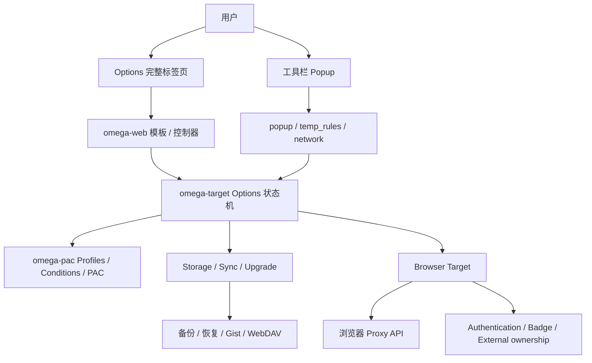
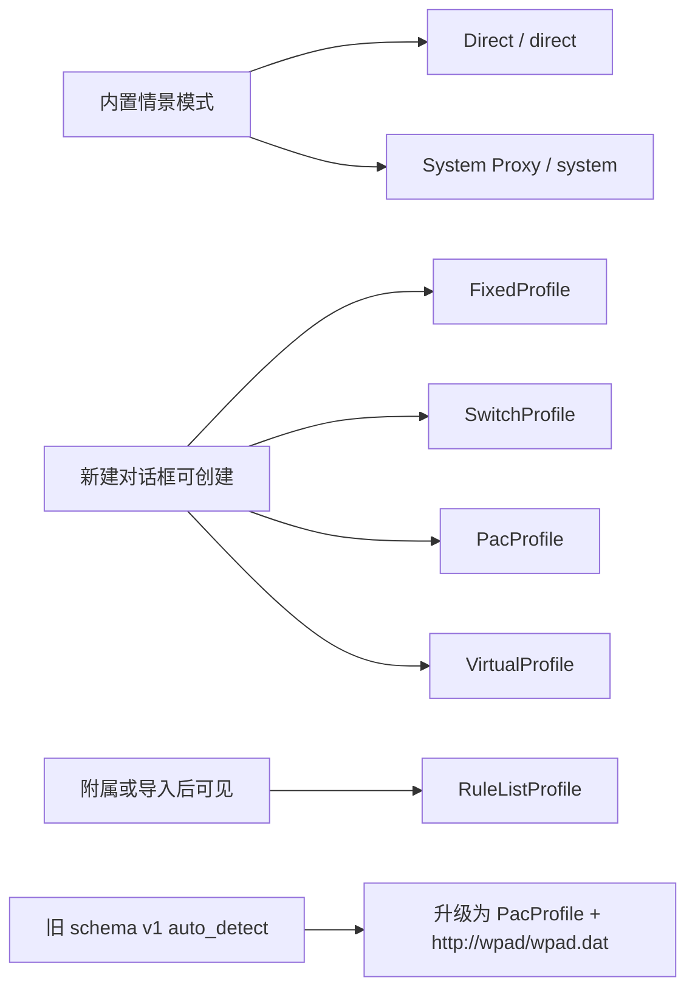
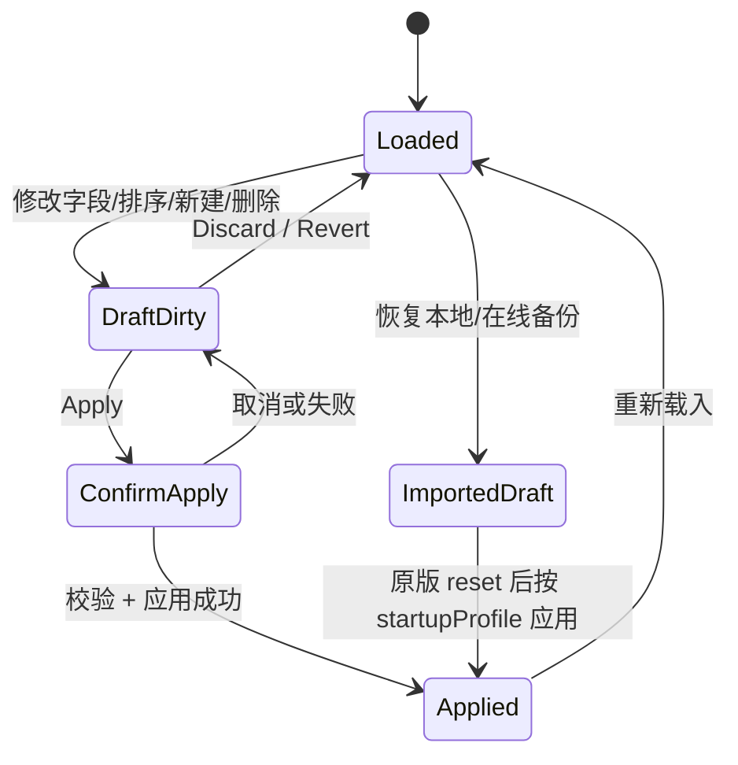
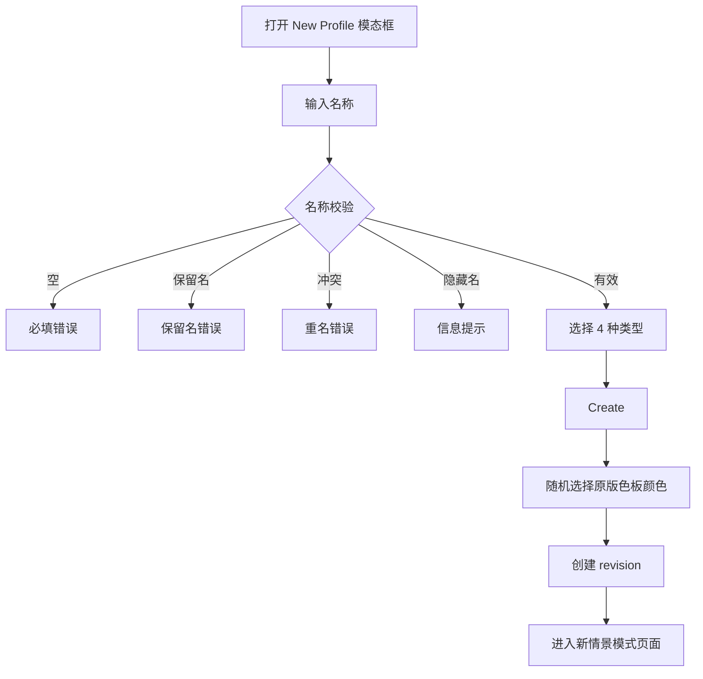
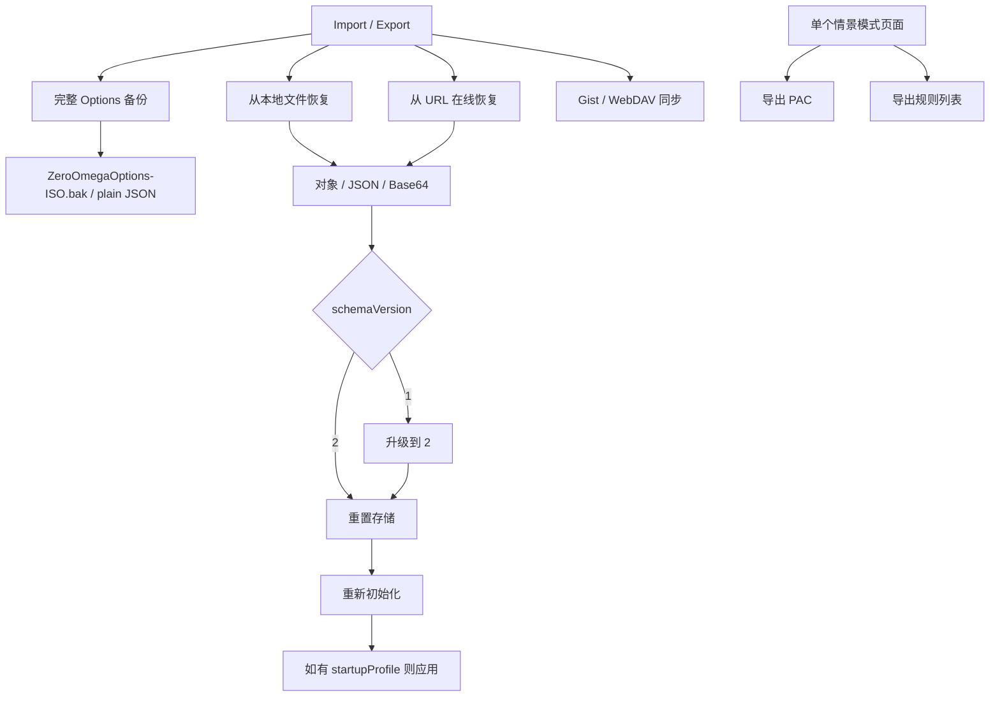

# ZeroOmega 原版知识图谱

> 状态：Milestone 8 的强制事实基线。任何 Options、Popup、情景模式、导入导出、语言或默认值改动，都必须同时更新本文与 [`UI_AUDIT_MATRIX.md`](./UI_AUDIT_MATRIX.md)。

## 1. 证据基线

| 项目                  | 固定值                                                                                   |
| --------------------- | ---------------------------------------------------------------------------------------- |
| 原版仓库              | `zero-peak/ZeroOmega`                                                                    |
| 原版基准版本          | `v3.5.0`                                                                                 |
| 原版 UI 证据工作流    | `Audit Original ZeroOmega UI` run `30181773502`                                          |
| 原版源码证据 Artifact | `original-zeroomega-ui-evidence-v3.5.0`, ID `8625759489`                                 |
| Artifact SHA-256      | `8403e963325a5d4fcac10fd2f3c8dac246cb720afb24f322c827d5cf8ebfdd19`                       |
| 证据范围              | `omega-web/src`、`omega-target/src`、Chromium target、`en_US/zh_CN/zh_TW/zh_Hant` locale |

事实优先级：

1. 固定标签 `v3.5.0` 的源码和 locale。
2. 原版实际可安装构建的行为。
3. 原版文档、帮助文字和截图。
4. Nex 现状、旧候选包或推测不得反向定义“原版”。

## 2. 系统结构图

### 分层边界

| 层             | 原版职责                               | Nex 对应原则                                                   |
| -------------- | -------------------------------------- | -------------------------------------------------------------- |
| `omega-web`    | 页面布局、字段、对话框、帮助、交互     | 可换 Svelte 和视觉皮肤，但信息结构、操作入口和行为必须逐项核对 |
| `omega-target` | 选项模型、升级、应用、导入、同步、下载 | 必须由类型化状态机替代，不得把示例文字直接写成已生效配置       |
| `omega-pac`    | 情景模式、条件、引用、PAC 生成         | Nex 可采用新 schema，但必须维护可逆的原版语义映射              |
| 浏览器 target  | Proxy API、权限、认证、外部控制状态    | 可按 Chromium/Firefox 能力差异实现，但差异必须显式显示         |

## 3. 情景模式分类图

### 关键结论

- 原版“新建情景模式”对话框只有 **4 类**：`FixedProfile`、`SwitchProfile`、`PacProfile`、`VirtualProfile`。
- `RuleListProfile` 是可编辑的真实类型，但通常由自动切换情景模式附加、导入或旧格式转换产生；不在普通新建对话框中。
- `Auto Detect Profile` 不是 v3.5.0 的独立普通新建类型。schema v1 中的 `auto_detect` 会升级为指向 `http://wpad/wpad.dat` 的 `PacProfile`。
- 历史 Nex 曾采用错误的五选一分类；当前普通新建入口已经修正为 Fixed / Switch / PAC / Virtual 四类，Rule List 与 Auto Detect 仅保留导入/兼容路径。

## 4. 全局 Options 生命周期

必须保留的全局语义：

- 左侧固定三组：设置、情景模式、操作。
- Apply 与 Discard 是全局操作，不属于某个单独情景模式。
- 新建、重命名、删除、替换引用、颜色修改先改变 Options 草稿。
- Draft 必须满足 JSON Schema、引用完整性、循环安全和秘密隔离；Switch 条件的文本/正则语义错误可暂存为 warning，便于用户完成编辑。
- Applied、导入结果、历史修订、PAC 编译输入与 Apply candidate 始终使用严格校验；存在条件错误时 Apply 在接触浏览器代理 API 前失败，并保留 Draft。
- 删除被引用的情景模式必须被阻止并列出引用者；不能静默改坏引用。
- 删除情景模式时还要清理启动项、快速切换项和附属规则列表。

## 5. 新建情景模式

原版来源：`partials/new_profile.jade`、`controllers/master.coffee`。

布局必须项：

- 模态框，而不是五张永久大卡片。
- 名称输入在类型选择之前。
- 名称实时校验与明确错误。
- 类型为单选列表；每项包含图标、名称、帮助说明。
- Fixed 默认选中。
- PAC 在不支持的目标上禁用并显示原因。
- 底部 Cancel / Create。

## 6. 共用情景模式页面外壳

原版来源：`partials/profile.jade`、`controllers/profile.coffee`。

必须项：

- 页面标题显示情景模式名。
- 标题旁有颜色编辑器；Virtual 继承目标颜色，不直接修改自己的颜色。
- 右上操作按能力显示：导出规则列表、导出 PAC、重命名、删除。
- 删除前检查引用关系。
- Virtual 提供“替换所有引用后删除/迁移”的专门路径。
- 类型内容由对应模板承载，不能用一个通用“高级编辑器”把各类型压成相同表单。

## 7. FixedProfile 知识节点

原版来源：`profile_fixed.jade`、`fixed_profile.coffee`、`fixed_auth_edit.jade`。

### 布局

- “代理服务器”表格。
- 列：URL scheme、代理协议、服务器、端口、认证操作。
- 默认/后备代理为第一行。
- 高级 scheme 行折叠，点击展开；未单独设置时显示默认行的 host/port 作为 placeholder。
- 每个 scheme 可独立选择协议和认证。
- “不代理的地址列表”独立区块，带帮助链接和多行文本框。

### 语义

- 允许按 scheme 分配代理；Nex 已改为 fallback/HTTP/HTTPS/FTP 独立映射，并在共享 endpoint 被编辑时先复制，避免串改其他行或情景模式。
- 认证是每个 scheme 的操作，不是全局一组随意附加字段。
- 默认 bypass 为 `127.0.0.1`、`[::1]`、`localhost`，这是原版真实默认值。
- 原版控制器仅在用户主动选择代理协议后才补端口及示例 host；Nex 不把示例写入配置：新建 Fixed 与首次运行的 Fixed 均无 endpoint，`example.com` 只作为新建行的输入 placeholder。
- 认证密码存放在浏览器秘密存储中，ProfileSpec 只保存 `passwordSecretRef`；Options 通过受引用检查的后台命令读取密码，并通过带秘密材料的原子 Draft 接受流程更新。

### FixedProfile 当前实现状态（2026-07-26）

- 已恢复原版表格、默认行、高级折叠、fallback placeholder、逐 scheme 认证按钮和 Bypass 帮助区。
- `MUST_MATCH` 的布局、空白默认值、fallback 继承和 HTTP 认证流程已进入组件测试、永久 UI 守卫及简体中文 Chromium E2E。
- FTP 应用能力、SOCKS 认证目标差异及真实浏览器认证仍保持 `PARTIAL/UNCERTAIN`，不得宣称完全等价。

## 8. SwitchProfile 知识节点

原版来源：`profile_switch.jade`、`switch_profile.coffee`、条件 locale。

### 规则编辑布局

- 可展开的条件帮助区，基础/高级条件分组。
- 规则表格按行编辑，不是每条规则一个大型 fieldset。
- 列：排序、条件类型、条件细节、结果情景模式、动作、可选备注。
- 支持拖动排序。
- 每行支持删除、复制、添加备注。
- 表格底部有“添加条件”。
- 独立“默认情景模式”行。
- 支持图形编辑与源码编辑切换，并显示解析错误。

### 源码编辑语义

- 原版源码采用结果模式的 SwitchyOmega Conditions 格式：文件头为 `[SwitchyOmega Conditions]`，随后是 `@with result`。
- 每条规则使用 `条件 +结果情景模式`；备注在规则前使用 `@note`；最后必须有 `* +默认情景模式`。
- `!条件` 表示使用最后默认情景模式。图形转源码时使用可逆的原版条件缩写/全名；源码转图形时必须校验条件、结果引用和最后默认规则。
- 切回图形模式、离开当前情景模式或执行 Apply 时解析已修改源码。解析失败时阻止动作、保留源码模式并显示行号/原因。
- 源码文本尚未解析前属于编辑器本地 Draft；因此必须参与全局 Apply/Discard 的 dirty 状态。Discard 可直接丢弃本地源码，Apply 必须先解析后再进入严格候选校验。
- 原版规则没有逐行 `enabled` 标记，也没有正则 flags 字段。Nex 不再提供这两项普通编辑入口；仅对旧 Nex 数据显示显式 Normalize 兼容操作，禁止静默丢失。
- 复制规则必须精确复制备注，不得添加 `copy` 等 Nex 自创后缀。

### 附属 RuleListProfile

- 可给 SwitchProfile 附加一个 RuleListProfile；原版隐藏名称固定为 `__ruleListOf_<父情景模式名称>`，不进入普通导航、Quick Switch、Startup 或其他 profile selector。
- 父 Switch 显式持有附属关系。启用时父默认路由指向隐藏 RuleList；隐藏 RuleList 的默认路由保存用户可见的 Switch 默认路由。禁用时父 Switch 直接使用该可见默认路由。
- 附属项可设置匹配结果情景模式、Switchy/AutoProxy 格式、inline/URL 来源、自定义请求头和规则文本。inline 文本可编辑；URL 来源使用已下载缓存并只读，缓存必须随原版备份保留以支持离线编译。
- 新增请求头先产生空白 Draft 行；空名称属于 Draft warning，Apply 仍严格拒绝。敏感 header 继续使用 secret reference，原始秘密不得进入 ProfileSpec。 后台提交成功后，Options 必须通过显式响应式 header 列表立即刷新新增行，不能用模板函数间接读取状态而形成 stale UI。
- 父情景模式改名/改色必须同步隐藏项；复制父项必须复制独立隐藏 profile/source；删除父项必须级联删除，单独解除附属则先恢复原默认路由并确认。
- 原版导入通过 `__ruleListOf_<父名称>` 自动重建关系；不得把隐藏附属项当作普通独立 RuleList 展示。
- “立即下载”由后台网络服务执行：Options 的用户手势先请求 URL origin 权限；后台解析秘密 header，使用 10 秒 timeout、4 MiB 解压后上限、`credentials: omit` 与无 referrer 请求。成功内容与状态在同一 workflow CAS 中替换；失败、空内容、超限或并发编辑保留旧缓存。更新时间、字节数、错误与 stale 状态属于 workflow 运行元数据，不进入 ProfileSpec。自动更新使用单一 alarms 扫描器：后台启动立即扫描，之后每分钟检查；每个源按 lastAttempt 与自身/全局 interval 判定到期，失败不会每分钟轰炸；无既有 host permission 时静默跳过，不在后台请求权限。 Options 通过 `storage.onChanged` 监听本地 workflow state，严格解析事件携带的新状态并同步 view，不插入额外命令；因此不会打断 import-and-apply 等链式操作。Switch 源码编辑器实例不重建，本地源码文本可在最新 backing spec 上提交。

### 条件语义

- 条件类型、帮助、限制提示和字段应由原版条件模型驱动。
- URL 条件有完整 URL 能力限制警告。
- Options 编辑器的“添加条件”始终追加到底部：第一条使用默认情景模式，之后复制最后一条规则作为模板。
- `-addConditionsToBottom` 只控制 Popup/当前站点条件注入使用 `push` 还是 `unshift`，不得复用于编辑器按钮。

### SwitchProfile 当前实现状态（2026-07-26）

- 已恢复单一紧凑规则表，列结构为排序、条件类型、条件细节、结果情景模式、动作和可选备注。
- 条件类型按基础或 Host/URL/Special 分组；现有高级条件会自动展开高级分组，避免导入数据失去可编辑项。
- 已提供原生拖动 handle 与键盘 Up/Down 后备；编辑器新增规则固定追加，第一条使用默认路由，后续复制最后一条规则。
- 文本条件首次新增时使用空 `pattern`；复制最后一条文本规则后也会清空 `pattern`，不再写入 `example.com` 一类假用户数据。
- Draft 校验将 Switch 条件的空 pattern、错误正则、无效 IP/前缀和无效范围降为 warning；结构、引用和循环错误仍阻止保存。
- Applied、导入、历史修订和 Apply candidate 保持严格校验；无效 Draft 不会进入浏览器激活、PAC 快照或 Applied 状态。
- 已实现原版结果模式源码的双向 compose/parse、备注、内置/用户结果引用、默认规则、原版条件类型和行级错误；源码修改纳入全局 Apply/Discard，并在导航离开前解析。
- 普通规则表已移除 Nex 自创的逐行启用复选框和正则 flags 输入；旧 Nex 数据必须先显式 Normalize 才能进入可逆源码模式。
- 图形/源码编辑已闭环；附属 RuleList 的创建、启停、路由、格式/URL/headers/文本、隐藏导航、导入重建、复制、删除事务和手动后台下载状态已实现。自动 interval 调度、完整 locale、源码模式跨重载持久化和浏览器拖放 E2E 仍未完成，因此 Switch 整体仍是 `PARTIAL`。

## 9. RuleListProfile 知识节点

原版来源：`profile_rule_list.jade`、`rule_list_profile.coffee`。

- 匹配时使用的情景模式。
- 未匹配时的默认情景模式。
- 规则列表格式单选。
- 规则列表 URL。
- “立即下载”。
- 规则列表文本；有 URL 时只读，无 URL 时可编辑。
- 作为独立可见类型时仍使用原版页面，但不应出现在普通新建类型列表。

## 10. PacProfile 知识节点

原版来源：`profile_pac.jade`、`pac_profile.coffee`。

- PAC URL 输入与清除。
- `file://` 支持/引用限制和警告。
- 远程 PAC 可配置请求头。
- “立即下载”。
- PAC Script 区块。
- 有远程 URL 时脚本通常由下载结果驱动/只读；无 URL 时可内联编辑。
- 认证全部代理服务器的入口、能力警告和浏览器差异。
- 不支持 PAC 的浏览器目标要显示明确错误。

禁止做法：切换“URL”选项时自动写入 `https://example.invalid/proxy.pac`；该字符串只能作为 placeholder/示例，不得变成用户配置。Nex 的模式切换现以空值初始化，并由永久 UI compatibility guard 阻止该回归。

## 11. VirtualProfile 知识节点

原版来源：`profile_virtual.jade`、`profile.coffee`、引用替换逻辑。

- 选择一个目标情景模式。
- 说明 Virtual 作为稳定别名/间接引用的用途。
- 显示目标情景模式颜色。
- 提供“将所有 Virtual 引用替换为当前目标”的操作。
- 删除和重定向必须保护引用完整性。

## 12. 导入、导出与同步图

### 必须兼容

- 完整 Options 纯 JSON 导出，文件名 `ZeroOmegaOptions-<ISO>.bak`。
- 本地文件恢复。
- URL 在线恢复。
- 输入可为对象、JSON 字符串或 Base64 JSON。
- schemaVersion 1 与 2；v1 `auto_detect` 升级为 WPAD PacProfile。
- 恢复是完整 reset，不是只抽取少量 Nex 字段后声称成功。
- 恢复后根据启动情景模式应用。
- 单情景模式 PAC/规则列表导出。

### 尚待范围决定

- Gist/WebDAV 同步属于原版功能，当前不得擅自标记“不搬”。在 UI 巡查表中保持 `UNCERTAIN`，等待安全模型、凭据存储和用户范围决定。

## 12.1 Nex Options shell、General 与 Interface typed 边界

- Options 左侧必须继续保持原版 Settings / Profiles / Actions 三组信息结构；Apply 与 Discard 固定在 Actions，不因本地化重排导航或改变 Draft/Applied 边界。
- shell、General 与 Interface 的导航、标题、帮助、startup/Quick Switch、诊断权限、确认/编辑、菜单/状态、select option、按钮、动态 Draft 状态和 ARIA 直接通过 typed 英文/简体中文/正體中文 catalog 渲染，不再依赖渲染后的全局英文替换。
- General 与 Interface 仍只修改 Draft；Apply 继续通过原有 verified transaction，Discard 继续恢复 Applied。typed 展示层不得直接写浏览器代理或绕过 `commitActiveProfileEditor`。
- App 级失败不得直接把后台 `response.message` 或异常 `error.message` 渲染到页面；界面显示非秘密的 typed 安全摘要，具体稳定 code/path 由对应功能状态区域承担。
- Chromium 必须真实进入 General 与 Interface，核验 resolved locale、关键标题/label/select/ARIA、Actions 状态并排除原英文模板。Firefox 继续验证正體中文 Apply 状态，防止 shell typed 化破坏跨浏览器工作流。

## 12.2 Nex Theme 与 Popup typed 边界

- Theme 继续只有 `auto` / `light` / `dark` 三种状态，Options 与 Popup 读取同一持久化选择；typed 文案不得增加第四种主题或改变自动模式的系统跟随语义。
- Popup 路由列表和结果选择只读取并修改 Applied；typed 展示层不得把 Draft 直接暴露为可切换状态，也不得绕过 `expectedAppliedRevisionId`。
- 临时规则继续只进入 `storage.session` 和 session snapshot，Popup 本地化不得把临时规则写入普通 ProfileSpec、持久快照或导出。
- ownership blocker 继续 fail closed；在 app/policy/disabled/unknown 任一不可控制状态下，情景模式、临时规则和当前网站操作都不得显示。
- Popup 的 route/result、外部配置、诊断摘要、临时规则、当前网站条件、底部 Options/状态及动态 ARIA 直接通过 typed 英文/简体中文/正體中文 catalog 渲染；不再依赖全局 observer 翻译。
- Popup 不直接渲染后台 `response.message` 或异常文字，只显示非秘密 typed 安全摘要；稳定技术证据仍由对应 Options/Network 页面承担。

## 13. 本地化知识节点

原版 locale 基线：`en_US`、`zh_CN`、`zh_TW`、`zh_Hant`。

必须覆盖：

- 页面标题、导航、按钮、标签、帮助、警告、错误、确认框。
- select option、动态状态、空状态。
- placeholder、title、`aria-label`。
- 原版默认名称的显示翻译与内部稳定标识分离：`direct/system` 是内部名，用户界面显示本地化名称。
- 示例文字必须以 placeholder/help 呈现；不得因本地化实现而写入配置值。
- 未找到翻译键时回退英文，但巡查表必须标为 `PARTIAL`，不能视为完成。

## 14. Popup、临时规则与网络检查

原版证据位于：`popup.jade`、`popup/js/*`、`popup/temp_rules/*`、`popup/network/*`。

功能节点：

- 内置与用户情景模式选择。
- Switch/Virtual 的结果情景模式显示/选择：原版在 profile 行显示 `[defaultProfileName]` 并提供合法结果下拉。Nex 对 Switch 写 `defaultRoute`、对 Virtual 写 `targetRoute`，排除隐藏、禁用、自身及会形成引用环的结果；通过后台 verified Apply 保存并保持当前活动路由，脏 Options Draft 时拒绝覆盖。
- 为当前网站添加条件：使用 activeTab 读取调用 Popup 的 tab；公共后缀列表计算 base domain/subdomain；默认 Host wildcard，可切 Host/URL wildcard/regex 与 URL keyword；添加前删除首个同 condition tag 规则，再由 `addConditionsToBottom` 决定 unshift/push。仅当前实际生效的 Switch Profile 可写入，Virtual 不可直接写入。
- Nex 的 Popup 永久条件通过后台 typed command 进入正常验证 Apply，并保持当前 Switch 路由；若 Options 存在未应用 Draft，则拒绝写入，避免覆盖独立用户工作。这是新状态模型下的安全边界，不把 Draft 静默并入 Applied。
- 当前网站临时规则是独立运行时覆盖，不与永久条件混合：原版用隐藏临时 Switch，规则为 base domain 的 `HostWildcardCondition('*.domain')`，相同结果再次选择即删除、不同结果替换；规则和临时 profile 状态写入 `chrome.storage.session`，浏览器会话内跨 service worker 重启保留，浏览器重启自动清空。
- Nex 用 session-only 状态和 session-only PAC snapshot 实现同一生命周期；持久化 proxy state 只保留可解码的临时 snapshot ID，不保存域名或脚本。正常 Apply、Popup 切换与结果修改均通过临时协调器重新叠加；System Proxy 暂停叠加但保留规则。启动时 session 已清空则拆除临时 snapshot 并恢复其底层路由。独立管理页支持逐条删除和全部删除。
- 外部代理行为分为两个独立节点：其一是控制权阻断，Chromium/Firefox 的 `levelOfControl` 为其他扩展控制或策略不可控时，原版隐藏正常 Popup 菜单、显示原因和通用说明，并提供取消与管理扩展入口；其二是在 System 模式下把浏览器当前有效 Fixed/PAC 设置作为外部情景模式导入，不能因完成阻断页就宣称整个 external profile 功能完成。
- Nex 的控制权阻断直接读取浏览器适配层 capability，不把有效代理值传给 Popup。`controlled-by-other-extension` 映射 `app`，`not-controllable` 映射 `policy`，缺少 Firefox 必需权限映射 `disabled`，检查异常映射 `unknown`；阻断时不渲染切换、结果、永久条件或临时规则入口。
- System 为逻辑活动路由、界面设置允许显示且 Chromium 当前有效配置可导入时，后台把 `auto_detect` 转为 WPAD PAC URL，把 `pac_script` 转为 URL/inline PAC，把 `fixed_servers` 的 single/fallback/HTTP/HTTPS/FTP 与 bypass 转为 Fixed；`singleProxy` 覆盖 fallback，`<local>` 去重等价本地主机。与现有 Profile 完全一致时不显示重复外部行。Popup 只收到 `fixed|pac` 与建议名称，不接收主机、端口或 PAC 正文。
- 外部行按原版使用内联名称表单；空名称、以下划线开头和重名均拒绝。保存命令只带名称和 Applied revision，后台重新读取有效配置、拒绝脏 Draft/非 System/并发变化，CAS 写入后走正常 verified Apply 并立即启用。原版解析实现位于 Chromium target；Firefox 不伪造未有源码依据的 external import。
- Inspect 菜单不是普通页面导航：原版只为 frame、link、image/video/audio 创建上下文菜单，目标限 HTTP/HTTPS/FTP。点击与当前 tab URL 相同的目标会清除检查态；其他目标保存为 inspect URL，并在该 tab 的工具栏徽标显示 `#`，随后 Popup 以该 URL 计算当前网站操作。
- Nex 的 Inspect 菜单由 Applied `showInspectMenu` 驱动；菜单关闭时移除全部三个入口。目标 URL 仅按 tab 写入 `storage.session`，10 分钟后过期，tab 关闭即删除；不进入 ProfileSpec、持久存储、日志或普通命令响应。Popup 只读取对应 tab 的目标，用它替换当前网站上下文，永久条件与临时规则继续走既有后台验证边界。
- 当前 Nex 已恢复菜单、session 生命周期、`#` 徽标和 Popup 目标切换；原版 action-for-URL 的结果颜色/标题计算及真实浏览器右键交互 E2E 尚未完成，因此 Inspect 保持 `PARTIAL`。
- 请求错误与网络检查页面。
- Options 入口和键盘操作。

上述功能必须分别分类，不能因为“Popup 能切换模式”就整体标为已兼容。

## 15. 原版默认值、示例与 placeholder 规则

| 数据                                    | 原版身份                       | Nex 处理原则                                                           |
| --------------------------------------- | ------------------------------ | ---------------------------------------------------------------------- |
| `proxy.example.com:8080`                | 初始示例 Proxy 的真实默认内容  | 只在等价初始示例中保留；新建/切换类型时不得无条件注入                  |
| `internal.example.com`、`*.example.com` | 初始 Auto Switch 示例规则      | 只属于初始示例；用户新建 Switch 不应自动带入，除非原版创建函数确实如此 |
| `127.0.0.1`、`::1`、`localhost`         | 默认 bypass                    | 语义必须保留                                                           |
| `https://example.invalid/...`           | Nex 临时占位写法，不是原版默认 | 必须改为 placeholder 或空值                                            |
| `! Add rules here.`                     | Nex 临时内容                   | 不得作为自动保存的默认规则正文                                         |
| `User-Agent: ZeroOmega Nex`             | Nex 临时 header                | 新增请求头必须为空白行；名称和值只可由用户输入，永久守卫阻止回归       |

## 15.4 Nex 导入审阅现状

- `LegacyImportPanel` 已实现本地文件优先选择、可选粘贴 JSON/base64、非激活兼容性分析、统计分类、技术明细、秘密材料抽离提示，以及“导入并立即使用/仅导入”两个明确动作。
- 选择或分析备份不会改变浏览器流量。“导入并立即使用”先接受候选 Draft，再走普通 verified Apply；“仅导入”保持 Applied 与浏览器状态不变。
- decoder/importer 已直接覆盖对象、JSON 字符串、base64 JSON、schemaVersion 2、资源边界、循环对象、非法编码和 unsafe fixture。旧矩阵中 G-04/G-05/G-06 的 `UNVERIFIED/BROKEN` 是状态漂移，不是当前实现事实。
- `LegacyImportPanel` 的导出、文件/粘贴输入、兼容性统计、技术明细、秘密材料提示、立即启用/仅导入、成功/错误、按钮、placeholder、title 与 ARIA 已直接通过 typed 英文/简体中文/正體中文 catalog 渲染；不再依赖渲染后的全局英文替换。
- 技术明细只呈现 localized status、稳定 machine code 与 source/target path；后台 `item.message` 和异常 `error.message` 不进入页面，从而避免泄漏不稳定英文或秘密相关上下文。
- Chromium 已执行原版备份上传、显式启用、清空 local/session、恢复导出备份与字节级再次导出；并对 fixture 的非默认 `switch` startup 要求 Applied startup route、活动快照 startRoute、Draft/Applied 修订和浏览器 `chrome.proxy.settings` 控制状态同时收敛。剩余本地导入缺口仅为仓库所有者真实复杂备份 QC。
- 在线 URL 恢复、schema v1 升级和 v1 AutoDetect→WPAD PAC 仍是独立开放项，不能用它们否定本地导入审阅已实现，也不能把本地审阅完成误当作这些开放项完成。

## 15.5 Nex 已验证快照历史与回滚

原版 Options 的导入/恢复、启动情景模式应用和浏览器代理回退语义是兼容基线；Nex 另外把新架构中的不可变已验证快照暴露为用户可见历史。这是保障原子激活与可恢复性的 Nex 产品能力，不得冒充原版 v3.5.0 页面。

- History 页面只读取修订、编译器、哈希、能力、验证、统计和 warning 元数据；不得把 ProfileSpec 内容、PAC 正文、请求头或秘密材料返回页面。
- 每个快照必须关联可恢复的 `sourceRevisionId`。缺少源修订时仅显示元数据，回滚按钮禁用。
- Draft 脏时回滚禁用；用户必须先 Apply 或 Discard，防止历史操作覆盖未应用工作。
- 回滚确认必须明确会立即切换浏览器流量，并同时替换 Applied 与 Draft。
- 后台先验证并安装归档快照，再以 CAS 提交源修订；工作流提交失败时必须恢复操作前浏览器状态，不能把部分成功报告为完成。
- Chromium 永久 E2E 必须从 History 页面真实点击回滚，并同时验证 `activeSnapshotId`、Applied revision、Draft revision 与页面 Active 标记收敛到同一快照。
- History 的标题、帮助、状态、元数据标签、确认框、按钮、空状态、错误和 ARIA 必须直接通过 typed 英文/简体中文/正體中文 catalog 渲染。

## 16. 实现决策分类

| 分类                     | 含义                                                   |
| ------------------------ | ------------------------------------------------------ |
| `MUST_MATCH`             | 用户可见的信息结构、入口、数据语义或行为必须和原版一致 |
| `REFERENCE`              | 可参考原版，但允许采用 Nex 主题、图标或现代组件        |
| `UNCERTAIN`              | 原版存在，但范围、安全性或现代浏览器可行性尚未确认     |
| `INTENTIONAL_DIVERGENCE` | 已记录且有理由的用户可见差异；必须经明确决定           |
| `NOT_PORTING`            | 明确不搬，仅限实现技术或已批准的功能；不得自行添加     |

## 17. 更新协议

每个 parity-sensitive 任务必须在同一提交中：

1. 更新本知识图谱中受影响的节点、边和事实。
2. 更新 `UI_AUDIT_MATRIX.md` 对应行的分类、状态、翻译状态、证据和下一步。
3. 更新或新增自动测试证据。
4. 若发现原版事实与既有文档冲突，以固定源码为准并记录修正。
5. 只有 `DONE + VERIFIED` 的行才可在 PR 描述中称为完成。
6. `PARTIAL`、`BROKEN`、`UNVERIFIED`、`UNCERTAIN` 均阻止 PR Ready。

CI 的 `Parity Documentation` 工作流会检查：只要最新提交修改 Options、Popup、legacy import、profile workflow 默认值或 locale，就必须同时修改本文件与 UI 巡查表。

## 18. 修订记录

| 日期       | 变更                                                                                                                         | 依据                                                                                         |
| ---------- | ---------------------------------------------------------------------------------------------------------------------------- | -------------------------------------------------------------------------------------------- |
| 2026-07-26 | 建立 v3.5.0 固定事实基线；纠正新建类型分类；补齐编辑器、I/O、locale、Popup 图谱                                              | 原版源码 Artifact `8625759489`                                                               |
| 2026-07-26 | 新建流程按原版四类模态框实现；新增 Virtual 数据模型、引用图、PAC、认证、迁移与编辑器；Rule List/Auto Detect 退出普通新建入口 | 原版 `new_profile.jade`、`profile_virtual.jade`、`profiles.coffee`                           |
| 2026-07-26 | 清除 PAC/Rule List 模式切换和新增请求头时写入配置的 Nex 假默认值；新增永久防回归守卫                                         | 原版 `profile_pac.jade`、`profile_rule_list.jade` 的空输入与 placeholder 语义                |
| 2026-07-26 | Switch 首切片恢复紧凑规则表、基础/高级分组帮助、排序、备注、默认路由行及新增位置语义                                         | 原版 `profile_switch.jade`、`switch_profile.coffee`                                          |
| 2026-07-26 | 拆分 Draft 与严格校验边界；文本条件新增/复制使用空 pattern，Apply 前严格拒绝无效条件                                         | 原版 `switch_profile.coffee` 的空 pattern 编辑语义与现有原子 Apply 边界                      |
| 2026-07-27 | 恢复 Switch 图形/源码双向编辑、原版结果模式格式、行级解析错误及 Apply/导航守卫；移除 Nex-only enabled/flags 正常入口         | 原版 `profile_switch.jade`、`switch_profile.coffee`、`rule_list.coffee`、`conditions.coffee` |
| 2026-07-27 | 恢复 Switch 附属 Rule List 隐藏关系、启停/路由、格式/URL/headers/文本、缓存迁移及复制/删除事务                               | 原版 `profile_switch.jade`、`switch_profile.coffee`、`profiles.coffee`                       |

- 请求错误诊断不属于常驻数据平面。用户必须在独立网络检查页明确启动当前浏览器会话；持久 `monitorWebRequests` 仅控制功能是否可用，不能在浏览器启动时自动注册监听器。
- 启动时才请求可选 `webRequest` 与 HTTP(S) 主机权限。记录只保存在 `storage.session`；停止、关闭设置、撤销权限或浏览器重启都会停止监听并清除记录。
- 只记录失败/超时所需的最小字段：标签页、方法、资源类型、开始/失败时间、错误码和净化 URL。URL 必须移除用户名、密码、查询参数和 fragment；请求头、正文、Cookie、凭据、响应头、响应正文一律不采集。
- 等待响应头超过 5 秒才标记临时超时；随后成功完成会撤销该超时记录。忽略阻止类、文件类、主动取消和原版已过滤的噪声错误。
- 记录保留 10 分钟，每标签页最多 1,000 条、全局最多 5,000 条；并发活动请求另设每标签页 256、全局 1,024 上限，防止异常页面制造无界计时器。
- Popup 只读取当前标签页的聚合计数与域名摘要，不接收完整 URL 列表；完整记录仅在独立网络检查页显示，URL 作为不可点击文本，避免诊断页重新触发失败请求。

- 原版 Inspect 点击后调用与普通标签页相同的 `actionForUrl(url)` 路由求值。`#` 徽章颜色不是固定色，而是 `action.resultColor`：通常为最终结果 Profile 颜色；DIRECT 结果使用内置 Direct 颜色。
- 原版 Inspect 标题为两段：`[Inspect]/[检查] <同域 path+query 或异域 hostname>`，换行后接普通 action title。Nex 使用已验证 Applied ProfileSpec、浏览器确认的活动 snapshot/startRoute 和 reference-interpreter 求值；无法精确求值时保留 Inspect 目标但使用中性回退色，不阻断上下文检查。

- Inspect 的浏览器级验收必须触发 Chromium 原生上下文菜单，而不能用 DOM `contextmenu` 事件或直接调用 `onClicked` 监听器替代。永久 E2E 在 headed Chromium/Xvfb 中真实右击链接，菜单获得原生键盘焦点后使用 `End → Up → Enter` 选择唯一已加载扩展的 `Inspect link`，再从 `storage.session`、`chrome.action` 徽章和标题三处验证结果。
- 该 E2E 不使用屏幕坐标。测试构建只加载 ZeroOmega Nex；Chromium 内置 `Inspect` 是链接菜单最后一项，扩展 `Inspect link` 紧邻其上。菜单结构变化会让 session-state 断言失败，而不是误报成功。

- 原版完整 Options 导出在 `IoCtrl.exportOptions` 中先执行 `applyOptionsConfirm()`；只有当前表单有效且未应用修改已成功 Apply 后，才对完整 Options 对象做深层 plain JSON 转换与 `JSON.stringify`。MIME 固定为 `text/plain;charset=utf-8`，文件名固定为 `ZeroOmegaOptions-<ISO 时间>.bak`。
- Nex 的 `.bak` 不得只是把 ProfileSpec 改后缀。导出器必须反向映射为原版 schemaVersion 2 根设置与 `+<profile name>` 对象，并保留 Fixed/Switch/PAC/Virtual/Rule List、路由、规则顺序、URL/inline cache、字面请求头和内置颜色。
- 普通备份禁止包含代理密码、secretRef 指向的请求头或敏感 header。导出器省略这些字段并生成可见兼容性警告；这优先于原版明文凭据导出行为。Nex-only 的 disabled、regex flags、PAC fallback 和 per-source interval 以原版可忽略的扩展字段保存，并在重新导入 Nex 时恢复。
- 真实原版 round-trip fixture 不是人工拼写：Actions 从固定 Artifact `8625759489` 校验 SHA-256 后执行原版 v3.5.0 `default_options.coffee`，再用原版同款 `JSON.stringify` 生成 `.bak`。浏览器验收执行导入→导出→清空 local/session storage→重新导入→再次导出，两个 JSON 必须字节一致。

- 独立 Rule List Profile 与附属 Rule List 共享 RuleSource 下载器、权限、secret header 解析、10 秒/4 MiB 边界、CAS 更新记录和调度器，但不共享隐藏 ownership、父 Switch 默认路由代理或 detach 事务。
- 原版独立 Rule List 页面只有三组：Config（match/default/format）、URL、Text。URL 是否为空直接决定模式；没有 Nex-only Source type、Source name 或 per-profile interval 控件。URL 非空时规则文本只读并可 Download now；清空 URL 后保留当前缓存并恢复可编辑 inline 文本。

- PAC Profile 的 URL 与脚本不是互斥丢弃关系：URL 非空表示 remote 模式，`source.script` 保存最近下载缓存；修改 URL 保留缓存但因更新账本 URL 不匹配而标记 obsolete/stale；清空 URL 将同一缓存转为可编辑 inline script。
- PAC 远程更新复用已验证的后台 downloader、secret header、10 秒/4 MiB 边界、CAS 与单一 alarms 调度器。持久状态仍使用兼容的 `ruleSourceUpdates` 账本，但 PAC 项以 `pac:<profileId>` 键隔离；ProfileSpec 不保存 `lastUpdate` 等运行时字段。
- `file:` PAC 不通过后台下载器；独立编辑页按原版显示本地文件警告，隐藏缓存脚本文本，并在被其他 Profile 引用时明确报错。真正的文件 PAC 激活能力仍需目标适配器范围决定。

- 任意 PAC Script 只有“直接作为顶层活动 PAC Profile”时可安装；Switch/Rule List/Virtual 中嵌套引用仍进入 typed PAC capability analysis，并因无法安全组合任意脚本而明确拒绝。顶层脚本生成 `raw-pac/1` 快照，要求非空、无 NUL、存在 `FindProxyForURL`、不超过统一脚本预算；记录 ProfileSpec/script 哈希、target-dependent 警告和 structural 验证，再复用浏览器 install→confirm→rollback/last-known-good 事务。
- `file:` PAC 当前明确不由 inline browser adapter 激活；UI 保留原版警告与“被引用时错误”，运行时在准备认证和修改浏览器前失败。此限制必须作为 target 能力决策保留，不能静默改用旧缓存。
- 原版 PAC `auth.all` 映射为 PacProfile 的一个 `credential` secret ref；密码只存在后台 proxy-auth secret store。顶层 PAC 激活时注册一个 `all-proxies` binding，只响应代理 Basic/Digest challenge；精确 endpoint binding 优先，多个 wildcard binding 视为歧义并拒绝，普通网站认证永不响应。普通 `.bak` 明确省略该凭据并告警。

- PAC `auth.all` 保存必须先由 Options 用户手势请求认证权限：Chromium=`webRequest + webRequestAuthProvider + http/https origins`，Firefox=`webRequest + webRequestBlocking + http/https origins`。拒绝或异常时不写 ProfileSpec credential、secret 或 active binding；授权后仍由激活事务决定何时注册 listener。

- 原版 `SwitchProfileCtrl` 使用 `omegaTarget.state('web._profileEditor.' + profile.name)` 保存 `{editSource}`，页面初始化时恢复；规则正文仍从当前 Profile compose，不把未提交源码文本塞入 UI 状态。Nex 对齐该边界，但以稳定 Profile ID 作为 localStorage key，重命名不丢模式；进入/成功退出时写/清状态，compose 失败时回退表格。
- 原版规则表使用 `ui-sortable` + `.sort-bar` 直接改变 `profile.rules` 顺序。Nex 的 drag handle 现在有 Chromium 真实拖放、Draft 顺序及重载后 DOM 顺序三重验证，键盘 Up/Down 仍作为无拖放环境后备。

- 原版 `profile_virtual.jade` 提供 Target Profile selector 与 Replace Profile 操作；`master.coffee` 先执行 `applyOptionsConfirm()`，确认后调用 target `replaceRef(fromName,toName)`。`Options#_replaceRefChanges` 明确跳过 from/to 两个 Profile 本体，改写其他 Profile 内引用、Startup，并按避免重复的规则处理 Quick Switch；两个端点都不删除。
- Nex 保留 typed Draft/Apply 不变量：Virtual shortcut 只生成一次完整 Draft 引用迁移，用户再走正常 Apply；不会直接改 Applied 或浏览器代理。当前 typed Quick Switch 采用“映射后去重”，比原版“目标已存在则不改 Quick Switch”更积极，这是为稳定 route ID 与无重复列表保留的已记录安全差异。
- Chromium 独立用户目录从原版 schema-v2 备份恢复跨类型引用图，通过真实 New Profile 模态框创建 Virtual、选择目标、确认 Replace，再验证 Startup、Quick Switch、Switch default/rules、Rule List match/default、PAC/Auto Detect fallback、其他 Virtual target 全部迁移，同时源 Profile 与新 Virtual 本体保持不变，最后经正常 Apply 提交。

- `AutoDetectProfile.fallbackRoute` 是 Nex typed 兼容字段，不是原版 v3.5.0 消费的标准字段。为避免 schema-v2 备份往返与 Virtual 引用迁移静默丢失，Nex 以 `fallbackProfileName` 扩展字段导入/导出，并始终产生 `auto-detect.fallback-nex-extension` preserved/warning 证据；不得把它宣称为原版浏览器行为。

- 原版 `ProfileCtrl.deleteProfile` 先调用 `OmegaPac.Profiles.referencedBySet`；若存在 Profile 引用，`cannot_delete_profile.jade` 列出引用者并只允许关闭，附属 `__ruleListOf_*` 通过 `getParentName` 折叠成父 Profile。Startup 与 Quick Switch 不属于阻断引用：确认删除后 Startup 清空、Quick Switch 移除该项；不会把剩余 Profile 引用静默改成 Direct。
- Nex 删除采用同样双层边界：`listProfileReferenceBlockers` 覆盖 Switch rules/default、Rule List match/default、PAC/Auto Detect fallback、Virtual target，并对隐藏附属 Rule List 去重映射父 Switch；Options 显式 `alertdialog` 列引用者，typed `deleteProfileDraft` 再次拒绝绕过 UI 的删除。未被引用时按 `confirmDeletion` 显示确认对话框或直接生成 Draft，随后仍需正常 Apply。
- ProfileSpec 允许 Startup route 缺省且 Quick Switch routes 为空，因此删除目标后对齐原版为删除 Startup 字段、过滤 Quick Switch 项，不注入 Nex-only Direct/System 默认。

- 原版通用 Replace Profile 实际只有 Virtual 页面入口，但 `master.coffee` 的 `$rootScope.replaceProfile(fromName, toName)` 会先执行 `applyOptionsConfirm()`，再打开 `replace_profile.jade`；对话框内 `fromName` 与 `toName` 都是可重新选择的普通 Profile，而不是固定确认框。
- `replace_profile.jade` 同时展示两个 Profile 的行内预览与箭头；帮助文案明确所有规则、Startup、Quick Switch 等引用会从 from 改为 to，但 from/to 两个 Profile 本身均不改变也不删除。
- Nex 因此由 Options 持有 Apply-before-dialog 边界与 `replaceProfileReferencesDraft` 事务；Virtual 编辑器只传入默认端点。对话框排除隐藏附属 Rule List，但允许用户把 from/to 改为任意可见 Profile；确认后只更新 Draft，仍需正常 Apply。

- 原版 `profile.jade` 在普通 Profile 页头显示 PAC 导出；Switch 另外注册 Rule List 导出。`MasterCtrl.exportScript` 使用当前内存 Options（不先 Apply）、`text/plain;charset=utf-8`、`OmegaProfile_<name.replace(/\W+/g, '_')>.pac`。Nex 同样只先提交当前 Switch 源码到 Draft，不改变 Applied 或当前流量。
- Typed Fixed/Switch/Rule List/Virtual 通过 cross-browser PAC compiler 导出；PAC Profile 通过与激活相同的顶层 raw-PAC 结构验证导出 inline/已下载缓存；Auto Detect 不显示 PAC 导出，未下载的远程 PAC 明确失败。导出文件不访问 secret store，凭据不会进入 PAC。
- Switch modern 导出为 `OmegaRules_*.sorl`，保留 result-enabled SwitchyOmega Conditions，并插入 Require/Date/Usage 元数据。legacy 选项仅在基础条件且高级条件界面关闭时导出 `SwitchyRules_*.ssrl`；否则按钮显示警告并回退 `.sorl`，避免静默丢失高级语义。
- legacy `.ssrl` 只表示 default 与 non-default 两类：与有效 default route 相同的规则加 `!`；Host wildcard、URL wildcard、URL regex 分别按原版写入 wildcard/regexp 区，False 忽略。附属 Rule List 启用时使用其 default route。

- Options 模态框的原版信息结构保持不变，但现代 Svelte 可访问性边界收紧：New Profile、Fixed/PAC authentication、删除阻断/确认均使用中性 `div` + `role=dialog/alertdialog`，不再把交互角色强加给 `section`；表格错误在 `td` 内部用 `span role=alert`，避免破坏表格语义。
- New Profile 不再使用 HTML `autofocus`，而是在组件挂载后聚焦名称输入；Fixed/PAC 认证在打开后聚焦用户名；删除对话框聚焦 Close/Cancel。Chromium 对这些真实焦点转移做回归验证。
- `@zeroomega-nex/extension check` 固定使用 `svelte-check --fail-on-warnings`。从此任何 Svelte 编译/可访问性警告都视为 CI 失败，不允许重新积累警告债务。

- 原版 locale 证据来自固定 v3.5.0 Artifact 的 `locale-zh_CN/omega-web.po`、`locale-zh_TW/omega-web.po` 及 New/Delete/Cannot Delete/Replace/Fixed Auth Jade。第一批不再依赖 DOM MutationObserver 猜测英文原文，而使用 `ui-messages.ts` 的 semantic typed keys 与参数化消息。
- `NewProfileDialog`、`ProfileDeletionDialog`、`ProfileReplacementDialog`、`FixedProfileEditor` 直接接收 `AppLocale` 并同步渲染正文、按钮、错误、placeholder、title 与 ARIA；Options 只解析一次 locale 并传入。旧 observer 暂留给尚未迁移页面，形成可逐批收缩的兼容层。
- `LOCALE_INVENTORY.json` 由源码扫描器稳定生成，记录剩余 Svelte 模板中的字面英文候选；typed `uiText/uiMessage/profileKindText` 调用被排除。`validate:locale` 同时检查 inventory 新鲜度和第一批英文回流，纳入全仓 `verify`。

- typed locale 第二批覆盖 `SwitchProfileEditor`、`AttachedRuleListConfig` 与独立 `RuleListProfileEditor`：原版条件组/表格/默认情景模式/在线规则列表三段结构使用固定 v3.5.0 PO 术语，Nex 新增拖放、缓存、秘密引用与更新状态沿用同一术语体系。
- Switch source parser 已有稳定 `SwitchSourceError.code`，UI 通过 code 与可选行号生成三语消息，不再把底层英文 parser message 直接展示。Rule Source 下载 ledger 尚无稳定错误码，本批只本地化失败状态并隐藏不稳定底层 message；将下载错误码化列为后续边界，不能据此宣称所有底层错误已完整翻译。
- 第二批组件直接接收 `AppLocale`，所有条件帮助、列名、动作、placeholder、更新摘要和 ARIA 均走 `uiText/uiMessage`；English 保留既有无障碍名称顺序，zh-CN/zh-TW 使用源证据术语。机器 inventory 排除三份已完成组件，永久 locale guard 阻止字面英文回流。

- typed locale PAC 批次直接覆盖 `PacProfileEditor` 的 URL/Clear、远程请求头、下载/缓存状态、脚本文本、`auth.all`、file 警告、fallback、按钮、placeholder 与 ARIA。zh-CN/zh-TW 文案来自固定 v3.5.0 `profile_pac.jade` 与 PO；现代背景秘密引用、结构验证和能力 fallback 使用同一术语体系。
- PAC 更新 ledger 与 Rule Source 一样仍只有底层 `message`，没有稳定错误码；UI 只显示 typed 失败摘要并保留旧缓存，不直接暴露不稳定英文。认证读取/授权/保存/删除异常改为不含秘密的 typed 通用错误，避免把后台异常或凭据细节渲染到页面。
- 原版 `auth.all` 三层警告已恢复：任意 PAC 返回代理可能收到凭据、URL/内联脚本必须可信、被其他 Profile 引用时可能把凭据发送到其他配置的代理。现代运行时仍只在顶层活动 PAC 下响应代理 Basic/Digest，不响应网站认证。
- Firefox E2E 通过真实 New Profile 模态框创建内联 PAC、编辑脚本、正常 Apply、Popup 激活并读取后台存储验证 `raw-pac/1` structural snapshot 与 startRoute；这证明现代顶层 PAC 可跨浏览器激活，但不代表 Firefox 远程下载权限流程或 `file:` PAC 已完成。

### Temporary Rules and Network typed presentation boundary

- Temporary Rules remain a browser-session overlay: rule state and temporary PAC snapshots stay in `storage.session`, survive worker restarts, clear on browser restart, and never enter the Options Draft.
- Network diagnostics remain explicit-session and bounded: monitoring starts only from the diagnostics page, stores sanitized failures in session storage, renders URLs as non-navigating code, and never collects headers, bodies, cookies, credentials, query strings, fragments, or response content.
- Both pages resolve one typed locale at entry, render all user-facing labels/status/ARIA through `ui-messages.ts`, and replace unstable backend or exception prose with safe semantic summaries. Stable request error codes remain visible as technical evidence.
- Chromium proves zh-CN temporary-rule deletion plus diagnostics start/capture/clear/stop. Firefox proves zh-TW empty/stopped shells without granting or starting request monitoring.

### Normal Options and Virtual typed presentation boundary

- Built-in Profiles, About, new-profile/empty shells, product branding, and profile export presentation are part of the normal Options information architecture and resolve through the typed three-locale catalog.
- Profile exports still commit the active editor first, preserve Draft/Applied separation, use the original filenames/MIME contracts, and expose warning counts without rendering raw issue text.
- Virtual target changes remain ordinary Draft mutations. General reference replacement still requires the existing Apply boundary and rewrites every typed route surface without deleting either endpoint profile.
- Chromium verifies the real zh-CN Built-in, About, export status, and Virtual migration path. Imported Auto Detect remains a separate compatibility editor and is not claimed by this slice.

### Imported Auto Detect and locale classification boundary

- Auto Detect is not a normal New Profile choice. It survives only as an imported compatibility profile with an optional fallback route; Options therefore exposes one fallback-only editor and no PAC export action.
- Rule List and PAC no longer share `AdvancedProfileEditor`; their dedicated editors own their complete source, download, authentication, and request-header workflows.
- Literal-English inventory schema v2 distinguishes unresolved user-facing text from source tokens, format names, standard technical terms, keyboard keys, examples, stable error codes, and scanner code fragments. Exact-Head verification fails whenever `user-visible-untranslated` is non-zero.
- Chromium proves the imported Auto Detect page, typed fallback selection, and absence of PAC export while retaining complete cross-profile reference migration.

### Stable remote-source failure contract

- Rule Source and PAC use one serializable fifteen-code failure taxonomy. Stored records include code, occurredAt, a bounded safe message, and only non-sensitive parameters such as HTTP status or byte limit.
- Browser downloader exceptions are converted at the adapter boundary. Raw response bodies, URLs, credentials, request-header secret references, and lower-level exception text never cross into workflow state or UI.
- Existing cached Rule List text or PAC script remains unchanged on every failed update. The failure record is committed atomically with compare-and-swap and remains separate from ProfileSpec.
- Legacy stored failures without code normalize to `unknown-failure`; new invalid codes and malformed numeric parameters fail storage parsing.
- Chromium verifies HTTP and empty-response failure paths, localized code-specific status, persisted codes, and unchanged cache content.

### Firefox optional host permission and remote-source boundary

- Production Firefox declares HTTP(S) origins only in `optional_host_permissions`; ordinary builds do not pregrant global hosts. Manual Rule Source and PAC downloads request the normalized origin from the bundled Options button click before any background command is sent.
- `runWithRuleSourceOriginPermission` makes denial fail closed: the update callback is never invoked when permission is refused or the URL is not HTTP(S). This is an explicit non-mutation boundary for Draft, update ledgers, caches, and browser traffic.
- Firefox automation disables only the permission prompt UI through `extensions.webextOptionalPermissionPrompts=false`. It first proves the loopback origin is absent, then requires the real `permissions.request` call to grant it from the user-triggered Download Now action.
- The Firefox regression creates a real Switch plus attached Rule List and a real PAC Profile, downloads both from a loopback HTTP server through `BrowserRuleSourceDownloader`, verifies one request per source, persisted success metadata, exact cache replacement, normal Apply, Popup activation, and a `raw-pac/1` snapshot.
- This closes Firefox remote HTTP(S) permission/download coverage. It does not decide `file:` PAC activation and does not replace repository-owner proxy 407 or complex-backup manual QC.

### `file:` PAC target boundary (ADR-015)

- Original local-file source identity is preserved in imported/exported non-secret configuration and continues to drive the source-backed standalone/referenced warning UI. Preservation is not activation support.
- The browser-only data plane has one activation invariant: traffic changes only through a reproducible, validated and confirmed snapshot. `file:` paths are machine-local and browser/user permission dependent, so direct URL delegation or extension file reads would create an unverified second data plane.
- Chromium and Firefox therefore reject a top-level `file:` PAC before authentication preparation, runtime creation, optional-origin permission, snapshot installation and browser proxy mutation. Nested PAC remains unsupported independently.
- Conversion is explicit: clear the URL and paste the PAC as inline text, or serve it over HTTP(S) and grant only that origin. Silent use of an old cached script is forbidden because displayed source and active traffic policy would diverge.

### Schema-v1 upgrade boundary

- Original v3.5.0 `Options.upgrade` accepts schema 1/2 only. Schema 1 scans inclusive Profile direct references; only a used `+auto_detect` is materialized as `{name: auto_detect, profileType: PacProfile, pacUrl: http://wpad/wpad.dat, color: #00cccc}`, then schemaVersion becomes 2.
- Inclusive reference evidence includes Switch/Virtual default and rule results plus Rule List result routes. Nex performs this scan before ProfileSpec IDs/routes are generated, so the synthesized PAC participates in ordinary deterministic inventory and references.
- Profiles with `syncOptions == disabled` lose both `syncOptions` and `syncError`, matching the original runtime cleanup. Input objects are cloned before these changes; migration evidence uses stable report codes.

### Online backup restore trust boundary

- Online restore is three explicit stages: user-granted origin download, page-local compatibility review, and a separate import choice. Downloading alone never writes ProfileSpec, secrets, revisions, snapshots, or browser proxy state.
- Backup text may contain proxy passwords, request-header values, or sync credentials. It therefore does not travel through extension runtime commands or background responses; only the existing importer extracts secrets during the later explicit import transaction.
- The downloader accepts absolute HTTP(S) without embedded credentials, requests only the normalized selected origin, omits credentials/referrer/cache, rejects redirects, enforces ten seconds and the legacy decoder byte limit, and exposes stable secret-safe errors.
- Gist, WebDAV, and built-in browser sync require independent credential, conflict, and storage ADRs; completing URL restore does not imply those synchronization systems.

### Remote synchronization scope boundary (ADR-016–018)

- Original Gist/WebDAV synchronization is not equivalent to import or online restore. It is a persistent bidirectional control plane: remote commit discovery, local merge/push, periodic pull, conflict state, local storage replacement, source refresh, and startup Profile reapplication.
- Gist uses a GitHub token and commit history around `ZeroOmega.json`. WebDAV emulates commit identity with `zeroomega-commit.txt` and versioned `zeroomega-<commit>.json`; Basic/Bearer credentials are supported, Digest is not, and the multi-request pointer update is not atomic.
- Nex defers both backends beyond the first browser replacement. A later remote-sync milestone must own credentials in the background, define remote schema and optimistic concurrency, bound scheduling/responses, recover interrupted writes, expose conflict UX, and test background suspension independently on Chromium and Firefox.
- Original built-in browser sync is a second channel that copies `gistId`, `gistToken`, `syncUsername`, `syncBackendType`, and `lastGistCommit` into browser `storage.sync`. For WebDAV, `gistToken` carries the password/bearer token. Nex intentionally does not port plaintext credential replication to vendor cloud sync.
- File backup, online URL restore, Gist sync, WebDAV sync, and browser-native sync are five distinct capabilities. Completion of one never implies another.

### Consolidated visual evidence matrix

- Visual acceptance is a reproducible artifact, not a collection of ad-hoc screenshots. One exact Chromium Head captures `zh-CN/light`, `zh-CN/dark`, `zh-TW/light`, and `zh-TW/dark` in isolated browser profiles.
- Each combination covers six representative surfaces: Options General/shell, Fixed Profile editor, Import/Export, Popup, Temporary Rules, and Network diagnostics. The matrix therefore contains exactly 24 PNG files.
- `scripts/capture-visual-evidence.mjs` requires the typed locale marker and explicit `data-theme` before capture, disables animation/caret noise, records image dimensions and SHA-256, and writes `manifest.json`, `manifest.sha256`, and a human-readable table.
- `.github/workflows/m8-visual-evidence.yml` builds the exact Chromium extension and uploads the complete artifact. Automated capture proves reproducibility and coverage; repository-owner visual acceptance remains a separate release gate.
