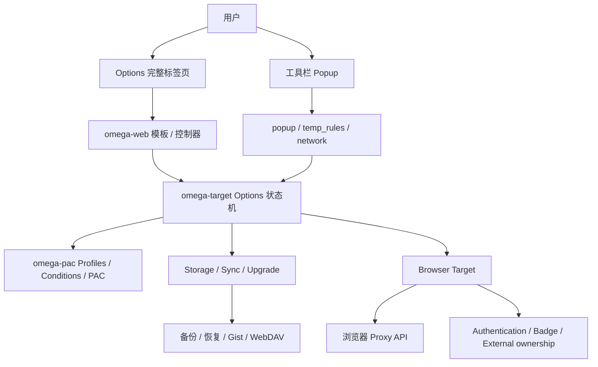
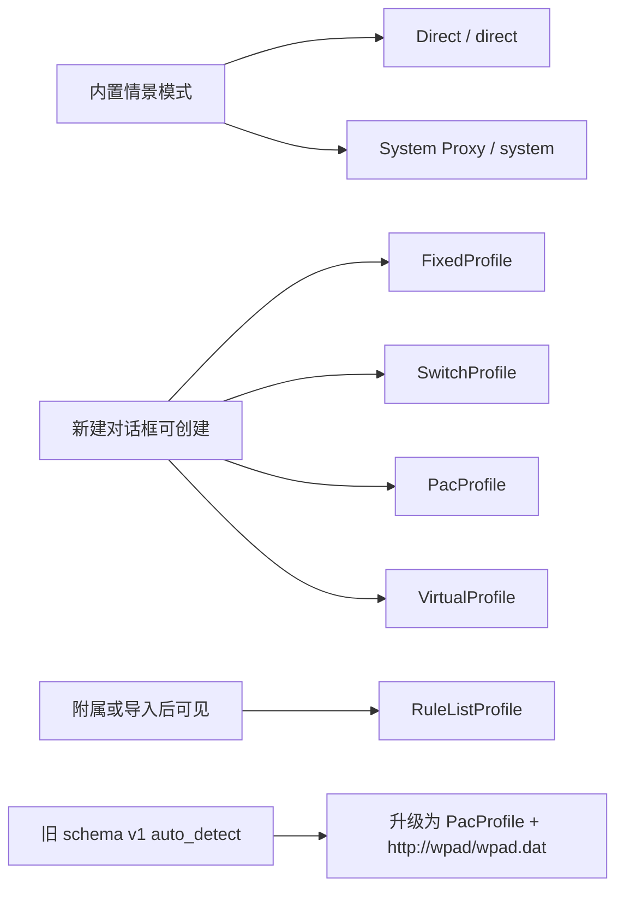
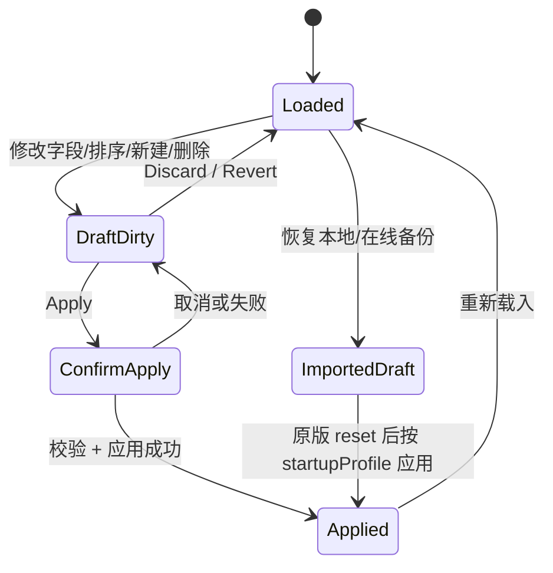
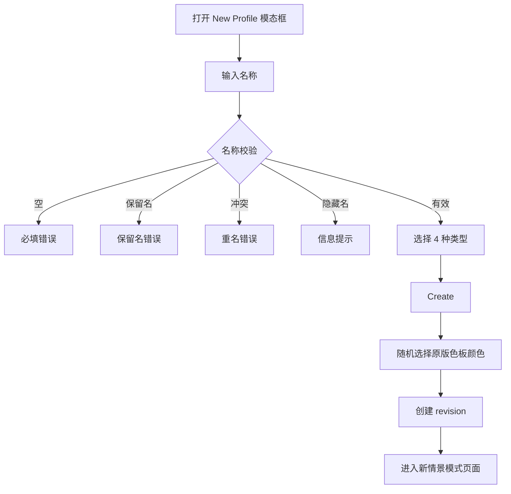
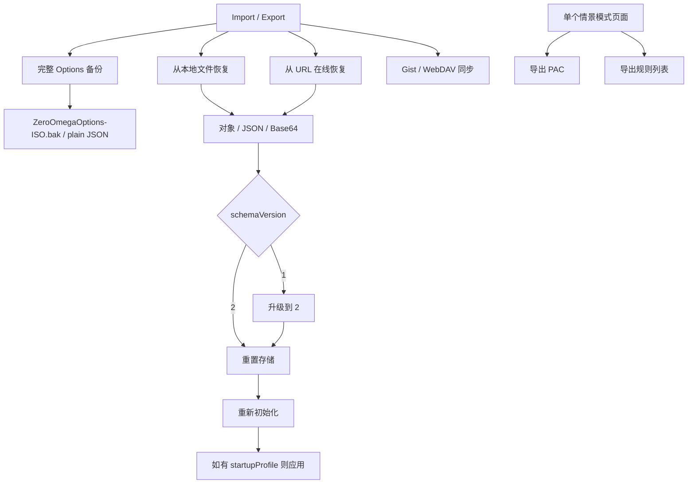

# ZeroOmega 原版知识图谱

> 状态：Milestone 8 的强制事实基线。任何 Options、Popup、情景模式、导入导出、语言或默认值改动，都必须同时更新本文与 [`UI_AUDIT_MATRIX.md`](./UI_AUDIT_MATRIX.md)。

## 1. 证据基线

| 项目                  | 固定值                                                                                   |
| --------------------- | ---------------------------------------------------------------------------------------- |
| 原版仓库              | `zero-peak/ZeroOmega`                                                                    |
| 原版基准版本          | `v3.5.0`                                                                                 |
| 原版 UI 证据工作流    | `Audit Original ZeroOmega UI` run `30181773502`                                          |
| 原版源码证据 Artifact | `original-zeroomega-ui-evidence-v3.5.0`, ID `8625759489`                                 |
| Artifact SHA-256      | `8403e963325a5d4fcac10fd2f3c8dac246cb720afb24f322c827d5cf8ebfdd19`                       |
| 证据范围              | `omega-web/src`、`omega-target/src`、Chromium target、`en_US/zh_CN/zh_TW/zh_Hant` locale |

事实优先级：

1. 固定标签 `v3.5.0` 的源码和 locale。
2. 原版实际可安装构建的行为。
3. 原版文档、帮助文字和截图。
4. Nex 现状、旧候选包或推测不得反向定义“原版”。

## 2. 系统结构图

### 分层边界

| 层             | 原版职责                               | Nex 对应原则                                                   |
| -------------- | -------------------------------------- | -------------------------------------------------------------- |
| `omega-web`    | 页面布局、字段、对话框、帮助、交互     | 可换 Svelte 和视觉皮肤，但信息结构、操作入口和行为必须逐项核对 |
| `omega-target` | 选项模型、升级、应用、导入、同步、下载 | 必须由类型化状态机替代，不得把示例文字直接写成已生效配置       |
| `omega-pac`    | 情景模式、条件、引用、PAC 生成         | Nex 可采用新 schema，但必须维护可逆的原版语义映射              |
| 浏览器 target  | Proxy API、权限、认证、外部控制状态    | 可按 Chromium/Firefox 能力差异实现，但差异必须显式显示         |

## 3. 情景模式分类图

### 关键结论

- 原版“新建情景模式”对话框只有 **4 类**：`FixedProfile`、`SwitchProfile`、`PacProfile`、`VirtualProfile`。
- `RuleListProfile` 是可编辑的真实类型，但通常由自动切换情景模式附加、导入或旧格式转换产生；不在普通新建对话框中。
- `Auto Detect Profile` 不是 v3.5.0 的独立普通新建类型。schema v1 中的 `auto_detect` 会升级为指向 `http://wpad/wpad.dat` 的 `PacProfile`。
- 历史 Nex 曾采用错误的五选一分类；当前普通新建入口已经修正为 Fixed / Switch / PAC / Virtual 四类，Rule List 与 Auto Detect 仅保留导入/兼容路径。

## 4. 全局 Options 生命周期

必须保留的全局语义：

- 左侧固定三组：设置、情景模式、操作。
- Apply 与 Discard 是全局操作，不属于某个单独情景模式。
- 新建、重命名、删除、替换引用、颜色修改先改变 Options 草稿。
- Draft 必须满足 JSON Schema、引用完整性、循环安全和秘密隔离；Switch 条件的文本/正则语义错误可暂存为 warning，便于用户完成编辑。
- Applied、导入结果、历史修订、PAC 编译输入与 Apply candidate 始终使用严格校验；存在条件错误时 Apply 在接触浏览器代理 API 前失败，并保留 Draft。
- 删除被引用的情景模式必须被阻止并列出引用者；不能静默改坏引用。
- 删除情景模式时还要清理启动项、快速切换项和附属规则列表。

## 5. 新建情景模式

原版来源：`partials/new_profile.jade`、`controllers/master.coffee`。

布局必须项：

- 模态框，而不是五张永久大卡片。
- 名称输入在类型选择之前。
- 名称实时校验与明确错误。
- 类型为单选列表；每项包含图标、名称、帮助说明。
- Fixed 默认选中。
- PAC 在不支持的目标上禁用并显示原因。
- 底部 Cancel / Create。

## 6. 共用情景模式页面外壳

原版来源：`partials/profile.jade`、`controllers/profile.coffee`。

必须项：

- 页面标题显示情景模式名。
- 标题旁有颜色编辑器；Virtual 继承目标颜色，不直接修改自己的颜色。
- 右上操作按能力显示：导出规则列表、导出 PAC、重命名、删除。
- 删除前检查引用关系。
- Virtual 提供“替换所有引用后删除/迁移”的专门路径。
- 类型内容由对应模板承载，不能用一个通用“高级编辑器”把各类型压成相同表单。

## 7. FixedProfile 知识节点

原版来源：`profile_fixed.jade`、`fixed_profile.coffee`、`fixed_auth_edit.jade`。

### 布局

- “代理服务器”表格。
- 列：URL scheme、代理协议、服务器、端口、认证操作。
- 默认/后备代理为第一行。
- 高级 scheme 行折叠，点击展开；未单独设置时显示默认行的 host/port 作为 placeholder。
- 每个 scheme 可独立选择协议和认证。
- “不代理的地址列表”独立区块，带帮助链接和多行文本框。

### 语义

- 允许按 scheme 分配代理；Nex 已改为 fallback/HTTP/HTTPS/FTP 独立映射，并在共享 endpoint 被编辑时先复制，避免串改其他行或情景模式。
- 认证是每个 scheme 的操作，不是全局一组随意附加字段。
- 默认 bypass 为 `127.0.0.1`、`[::1]`、`localhost`，这是原版真实默认值。
- 原版控制器仅在用户主动选择代理协议后才补端口及示例 host；Nex 不把示例写入配置：新建 Fixed 与首次运行的 Fixed 均无 endpoint，`example.com` 只作为新建行的输入 placeholder。
- 认证密码存放在浏览器秘密存储中，ProfileSpec 只保存 `passwordSecretRef`；Options 通过受引用检查的后台命令读取密码，并通过带秘密材料的原子 Draft 接受流程更新。

### FixedProfile 当前实现状态（2026-07-26）

- 已恢复原版表格、默认行、高级折叠、fallback placeholder、逐 scheme 认证按钮和 Bypass 帮助区。
- `MUST_MATCH` 的布局、空白默认值、fallback 继承和 HTTP 认证流程已进入组件测试、永久 UI 守卫及简体中文 Chromium E2E。
- FTP 应用能力、SOCKS 认证目标差异及真实浏览器认证仍保持 `PARTIAL/UNCERTAIN`，不得宣称完全等价。

## 8. SwitchProfile 知识节点

原版来源：`profile_switch.jade`、`switch_profile.coffee`、条件 locale。

### 规则编辑布局

- 可展开的条件帮助区，基础/高级条件分组。
- 规则表格按行编辑，不是每条规则一个大型 fieldset。
- 列：排序、条件类型、条件细节、结果情景模式、动作、可选备注。
- 支持拖动排序。
- 每行支持删除、复制、添加备注。
- 表格底部有“添加条件”。
- 独立“默认情景模式”行。
- 支持图形编辑与源码编辑切换，并显示解析错误。

### 附属 RuleListProfile

- 可给 SwitchProfile 附加一个 RuleListProfile。
- 附属项可启用/禁用，设置匹配结果情景模式。
- 可选择格式、URL、自定义请求头、立即下载、查看/编辑规则文本。
- 删除附属规则列表必须确认，并恢复原默认情景模式引用。

### 条件语义

- 条件类型、帮助、限制提示和字段应由原版条件模型驱动。
- URL 条件有完整 URL 能力限制警告。
- Options 编辑器的“添加条件”始终追加到底部：第一条使用默认情景模式，之后复制最后一条规则作为模板。
- `-addConditionsToBottom` 只控制 Popup/当前站点条件注入使用 `push` 还是 `unshift`，不得复用于编辑器按钮。

### SwitchProfile 当前实现状态（2026-07-26）

- 已恢复单一紧凑规则表，列结构为排序、条件类型、条件细节、结果情景模式、动作和可选备注。
- 条件类型按基础或 Host/URL/Special 分组；现有高级条件会自动展开高级分组，避免导入数据失去可编辑项。
- 已提供原生拖动 handle 与键盘 Up/Down 后备；编辑器新增规则固定追加，第一条使用默认路由，后续复制最后一条规则。
- 文本条件首次新增时使用空 `pattern`；复制最后一条文本规则后也会清空 `pattern`，不再写入 `example.com` 一类假用户数据。
- Draft 校验将 Switch 条件的空 pattern、错误正则、无效 IP/前缀和无效范围降为 warning；结构、引用和循环错误仍阻止保存。
- Applied、导入、历史修订和 Apply candidate 保持严格校验；无效 Draft 不会进入浏览器激活、PAC 快照或 Applied 状态。
- 图形/源码双向编辑、附属 RuleList、原版 locale 文本、字段级错误展示和浏览器拖放 E2E 尚未完成，因此 Switch 整体仍是 `PARTIAL`。

## 9. RuleListProfile 知识节点

原版来源：`profile_rule_list.jade`、`rule_list_profile.coffee`。

- 匹配时使用的情景模式。
- 未匹配时的默认情景模式。
- 规则列表格式单选。
- 规则列表 URL。
- “立即下载”。
- 规则列表文本；有 URL 时只读，无 URL 时可编辑。
- 作为独立可见类型时仍使用原版页面，但不应出现在普通新建类型列表。

## 10. PacProfile 知识节点

原版来源：`profile_pac.jade`、`pac_profile.coffee`。

- PAC URL 输入与清除。
- `file://` 支持/引用限制和警告。
- 远程 PAC 可配置请求头。
- “立即下载”。
- PAC Script 区块。
- 有远程 URL 时脚本通常由下载结果驱动/只读；无 URL 时可内联编辑。
- 认证全部代理服务器的入口、能力警告和浏览器差异。
- 不支持 PAC 的浏览器目标要显示明确错误。

禁止做法：切换“URL”选项时自动写入 `https://example.invalid/proxy.pac`；该字符串只能作为 placeholder/示例，不得变成用户配置。Nex 的模式切换现以空值初始化，并由永久 UI compatibility guard 阻止该回归。

## 11. VirtualProfile 知识节点

原版来源：`profile_virtual.jade`、`profile.coffee`、引用替换逻辑。

- 选择一个目标情景模式。
- 说明 Virtual 作为稳定别名/间接引用的用途。
- 显示目标情景模式颜色。
- 提供“将所有 Virtual 引用替换为当前目标”的操作。
- 删除和重定向必须保护引用完整性。

## 12. 导入、导出与同步图

### 必须兼容

- 完整 Options 纯 JSON 导出，文件名 `ZeroOmegaOptions-<ISO>.bak`。
- 本地文件恢复。
- URL 在线恢复。
- 输入可为对象、JSON 字符串或 Base64 JSON。
- schemaVersion 1 与 2；v1 `auto_detect` 升级为 WPAD PacProfile。
- 恢复是完整 reset，不是只抽取少量 Nex 字段后声称成功。
- 恢复后根据启动情景模式应用。
- 单情景模式 PAC/规则列表导出。

### 尚待范围决定

- Gist/WebDAV 同步属于原版功能，当前不得擅自标记“不搬”。在 UI 巡查表中保持 `UNCERTAIN`，等待安全模型、凭据存储和用户范围决定。

## 13. 本地化知识节点

原版 locale 基线：`en_US`、`zh_CN`、`zh_TW`、`zh_Hant`。

必须覆盖：

- 页面标题、导航、按钮、标签、帮助、警告、错误、确认框。
- select option、动态状态、空状态。
- placeholder、title、`aria-label`。
- 原版默认名称的显示翻译与内部稳定标识分离：`direct/system` 是内部名，用户界面显示本地化名称。
- 示例文字必须以 placeholder/help 呈现；不得因本地化实现而写入配置值。
- 未找到翻译键时回退英文，但巡查表必须标为 `PARTIAL`，不能视为完成。

## 14. Popup、临时规则与网络检查

原版证据位于：`popup.jade`、`popup/js/*`、`popup/temp_rules/*`、`popup/network/*`。

功能节点：

- 内置与用户情景模式选择。
- Switch/Virtual 的结果情景模式显示/选择。
- 为当前网站添加条件。
- 当前网站临时规则。
- 外部扩展控制的代理状态。
- 请求错误与网络检查页面。
- Options 入口和键盘操作。

上述功能必须分别分类，不能因为“Popup 能切换模式”就整体标为已兼容。

## 15. 原版默认值、示例与 placeholder 规则

| 数据                                    | 原版身份                       | Nex 处理原则                                                           |
| --------------------------------------- | ------------------------------ | ---------------------------------------------------------------------- |
| `proxy.example.com:8080`                | 初始示例 Proxy 的真实默认内容  | 只在等价初始示例中保留；新建/切换类型时不得无条件注入                  |
| `internal.example.com`、`*.example.com` | 初始 Auto Switch 示例规则      | 只属于初始示例；用户新建 Switch 不应自动带入，除非原版创建函数确实如此 |
| `127.0.0.1`、`::1`、`localhost`         | 默认 bypass                    | 语义必须保留                                                           |
| `https://example.invalid/...`           | Nex 临时占位写法，不是原版默认 | 必须改为 placeholder 或空值                                            |
| `! Add rules here.`                     | Nex 临时内容                   | 不得作为自动保存的默认规则正文                                         |
| `User-Agent: ZeroOmega Nex`             | Nex 临时 header                | 新增请求头必须为空白行；名称和值只可由用户输入，永久守卫阻止回归       |

## 16. 实现决策分类

| 分类                     | 含义                                                   |
| ------------------------ | ------------------------------------------------------ |
| `MUST_MATCH`             | 用户可见的信息结构、入口、数据语义或行为必须和原版一致 |
| `REFERENCE`              | 可参考原版，但允许采用 Nex 主题、图标或现代组件        |
| `UNCERTAIN`              | 原版存在，但范围、安全性或现代浏览器可行性尚未确认     |
| `INTENTIONAL_DIVERGENCE` | 已记录且有理由的用户可见差异；必须经明确决定           |
| `NOT_PORTING`            | 明确不搬，仅限实现技术或已批准的功能；不得自行添加     |

## 17. 更新协议

每个 parity-sensitive 任务必须在同一提交中：

1. 更新本知识图谱中受影响的节点、边和事实。
2. 更新 `UI_AUDIT_MATRIX.md` 对应行的分类、状态、翻译状态、证据和下一步。
3. 更新或新增自动测试证据。
4. 若发现原版事实与既有文档冲突，以固定源码为准并记录修正。
5. 只有 `DONE + VERIFIED` 的行才可在 PR 描述中称为完成。
6. `PARTIAL`、`BROKEN`、`UNVERIFIED`、`UNCERTAIN` 均阻止 PR Ready。

CI 的 `Parity Documentation` 工作流会检查：只要最新提交修改 Options、Popup、legacy import、profile workflow 默认值或 locale，就必须同时修改本文件与 UI 巡查表。

## 18. 修订记录

| 日期       | 变更                                                                                                                         | 依据                                                                          |
| ---------- | ---------------------------------------------------------------------------------------------------------------------------- | ----------------------------------------------------------------------------- |
| 2026-07-26 | 建立 v3.5.0 固定事实基线；纠正新建类型分类；补齐编辑器、I/O、locale、Popup 图谱                                              | 原版源码 Artifact `8625759489`                                                |
| 2026-07-26 | 新建流程按原版四类模态框实现；新增 Virtual 数据模型、引用图、PAC、认证、迁移与编辑器；Rule List/Auto Detect 退出普通新建入口 | 原版 `new_profile.jade`、`profile_virtual.jade`、`profiles.coffee`            |
| 2026-07-26 | 清除 PAC/Rule List 模式切换和新增请求头时写入配置的 Nex 假默认值；新增永久防回归守卫                                         | 原版 `profile_pac.jade`、`profile_rule_list.jade` 的空输入与 placeholder 语义 |
| 2026-07-26 | Switch 首切片恢复紧凑规则表、基础/高级分组帮助、排序、备注、默认路由行及新增位置语义                                         | 原版 `profile_switch.jade`、`switch_profile.coffee`                           |
| 2026-07-26 | 拆分 Draft 与严格校验边界；文本条件新增/复制使用空 pattern，Apply 前严格拒绝无效条件                                         | 原版 `switch_profile.coffee` 的空 pattern 编辑语义与现有原子 Apply 边界       |
