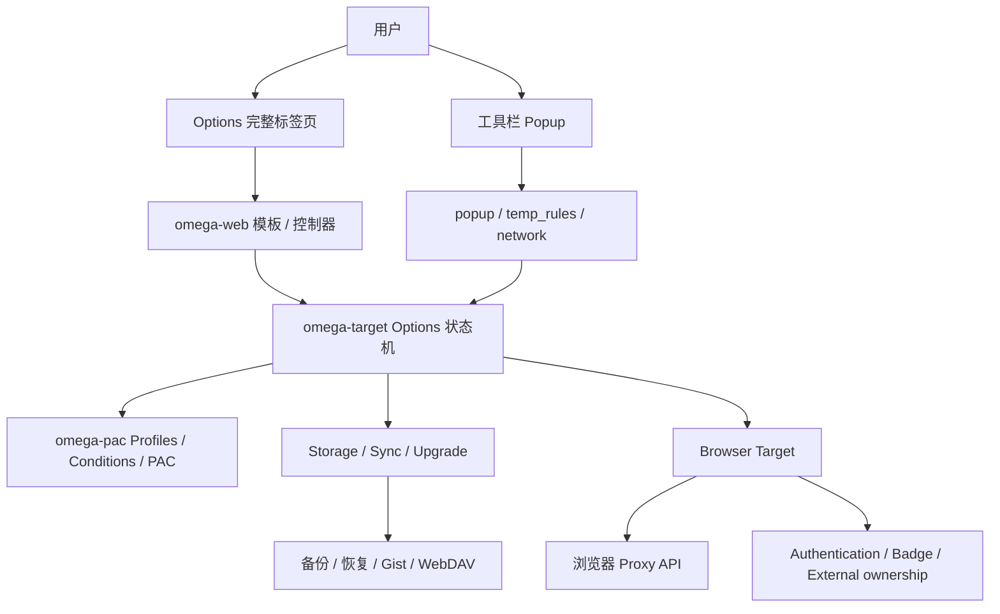
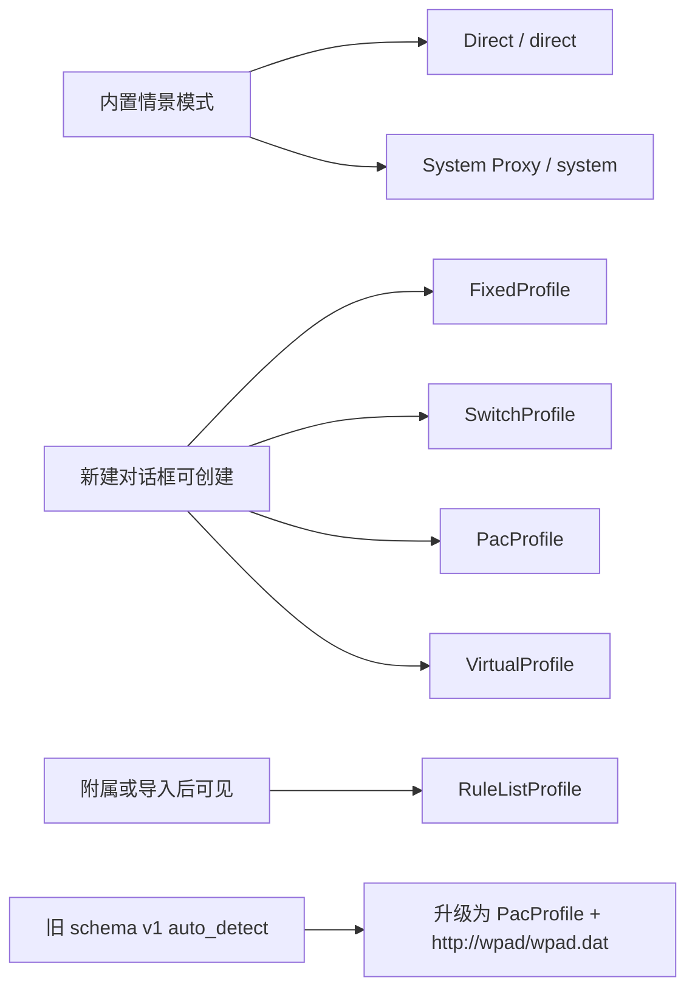
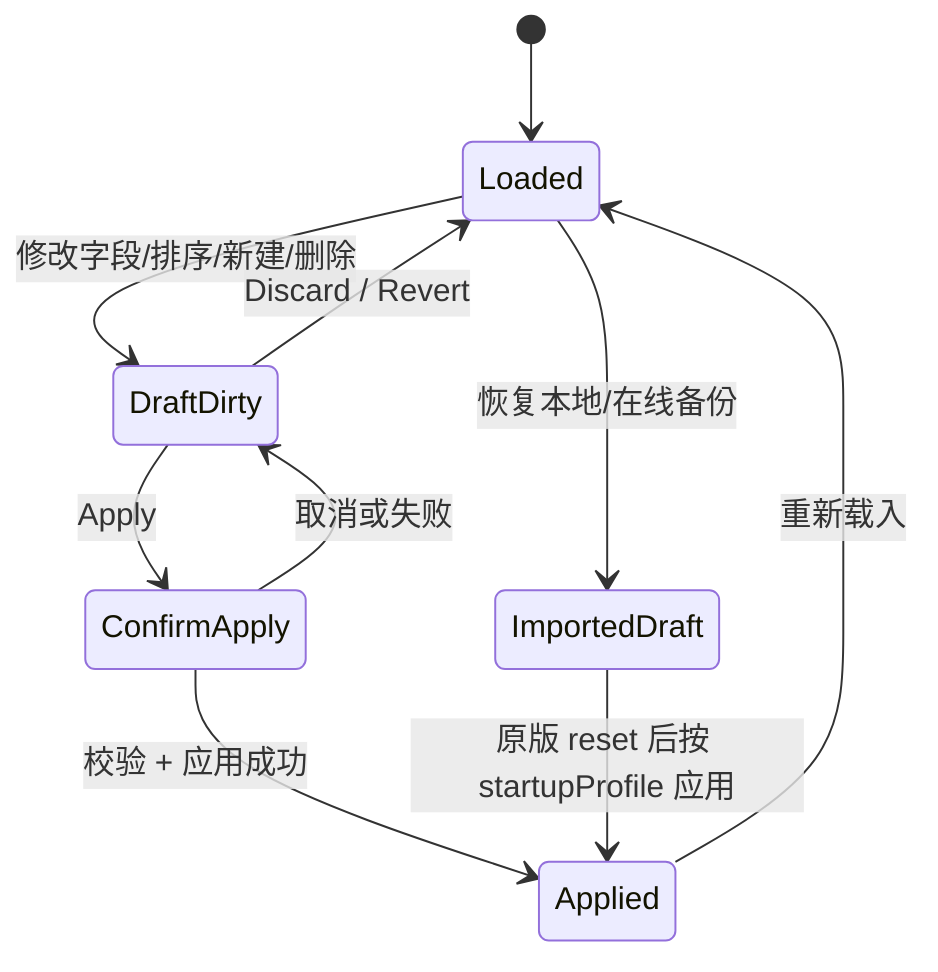
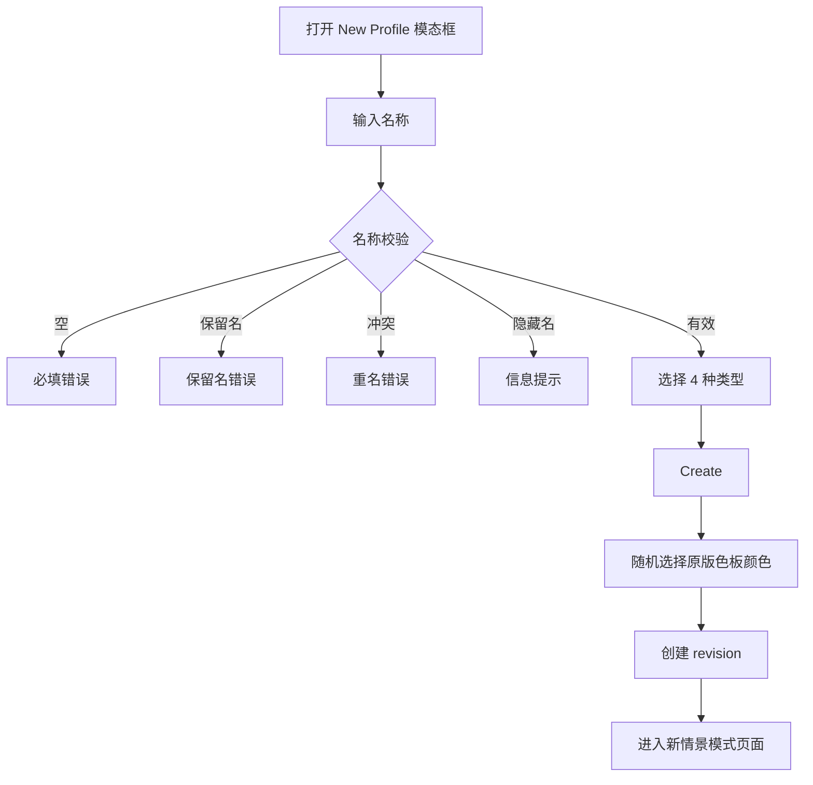
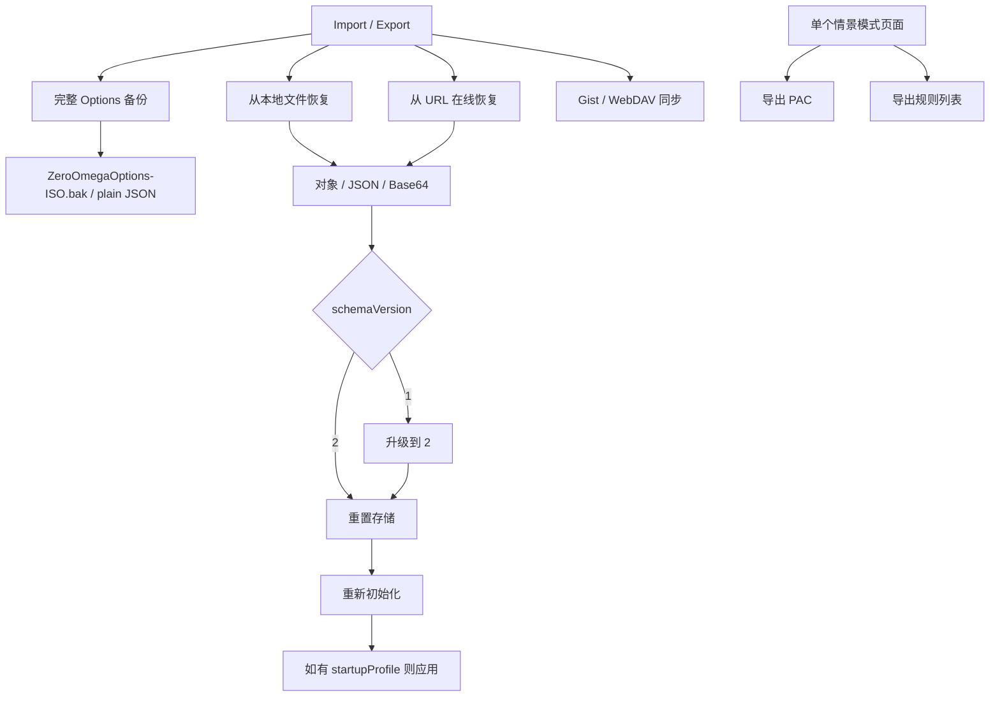

# ZeroOmega 原版知识图谱

> 状态：Milestone 8 的强制事实基线。任何 Options、Popup、情景模式、导入导出、语言或默认值改动，都必须同时更新本文与 [`UI_AUDIT_MATRIX.md`](./UI_AUDIT_MATRIX.md)。

## 1. 证据基线

| 项目                  | 固定值                                                                                   |
| --------------------- | ---------------------------------------------------------------------------------------- |
| 原版仓库              | `zero-peak/ZeroOmega`                                                                    |
| 原版基准版本          | `v3.5.0`                                                                                 |
| 原版 UI 证据工作流    | `Audit Original ZeroOmega UI` run `30181773502`                                          |
| 原版源码证据 Artifact | `original-zeroomega-ui-evidence-v3.5.0`, ID `8625759489`                                 |
| Artifact SHA-256      | `8403e963325a5d4fcac10fd2f3c8dac246cb720afb24f322c827d5cf8ebfdd19`                       |
| 证据范围              | `omega-web/src`、`omega-target/src`、Chromium target、`en_US/zh_CN/zh_TW/zh_Hant` locale |

事实优先级：

1. 固定标签 `v3.5.0` 的源码和 locale。
2. 原版实际可安装构建的行为。
3. 原版文档、帮助文字和截图。
4. Nex 现状、旧候选包或推测不得反向定义“原版”。

## 2. 系统结构图

### 分层边界

| 层             | 原版职责                               | Nex 对应原则                                                   |
| -------------- | -------------------------------------- | -------------------------------------------------------------- |
| `omega-web`    | 页面布局、字段、对话框、帮助、交互     | 可换 Svelte 和视觉皮肤，但信息结构、操作入口和行为必须逐项核对 |
| `omega-target` | 选项模型、升级、应用、导入、同步、下载 | 必须由类型化状态机替代，不得把示例文字直接写成已生效配置       |
| `omega-pac`    | 情景模式、条件、引用、PAC 生成         | Nex 可采用新 schema，但必须维护可逆的原版语义映射              |
| 浏览器 target  | Proxy API、权限、认证、外部控制状态    | 可按 Chromium/Firefox 能力差异实现，但差异必须显式显示         |

## 3. 情景模式分类图

### 关键结论

- 原版“新建情景模式”对话框只有 **4 类**：`FixedProfile`、`SwitchProfile`、`PacProfile`、`VirtualProfile`。
- `RuleListProfile` 是可编辑的真实类型，但通常由自动切换情景模式附加、导入或旧格式转换产生；不在普通新建对话框中。
- `Auto Detect Profile` 不是 v3.5.0 的独立普通新建类型。schema v1 中的 `auto_detect` 会升级为指向 `http://wpad/wpad.dat` 的 `PacProfile`。
- 历史 Nex 曾采用错误的五选一分类；当前普通新建入口已经修正为 Fixed / Switch / PAC / Virtual 四类，Rule List 与 Auto Detect 仅保留导入/兼容路径。

## 4. 全局 Options 生命周期

必须保留的全局语义：

- 左侧固定三组：设置、情景模式、操作。
- Apply 与 Discard 是全局操作，不属于某个单独情景模式。
- 新建、重命名、删除、替换引用、颜色修改先改变 Options 草稿。
- Draft 必须满足 JSON Schema、引用完整性、循环安全和秘密隔离；Switch 条件的文本/正则语义错误可暂存为 warning，便于用户完成编辑。
- Applied、导入结果、历史修订、PAC 编译输入与 Apply candidate 始终使用严格校验；存在条件错误时 Apply 在接触浏览器代理 API 前失败，并保留 Draft。
- 删除被引用的情景模式必须被阻止并列出引用者；不能静默改坏引用。
- 删除情景模式时还要清理启动项、快速切换项和附属规则列表。

## 5. 新建情景模式

原版来源：`partials/new_profile.jade`、`controllers/master.coffee`。

布局必须项：

- 模态框，而不是五张永久大卡片。
- 名称输入在类型选择之前。
- 名称实时校验与明确错误。
- 类型为单选列表；每项包含图标、名称、帮助说明。
- Fixed 默认选中。
- PAC 在不支持的目标上禁用并显示原因。
- 底部 Cancel / Create。

## 6. 共用情景模式页面外壳

原版来源：`partials/profile.jade`、`controllers/profile.coffee`。

必须项：

- 页面标题显示情景模式名。
- 标题旁有颜色编辑器；Virtual 继承目标颜色，不直接修改自己的颜色。
- 右上操作按能力显示：导出规则列表、导出 PAC、重命名、删除。
- 删除前检查引用关系。
- Virtual 提供“替换所有引用后删除/迁移”的专门路径。
- 类型内容由对应模板承载，不能用一个通用“高级编辑器”把各类型压成相同表单。

## 7. FixedProfile 知识节点

原版来源：`profile_fixed.jade`、`fixed_profile.coffee`、`fixed_auth_edit.jade`。

### 布局

- “代理服务器”表格。
- 列：URL scheme、代理协议、服务器、端口、认证操作。
- 默认/后备代理为第一行。
- 高级 scheme 行折叠，点击展开；未单独设置时显示默认行的 host/port 作为 placeholder。
- 每个 scheme 可独立选择协议和认证。
- “不代理的地址列表”独立区块，带帮助链接和多行文本框。

### 语义

- 允许按 scheme 分配代理；Nex 已改为 fallback/HTTP/HTTPS/FTP 独立映射，并在共享 endpoint 被编辑时先复制，避免串改其他行或情景模式。
- 认证是每个 scheme 的操作，不是全局一组随意附加字段。
- 默认 bypass 为 `127.0.0.1`、`[::1]`、`localhost`，这是原版真实默认值。
- 原版控制器仅在用户主动选择代理协议后才补端口及示例 host；Nex 不把示例写入配置：新建 Fixed 与首次运行的 Fixed 均无 endpoint，`example.com` 只作为新建行的输入 placeholder。
- 认证密码存放在浏览器秘密存储中，ProfileSpec 只保存 `passwordSecretRef`；Options 通过受引用检查的后台命令读取密码，并通过带秘密材料的原子 Draft 接受流程更新。

### FixedProfile 当前实现状态（2026-07-26）

- 已恢复原版表格、默认行、高级折叠、fallback placeholder、逐 scheme 认证按钮和 Bypass 帮助区。
- `MUST_MATCH` 的布局、空白默认值、fallback 继承和 HTTP 认证流程已进入组件测试、永久 UI 守卫及简体中文 Chromium E2E。
- FTP 应用能力、SOCKS 认证目标差异及真实浏览器认证仍保持 `PARTIAL/UNCERTAIN`，不得宣称完全等价。

## 8. SwitchProfile 知识节点

原版来源：`profile_switch.jade`、`switch_profile.coffee`、条件 locale。

### 规则编辑布局

- 可展开的条件帮助区，基础/高级条件分组。
- 规则表格按行编辑，不是每条规则一个大型 fieldset。
- 列：排序、条件类型、条件细节、结果情景模式、动作、可选备注。
- 支持拖动排序。
- 每行支持删除、复制、添加备注。
- 表格底部有“添加条件”。
- 独立“默认情景模式”行。
- 支持图形编辑与源码编辑切换，并显示解析错误。

### 源码编辑语义

- 原版源码采用结果模式的 SwitchyOmega Conditions 格式：文件头为 `[SwitchyOmega Conditions]`，随后是 `@with result`。
- 每条规则使用 `条件 +结果情景模式`；备注在规则前使用 `@note`；最后必须有 `* +默认情景模式`。
- `!条件` 表示使用最后默认情景模式。图形转源码时使用可逆的原版条件缩写/全名；源码转图形时必须校验条件、结果引用和最后默认规则。
- 切回图形模式、离开当前情景模式或执行 Apply 时解析已修改源码。解析失败时阻止动作、保留源码模式并显示行号/原因。
- 源码文本尚未解析前属于编辑器本地 Draft；因此必须参与全局 Apply/Discard 的 dirty 状态。Discard 可直接丢弃本地源码，Apply 必须先解析后再进入严格候选校验。
- 原版规则没有逐行 `enabled` 标记，也没有正则 flags 字段。Nex 不再提供这两项普通编辑入口；仅对旧 Nex 数据显示显式 Normalize 兼容操作，禁止静默丢失。
- 复制规则必须精确复制备注，不得添加 `copy` 等 Nex 自创后缀。

### 附属 RuleListProfile

- 可给 SwitchProfile 附加一个 RuleListProfile；原版隐藏名称固定为 `__ruleListOf_<父情景模式名称>`，不进入普通导航、Quick Switch、Startup 或其他 profile selector。
- 父 Switch 显式持有附属关系。启用时父默认路由指向隐藏 RuleList；隐藏 RuleList 的默认路由保存用户可见的 Switch 默认路由。禁用时父 Switch 直接使用该可见默认路由。
- 附属项可设置匹配结果情景模式、Switchy/AutoProxy 格式、inline/URL 来源、自定义请求头和规则文本。inline 文本可编辑；URL 来源使用已下载缓存并只读，缓存必须随原版备份保留以支持离线编译。
- 新增请求头先产生空白 Draft 行；空名称属于 Draft warning，Apply 仍严格拒绝。敏感 header 继续使用 secret reference，原始秘密不得进入 ProfileSpec。 后台提交成功后，Options 必须通过显式响应式 header 列表立即刷新新增行，不能用模板函数间接读取状态而形成 stale UI。
- 父情景模式改名/改色必须同步隐藏项；复制父项必须复制独立隐藏 profile/source；删除父项必须级联删除，单独解除附属则先恢复原默认路由并确认。
- 原版导入通过 `__ruleListOf_<父名称>` 自动重建关系；不得把隐藏附属项当作普通独立 RuleList 展示。
- “立即下载”由后台网络服务执行：Options 的用户手势先请求 URL origin 权限；后台解析秘密 header，使用 10 秒 timeout、4 MiB 解压后上限、`credentials: omit` 与无 referrer 请求。成功内容与状态在同一 workflow CAS 中替换；失败、空内容、超限或并发编辑保留旧缓存。更新时间、字节数、错误与 stale 状态属于 workflow 运行元数据，不进入 ProfileSpec。自动更新使用单一 alarms 扫描器：后台启动立即扫描，之后每分钟检查；每个源按 lastAttempt 与自身/全局 interval 判定到期，失败不会每分钟轰炸；无既有 host permission 时静默跳过，不在后台请求权限。 Options 通过 `storage.onChanged` 监听本地 workflow state，严格解析事件携带的新状态并同步 view，不插入额外命令；因此不会打断 import-and-apply 等链式操作。Switch 源码编辑器实例不重建，本地源码文本可在最新 backing spec 上提交。

### 条件语义

- 条件类型、帮助、限制提示和字段应由原版条件模型驱动。
- URL 条件有完整 URL 能力限制警告。
- Options 编辑器的“添加条件”始终追加到底部：第一条使用默认情景模式，之后复制最后一条规则作为模板。
- `-addConditionsToBottom` 只控制 Popup/当前站点条件注入使用 `push` 还是 `unshift`，不得复用于编辑器按钮。

### SwitchProfile 当前实现状态（2026-07-26）

- 已恢复单一紧凑规则表，列结构为排序、条件类型、条件细节、结果情景模式、动作和可选备注。
- 条件类型按基础或 Host/URL/Special 分组；现有高级条件会自动展开高级分组，避免导入数据失去可编辑项。
- 已提供原生拖动 handle 与键盘 Up/Down 后备；编辑器新增规则固定追加，第一条使用默认路由，后续复制最后一条规则。
- 文本条件首次新增时使用空 `pattern`；复制最后一条文本规则后也会清空 `pattern`，不再写入 `example.com` 一类假用户数据。
- Draft 校验将 Switch 条件的空 pattern、错误正则、无效 IP/前缀和无效范围降为 warning；结构、引用和循环错误仍阻止保存。
- Applied、导入、历史修订和 Apply candidate 保持严格校验；无效 Draft 不会进入浏览器激活、PAC 快照或 Applied 状态。
- 已实现原版结果模式源码的双向 compose/parse、备注、内置/用户结果引用、默认规则、原版条件类型和行级错误；源码修改纳入全局 Apply/Discard，并在导航离开前解析。
- 普通规则表已移除 Nex 自创的逐行启用复选框和正则 flags 输入；旧 Nex 数据必须先显式 Normalize 才能进入可逆源码模式。
- 图形/源码编辑已闭环；附属 RuleList 的创建、启停、路由、格式/URL/headers/文本、隐藏导航、导入重建、复制、删除事务和手动后台下载状态已实现。自动 interval 调度、完整 locale、源码模式跨重载持久化和浏览器拖放 E2E 仍未完成，因此 Switch 整体仍是 `PARTIAL`。

## 9. RuleListProfile 知识节点

原版来源：`profile_rule_list.jade`、`rule_list_profile.coffee`。

- 匹配时使用的情景模式。
- 未匹配时的默认情景模式。
- 规则列表格式单选。
- 规则列表 URL。
- “立即下载”。
- 规则列表文本；有 URL 时只读，无 URL 时可编辑。
- 作为独立可见类型时仍使用原版页面，但不应出现在普通新建类型列表。

## 10. PacProfile 知识节点

原版来源：`profile_pac.jade`、`pac_profile.coffee`。

- PAC URL 输入与清除。
- `file://` 支持/引用限制和警告。
- 远程 PAC 可配置请求头。
- “立即下载”。
- PAC Script 区块。
- 有远程 URL 时脚本通常由下载结果驱动/只读；无 URL 时可内联编辑。
- 认证全部代理服务器的入口、能力警告和浏览器差异。
- 不支持 PAC 的浏览器目标要显示明确错误。

禁止做法：切换“URL”选项时自动写入 `https://example.invalid/proxy.pac`；该字符串只能作为 placeholder/示例，不得变成用户配置。Nex 的模式切换现以空值初始化，并由永久 UI compatibility guard 阻止该回归。

## 11. VirtualProfile 知识节点

原版来源：`profile_virtual.jade`、`profile.coffee`、引用替换逻辑。

- 选择一个目标情景模式。
- 说明 Virtual 作为稳定别名/间接引用的用途。
- 显示目标情景模式颜色。
- 提供“将所有 Virtual 引用替换为当前目标”的操作。
- 删除和重定向必须保护引用完整性。

## 12. 导入、导出与同步图

### 必须兼容

- 完整 Options 纯 JSON 导出，文件名 `ZeroOmegaOptions-<ISO>.bak`。
- 本地文件恢复。
- URL 在线恢复。
- 输入可为对象、JSON 字符串或 Base64 JSON。
- schemaVersion 1 与 2；v1 `auto_detect` 升级为 WPAD PacProfile。
- 恢复是完整 reset，不是只抽取少量 Nex 字段后声称成功。
- 恢复后根据启动情景模式应用。
- 单情景模式 PAC/规则列表导出。

### 尚待范围决定

- Gist/WebDAV 同步属于原版功能，当前不得擅自标记“不搬”。在 UI 巡查表中保持 `UNCERTAIN`，等待安全模型、凭据存储和用户范围决定。

## 13. 本地化知识节点

原版 locale 基线：`en_US`、`zh_CN`、`zh_TW`、`zh_Hant`。

必须覆盖：

- 页面标题、导航、按钮、标签、帮助、警告、错误、确认框。
- select option、动态状态、空状态。
- placeholder、title、`aria-label`。
- 原版默认名称的显示翻译与内部稳定标识分离：`direct/system` 是内部名，用户界面显示本地化名称。
- 示例文字必须以 placeholder/help 呈现；不得因本地化实现而写入配置值。
- 未找到翻译键时回退英文，但巡查表必须标为 `PARTIAL`，不能视为完成。

## 14. Popup、临时规则与网络检查

原版证据位于：`popup.jade`、`popup/js/*`、`popup/temp_rules/*`、`popup/network/*`。

功能节点：

- 内置与用户情景模式选择。
- Switch/Virtual 的结果情景模式显示/选择：原版在 profile 行显示 `[defaultProfileName]` 并提供合法结果下拉。Nex 对 Switch 写 `defaultRoute`、对 Virtual 写 `targetRoute`，排除隐藏、禁用、自身及会形成引用环的结果；通过后台 verified Apply 保存并保持当前活动路由，脏 Options Draft 时拒绝覆盖。
- 为当前网站添加条件：使用 activeTab 读取调用 Popup 的 tab；公共后缀列表计算 base domain/subdomain；默认 Host wildcard，可切 Host/URL wildcard/regex 与 URL keyword；添加前删除首个同 condition tag 规则，再由 `addConditionsToBottom` 决定 unshift/push。仅当前实际生效的 Switch Profile 可写入，Virtual 不可直接写入。
- Nex 的 Popup 永久条件通过后台 typed command 进入正常验证 Apply，并保持当前 Switch 路由；若 Options 存在未应用 Draft，则拒绝写入，避免覆盖独立用户工作。这是新状态模型下的安全边界，不把 Draft 静默并入 Applied。
- 当前网站临时规则是独立运行时覆盖，不与永久条件混合：原版用隐藏临时 Switch，规则为 base domain 的 `HostWildcardCondition('*.domain')`，相同结果再次选择即删除、不同结果替换；规则和临时 profile 状态写入 `chrome.storage.session`，浏览器会话内跨 service worker 重启保留，浏览器重启自动清空。
- Nex 用 session-only 状态和 session-only PAC snapshot 实现同一生命周期；持久化 proxy state 只保留可解码的临时 snapshot ID，不保存域名或脚本。正常 Apply、Popup 切换与结果修改均通过临时协调器重新叠加；System Proxy 暂停叠加但保留规则。启动时 session 已清空则拆除临时 snapshot 并恢复其底层路由。独立管理页支持逐条删除和全部删除。
- 外部代理行为分为两个独立节点：其一是控制权阻断，Chromium/Firefox 的 `levelOfControl` 为其他扩展控制或策略不可控时，原版隐藏正常 Popup 菜单、显示原因和通用说明，并提供取消与管理扩展入口；其二是在 System 模式下把浏览器当前有效 Fixed/PAC 设置作为外部情景模式导入，不能因完成阻断页就宣称整个 external profile 功能完成。
- Nex 的控制权阻断直接读取浏览器适配层 capability，不把有效代理值传给 Popup。`controlled-by-other-extension` 映射 `app`，`not-controllable` 映射 `policy`，缺少 Firefox 必需权限映射 `disabled`，检查异常映射 `unknown`；阻断时不渲染切换、结果、永久条件或临时规则入口。
- System 为逻辑活动路由、界面设置允许显示且 Chromium 当前有效配置可导入时，后台把 `auto_detect` 转为 WPAD PAC URL，把 `pac_script` 转为 URL/inline PAC，把 `fixed_servers` 的 single/fallback/HTTP/HTTPS/FTP 与 bypass 转为 Fixed；`singleProxy` 覆盖 fallback，`<local>` 去重等价本地主机。与现有 Profile 完全一致时不显示重复外部行。Popup 只收到 `fixed|pac` 与建议名称，不接收主机、端口或 PAC 正文。
- 外部行按原版使用内联名称表单；空名称、以下划线开头和重名均拒绝。保存命令只带名称和 Applied revision，后台重新读取有效配置、拒绝脏 Draft/非 System/并发变化，CAS 写入后走正常 verified Apply 并立即启用。原版解析实现位于 Chromium target；Firefox 不伪造未有源码依据的 external import。
- Inspect 菜单不是普通页面导航：原版只为 frame、link、image/video/audio 创建上下文菜单，目标限 HTTP/HTTPS/FTP。点击与当前 tab URL 相同的目标会清除检查态；其他目标保存为 inspect URL，并在该 tab 的工具栏徽标显示 `#`，随后 Popup 以该 URL 计算当前网站操作。
- Nex 的 Inspect 菜单由 Applied `showInspectMenu` 驱动；菜单关闭时移除全部三个入口。目标 URL 仅按 tab 写入 `storage.session`，10 分钟后过期，tab 关闭即删除；不进入 ProfileSpec、持久存储、日志或普通命令响应。Popup 只读取对应 tab 的目标，用它替换当前网站上下文，永久条件与临时规则继续走既有后台验证边界。
- 当前 Nex 已恢复菜单、session 生命周期、`#` 徽标和 Popup 目标切换；原版 action-for-URL 的结果颜色/标题计算及真实浏览器右键交互 E2E 尚未完成，因此 Inspect 保持 `PARTIAL`。
- 请求错误与网络检查页面。
- Options 入口和键盘操作。

上述功能必须分别分类，不能因为“Popup 能切换模式”就整体标为已兼容。

## 15. 原版默认值、示例与 placeholder 规则

| 数据                                    | 原版身份                       | Nex 处理原则                                                           |
| --------------------------------------- | ------------------------------ | ---------------------------------------------------------------------- |
| `proxy.example.com:8080`                | 初始示例 Proxy 的真实默认内容  | 只在等价初始示例中保留；新建/切换类型时不得无条件注入                  |
| `internal.example.com`、`*.example.com` | 初始 Auto Switch 示例规则      | 只属于初始示例；用户新建 Switch 不应自动带入，除非原版创建函数确实如此 |
| `127.0.0.1`、`::1`、`localhost`         | 默认 bypass                    | 语义必须保留                                                           |
| `https://example.invalid/...`           | Nex 临时占位写法，不是原版默认 | 必须改为 placeholder 或空值                                            |
| `! Add rules here.`                     | Nex 临时内容                   | 不得作为自动保存的默认规则正文                                         |
| `User-Agent: ZeroOmega Nex`             | Nex 临时 header                | 新增请求头必须为空白行；名称和值只可由用户输入，永久守卫阻止回归       |

## 16. 实现决策分类

| 分类                     | 含义                                                   |
| ------------------------ | ------------------------------------------------------ |
| `MUST_MATCH`             | 用户可见的信息结构、入口、数据语义或行为必须和原版一致 |
| `REFERENCE`              | 可参考原版，但允许采用 Nex 主题、图标或现代组件        |
| `UNCERTAIN`              | 原版存在，但范围、安全性或现代浏览器可行性尚未确认     |
| `INTENTIONAL_DIVERGENCE` | 已记录且有理由的用户可见差异；必须经明确决定           |
| `NOT_PORTING`            | 明确不搬，仅限实现技术或已批准的功能；不得自行添加     |

## 17. 更新协议

每个 parity-sensitive 任务必须在同一提交中：

1. 更新本知识图谱中受影响的节点、边和事实。
2. 更新 `UI_AUDIT_MATRIX.md` 对应行的分类、状态、翻译状态、证据和下一步。
3. 更新或新增自动测试证据。
4. 若发现原版事实与既有文档冲突，以固定源码为准并记录修正。
5. 只有 `DONE + VERIFIED` 的行才可在 PR 描述中称为完成。
6. `PARTIAL`、`BROKEN`、`UNVERIFIED`、`UNCERTAIN` 均阻止 PR Ready。

CI 的 `Parity Documentation` 工作流会检查：只要最新提交修改 Options、Popup、legacy import、profile workflow 默认值或 locale，就必须同时修改本文件与 UI 巡查表。

## 18. 修订记录

| 日期       | 变更                                                                                                                         | 依据                                                                                         |
| ---------- | ---------------------------------------------------------------------------------------------------------------------------- | -------------------------------------------------------------------------------------------- |
| 2026-07-26 | 建立 v3.5.0 固定事实基线；纠正新建类型分类；补齐编辑器、I/O、locale、Popup 图谱                                              | 原版源码 Artifact `8625759489`                                                               |
| 2026-07-26 | 新建流程按原版四类模态框实现；新增 Virtual 数据模型、引用图、PAC、认证、迁移与编辑器；Rule List/Auto Detect 退出普通新建入口 | 原版 `new_profile.jade`、`profile_virtual.jade`、`profiles.coffee`                           |
| 2026-07-26 | 清除 PAC/Rule List 模式切换和新增请求头时写入配置的 Nex 假默认值；新增永久防回归守卫                                         | 原版 `profile_pac.jade`、`profile_rule_list.jade` 的空输入与 placeholder 语义                |
| 2026-07-26 | Switch 首切片恢复紧凑规则表、基础/高级分组帮助、排序、备注、默认路由行及新增位置语义                                         | 原版 `profile_switch.jade`、`switch_profile.coffee`                                          |
| 2026-07-26 | 拆分 Draft 与严格校验边界；文本条件新增/复制使用空 pattern，Apply 前严格拒绝无效条件                                         | 原版 `switch_profile.coffee` 的空 pattern 编辑语义与现有原子 Apply 边界                      |
| 2026-07-27 | 恢复 Switch 图形/源码双向编辑、原版结果模式格式、行级解析错误及 Apply/导航守卫；移除 Nex-only enabled/flags 正常入口         | 原版 `profile_switch.jade`、`switch_profile.coffee`、`rule_list.coffee`、`conditions.coffee` |
| 2026-07-27 | 恢复 Switch 附属 Rule List 隐藏关系、启停/路由、格式/URL/headers/文本、缓存迁移及复制/删除事务                               | 原版 `profile_switch.jade`、`switch_profile.coffee`、`profiles.coffee`                       |

- 请求错误诊断不属于常驻数据平面。用户必须在独立网络检查页明确启动当前浏览器会话；持久 `monitorWebRequests` 仅控制功能是否可用，不能在浏览器启动时自动注册监听器。
- 启动时才请求可选 `webRequest` 与 HTTP(S) 主机权限。记录只保存在 `storage.session`；停止、关闭设置、撤销权限或浏览器重启都会停止监听并清除记录。
- 只记录失败/超时所需的最小字段：标签页、方法、资源类型、开始/失败时间、错误码和净化 URL。URL 必须移除用户名、密码、查询参数和 fragment；请求头、正文、Cookie、凭据、响应头、响应正文一律不采集。
- 等待响应头超过 5 秒才标记临时超时；随后成功完成会撤销该超时记录。忽略阻止类、文件类、主动取消和原版已过滤的噪声错误。
- 记录保留 10 分钟，每标签页最多 1,000 条、全局最多 5,000 条；并发活动请求另设每标签页 256、全局 1,024 上限，防止异常页面制造无界计时器。
- Popup 只读取当前标签页的聚合计数与域名摘要，不接收完整 URL 列表；完整记录仅在独立网络检查页显示，URL 作为不可点击文本，避免诊断页重新触发失败请求。

- 原版 Inspect 点击后调用与普通标签页相同的 `actionForUrl(url)` 路由求值。`#` 徽章颜色不是固定色，而是 `action.resultColor`：通常为最终结果 Profile 颜色；DIRECT 结果使用内置 Direct 颜色。
- 原版 Inspect 标题为两段：`[Inspect]/[检查] <同域 path+query 或异域 hostname>`，换行后接普通 action title。Nex 使用已验证 Applied ProfileSpec、浏览器确认的活动 snapshot/startRoute 和 reference-interpreter 求值；无法精确求值时保留 Inspect 目标但使用中性回退色，不阻断上下文检查。

- Inspect 的浏览器级验收必须触发 Chromium 原生上下文菜单，而不能用 DOM `contextmenu` 事件或直接调用 `onClicked` 监听器替代。永久 E2E 在 headed Chromium/Xvfb 中真实右击链接，菜单获得原生键盘焦点后使用 `End → Up → Enter` 选择唯一已加载扩展的 `Inspect link`，再从 `storage.session`、`chrome.action` 徽章和标题三处验证结果。
- 该 E2E 不使用屏幕坐标。测试构建只加载 ZeroOmega Nex；Chromium 内置 `Inspect` 是链接菜单最后一项，扩展 `Inspect link` 紧邻其上。菜单结构变化会让 session-state 断言失败，而不是误报成功。

- 原版完整 Options 导出在 `IoCtrl.exportOptions` 中先执行 `applyOptionsConfirm()`；只有当前表单有效且未应用修改已成功 Apply 后，才对完整 Options 对象做深层 plain JSON 转换与 `JSON.stringify`。MIME 固定为 `text/plain;charset=utf-8`，文件名固定为 `ZeroOmegaOptions-<ISO 时间>.bak`。
- Nex 的 `.bak` 不得只是把 ProfileSpec 改后缀。导出器必须反向映射为原版 schemaVersion 2 根设置与 `+<profile name>` 对象，并保留 Fixed/Switch/PAC/Virtual/Rule List、路由、规则顺序、URL/inline cache、字面请求头和内置颜色。
- 普通备份禁止包含代理密码、secretRef 指向的请求头或敏感 header。导出器省略这些字段并生成可见兼容性警告；这优先于原版明文凭据导出行为。Nex-only 的 disabled、regex flags、PAC fallback 和 per-source interval 以原版可忽略的扩展字段保存，并在重新导入 Nex 时恢复。
- 真实原版 round-trip fixture 不是人工拼写：Actions 从固定 Artifact `8625759489` 校验 SHA-256 后执行原版 v3.5.0 `default_options.coffee`，再用原版同款 `JSON.stringify` 生成 `.bak`。浏览器验收执行导入→导出→清空 local/session storage→重新导入→再次导出，两个 JSON 必须字节一致。

- 独立 Rule List Profile 与附属 Rule List 共享 RuleSource 下载器、权限、secret header 解析、10 秒/4 MiB 边界、CAS 更新记录和调度器，但不共享隐藏 ownership、父 Switch 默认路由代理或 detach 事务。
- 原版独立 Rule List 页面只有三组：Config（match/default/format）、URL、Text。URL 是否为空直接决定模式；没有 Nex-only Source type、Source name 或 per-profile interval 控件。URL 非空时规则文本只读并可 Download now；清空 URL 后保留当前缓存并恢复可编辑 inline 文本。
