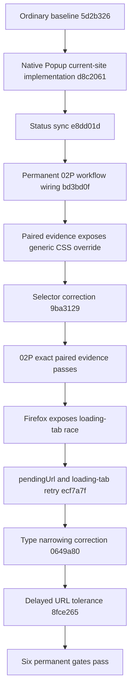

# Session 11 Knowledge Graph — Popup Current-Site Actions

## 0. Authority and current truth

This document is the Session 11 transaction graph for the Popup current-site correction. It supplements, and does not replace, `PRODUCT_CONSTITUTION.md`, `DELIVERY_PLAN.md`, `ORIGINAL_NEX_DELIVERY_KNOWLEDGE_GRAPH.md`, `ORIGINAL_KNOWLEDGE_GRAPH.md`, `UI_AUDIT_MATRIX.md` and `MILESTONE_8_STATUS.md`.

Current truth after the verified transaction:

- bounded implementation Head: `8fce26518a2cb520bc2eb27d395e967fd2c621a2`;
- Draft PR: #11, branch `feat/m8-profile-workflow`;
- project progress: 48% (47.9%; confidence 43%–50%);
- Order 1 entry experience: 45%;
- latest owner result: `FAIL`, Firefox, 2026-08-02;
- candidate: none;
- owner retest, merge and release: prohibited;
- `I-05`, `I-06` and `I-11`: `MUST_MATCH / PARTIAL`;
- closed current-site rows: `VERIFIED_AUTOMATION`;
- expanded menu, Add-condition form and ownership/external states: open.

## 1. Transaction graph

No temporary delivery workflow, MutationObserver compatibility layer, WIP source archive or CI writer entered PR #11.

## 2. Node inventory

### `KG-S11-DELIVERY-001`

Status: `VERIFIED_AUTOMATION`.

- Commit `d8c206132df4cd587944ab31e4956989c058aa00` was reconstructed from ordinary baseline `5d2b3260f6106fbcf53b3aeeb8bbe230016f98ba`.
- Delivery run `30898116359` completed two independent `pnpm verify` transactions.
- The result was one ordinary fast-forward commit containing only formal Popup, evidence, E2E and documentation files.
- WIP-only execution workflows and the DOM compatibility experiment were excluded.

Edges:

- `WIP experiment -> formal implementation`: `MODERNIZED_EQUIVALENT` only where original behavior remained observable.
- `MutationObserver compatibility layer -> PR #11`: `NOT_PORTED`.
- `temporary writer workflow -> permanent workflow`: `NOT_PORTED`.

### `KG-S11-EVIDENCE-WIRING-001`

Status: `VERIFIED_AUTOMATION`.

- The first landed capture script was not yet invoked by the permanent paired workflow.
- Commit `bd3bd0f7e263e557782e9781d2190ff9078cc481` added the 02P script to `Original Nex UI Evidence`.
- The workflow retained `permissions: contents: read`.
- It downloads and SHA-256 verifies official ZeroOmega v3.5.0, builds the exact Nex Head, captures default UI and current-site UI, and uploads both evidence families.

Invalidated claim:

- “02P is paired in permanent automation” was false before `bd3bd0f`; the script existed but was not connected.

### `KG-S11-SITE-STYLE-001`

Status: `VERIFIED_AUTOMATION`.

Demonstrated defect:

- generic `.current-site-action button` and `.temporary-rule-action button` selectors overrode original-compatible row styles;
- Original color was `rgb(51, 122, 183)` while Nex inherited `rgb(38, 50, 56)`;
- background, border and radius were also vulnerable to the same specificity error.

Correction:

- commit `9ba3129729a3f27e9fd209385e8cc04a747271b7` scopes the original-compatible selectors through the current-site containers;
- no `!important`, inline style or DOM replacement was introduced.

Evidence edge:

`official computed style -> Nex computed style = EXACT_EQUIVALENT` for the closed Add-condition and domain rows.

### `KG-S11-LOADING-TAB-001`

Status: `VERIFIED_AUTOMATION` for the bounded explicit-tab Popup journey.

Demonstrated defect:

- Firefox could return from `browser.tabs.create()` before `tabs.get()` exposed a supported URL;
- Popup inspected the explicit tab once and permanently omitted current-site actions;
- the failure was deterministic at the UI boundary but timing-dependent in CI.

Correction chain:

- `ecf7a7f33d45bc753fd6ad95605b6ff5c0cc17b2` adds `pendingUrl` support and bounded loading-tab rechecks;
- `0649a80525bd168d30a5fa9cfb95c0217136c87f` fixes TypeScript control-flow narrowing by retaining the validated tab ID;
- `8fce26518a2cb520bc2eb27d395e967fd2c621a2` expands the loading-only retry window to tolerate delayed Firefox URL visibility.

Boundary:

- completed tabs and supported URLs return immediately;
- unsupported completed/internal tabs return immediately;
- only a tab still marked `loading` with no supported `pendingUrl` or `url` enters the bounded retry path.

### `KG-POPUP-CURRENT-SITE-CLOSED-001`

Status: `VERIFIED_AUTOMATION`.

Original ↔ Nex mapping:

| Observable | Original v3.5.0 | Nex at `8fce265` | Edge |
| --- | --- | --- | --- |
| Row order | Add condition, then domain | same | `EXACT_EQUIVALENT` |
| Row size | 430×31px | same | `EXACT_EQUIVALENT` |
| Padding | 5/25/5/8px | same | `EXACT_EQUIVALENT` |
| Typography | 14px / 21px | same | `EXACT_EQUIVALENT` |
| Action color | `#337ab7` | same | `EXACT_EQUIVALENT` |
| Background | transparent | same | `EXACT_EQUIVALENT` |
| Border | none | same | `EXACT_EQUIVALENT` |
| Radius | 4px | same | `EXACT_EQUIVALENT` |
| Plus/filter/caret | present | present | `EXACT_EQUIVALENT` |
| Persistent result select | absent | absent | `EXACT_EQUIVALENT` |
| Closed text lines | seven exact lines | same | `EXACT_EQUIVALENT` |

The node closes only the two-row closed surface. It does not close the complete Popup current-site journey.

## 3. Evidence graph

Final implementation Head: `8fce26518a2cb520bc2eb27d395e967fd2c621a2`.

Permanent checks:

| Gate | Run | Result |
| --- | ---: | --- |
| CI | `30901231540` | success |
| Browser E2E | `30901231545` | success |
| Parity Documentation | `30901231490` | success |
| Milestone 8 Visual Evidence | `30901231497` | success |
| Original Toolbar Evidence | `30901231444` | success |
| Original Nex UI Evidence | `30901231447` | success |

Browser boundary:

- Firefox main E2E: success;
- Firefox Toolbar Action, restart, attached Rule List, profile trace, external control and renderer fallback: success;
- Chromium main E2E: success;
- Chromium native Inspect: success;
- Chromium Toolbar Action, restart, attached Rule List, profile trace, external control and renderer fallback: success.

Paired artifact:

- ID: `8889164450`;
- digest: `sha256:879a1ac72ecf2e576d519b974e97131e7ec6c43815cb21799ef5c1b5f1f48d10`;
- source Head: `8fce26518a2cb520bc2eb27d395e967fd2c621a2`;
- browser: Chromium `149.0.7827.55` for both sides;
- evidence URL: `https://example.com/`;
- `extraInNex=[]`;
- `missingInNex=[]`;
- Original and Nex structure both contain one Add-rule icon, one temporary-rule icon, one caret and zero persistent selects.

## 4. Acceptance graph

`KG-POPUP-CURRENT-SITE-CLOSED-001 -> KG-ICON-001`

- relationship: supporting node only;
- parent status remains `FAILED` because the owner-observed entry journey is not yet reaccepted.

`KG-POPUP-CURRENT-SITE-CLOSED-001 -> I-05`

- closes the compact closed-row defect;
- `I-05` remains `MUST_MATCH / PARTIAL` because expanded menu and Add-condition presentation remain open.

`KG-POPUP-CURRENT-SITE-CLOSED-001 -> I-06`

- preserves the temporary-rule transaction and opens the native menu;
- `I-06` remains `MUST_MATCH / PARTIAL` until expanded menu geometry, choices, active state, removal behavior and cross-browser presentation are paired.

`KG-POPUP-CURRENT-SITE-CLOSED-001 -> I-11`

- proves a bounded Original↔Nex computed-style surface;
- `I-11` remains `MUST_MATCH / PARTIAL` because ownership/external states and complete Popup density remain open.

## 5. Invalidated intermediate conclusions

- A capture script existing in the repository did not prove permanent evidence coverage.
- A successful WIP `pnpm verify` did not prove the reconstructed ordinary tree until the second independent verification completed.
- Generic button styles were not harmless; selector specificity changed observable parity.
- A one-second loading-tab retry was not stable enough for Firefox.
- Green automation for this bounded node does not create owner readiness, a release candidate or a progress increase.

## 6. Next fixed edge

Execution order remains:

1. capture and pair the expanded temporary-rule menu;
2. capture and pair the Add-condition form, validation and submission journey;
3. capture ownership-blocked, external-profile and browser-owned Popup states;
4. capture Options profile-editor and dialog density;
5. validate Firefox first and Chromium second;
6. keep all permanent workflows read-only;
7. do not request owner retest during this correction phase.

No project percentage change is authorized by this transaction.
