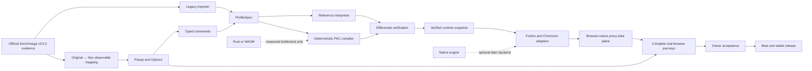
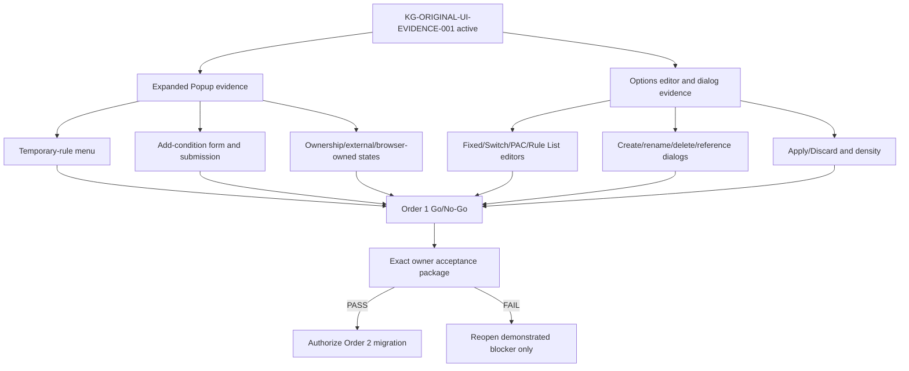

# Session 12 Knowledge Graph — Project Baseline, Drift Review and Execution Order

## Authority and purpose

This document records the Session 12 project-level review of ZeroOmega Nex. It exists to prevent compressed chat history, local success, green CI or moving branch state from replacing the project contract.

Authority order:

1. `PRODUCT_CONSTITUTION.md` — product identity and non-negotiable compatibility contract;
2. `PROJECT_PROGRESS_MODEL.md` — project percentage and scoring rules;
3. `MILESTONE_8_STATUS.md` — active Milestone 8 state and blockers;
4. Draft PR #11 and GitHub Checks — exact moving Head and workflow evidence;
5. this Session 12 graph — project review, drift diagnosis, scope freeze and execution order;
6. `SESSION_11_KNOWLEDGE_GRAPH.md` — bounded Session 11 current-site transaction details.

When these sources conflict, the higher source wins and the lower source must be corrected. Chat summaries do not override repository evidence.

## Session 12 frozen baseline

- Repository: `ChriX-Goh/ZeroOmega-Nex`.
- Stable branch: `main`, completed through Milestone 7.
- Active product branch: `feat/m8-profile-workflow`.
- Active delivery pull request: #11, Draft.
- PR #11 baseline Head at Session 12 review start: `6147977da6172cae2fba7880df124aa22082be56`.
- PR #11 baseline size: 2,257 commits, 362 changed files, 78,610 additions and 1,294 deletions.
- Active acceptance or release candidate: none.
- Retired owner build: `d57449bb74d9fedb53602af9b1e908ae18d700b9`.
- Latest owner result: `FAIL` on Firefox, 2026-08-02.
- Total product progress: **48%**.
- Unrounded progress: **47.9%**.
- Confidence band: **43%–50%**.
- Active journey: Order 1, **45%**.
- Merge, release and owner retest: prohibited.

The baseline percentage measures progress toward the first stable original-compatible browser release. It does not measure code volume, modules, commits, tests or green workflows.

## Project identity

ZeroOmega Nex is a clean-room, bottom-layer rewrite of ZeroOmega v3.5.0. It is not a redesign inspired by ZeroOmega.

Required observable contract:

- supported original exports import directly and become immediately usable;
- experienced original users do not rebuild ordinary profiles or relearn ordinary operation;
- Popup, Options, terminology, defaults, hierarchy, density, interaction order and visible behavior follow the original unless a documented browser limitation prevents exact behavior;
- engineering concepts remain in code, tests and documentation, not ordinary UI;
- a visible difference requires original evidence, a bounded browser limitation or explicit repository-owner acceptance;
- Firefox is the primary browser-facing validation target; Chromium confirms the same contract afterward.

## Current project graph

The left engineering chain is mature. The blocking path is the right product chain: original evidence → visible mapping → complete browser journey → owner acceptance.

## Progress model

- Order 1 — installation, startup, Toolbar and entry experience: weight 12%; completion 45%; earned 5.4 points.
- Order 2 — original export → direct import → immediate equivalent use: weight 20%; completion 35%; earned 7.0 points.
- Order 3 — Popup, result state, current-site and temporary rules: weight 12%; completion 46%; earned 5.5 points.
- Order 4 — Options, dialogs and Apply/Discard lifecycle: weight 16%; completion 51%; earned 8.1 points.
- Order 5 — Fixed, Switch, PAC, Virtual, Rule List and lifecycle: weight 22%; completion 60%; earned 13.2 points.
- Order 6 — export, restart, rollback, ownership and authentication: weight 10%; completion 52%; earned 5.2 points.
- Order 7 — localization, density and visual alignment: weight 8%; completion 44%; earned 3.5 points.
- Total: 47.9 points, rounded to **48%**.

Progress remains provisional because full paired capture may reveal additional original surfaces and correct the denominator. Session 11's bounded success does not increase the percentage because it did not close a complete journey or receive owner acceptance.

## Milestone status

- M0 Foundation and governance: completed. Valid asset; original wording later required the stricter product constitution.
- M1 Tooling and dual-browser shell: completed. Valid asset.
- M2 Legacy inventory and fixtures: completed. Valid asset; a real owner export is still absent.
- M3 ProfileSpec and validation: completed. Valid asset.
- M4 Importer: engineering complete, journey incomplete. Direct real-export migration remains blocked.
- M5 Reference interpreter: completed. Valid asset.
- M6 PAC compiler: completed. Valid asset.
- M7 Browser adapters and atomic activation: completed and merged. Valid asset.
- M8 Original-compatible UI/workflow: active, failed owner acceptance. Current critical path.
- M9 Rule updates and diagnostics: not formally authorized. Partial foundations landed early; no completion credit.
- M10 Packaging and beta: not authorized. No candidate and no owner `PASS`.
- M11 Rust/WASM: correctly deferred. No measured bottleneck authorizes it.
- M12 Native engine: optional and deferred. Not part of the current plan.

## Drift assessment

### Architecture drift: low

The core technical direction remains aligned:

- PAC-first data plane;
- configuration-time compilation;
- deterministic snapshots and differential verification;
- Firefox/Chromium adapter separation;
- atomic activation, rollback and restart recovery;
- narrow opt-in authentication boundary;
- no extension-side global proxy decision callback for ordinary navigation.

No evidence justifies discarding M0–M7 or restarting the rewrite.

### Product-contract drift: high

Milestone 8 previously interpreted “familiar” as permission to redesign. The branch added or exposed:

- Nex branding;
- top-level History;
- persistent Draft/application state;
- protocol-capability research and browser-internal explanation;
- helper prose and subtitles without original provenance;
- a wrong default Options page;
- a missing original default `auto switch` profile;
- altered Popup rows, geometry, labels, order and selected state.

The Firefox owner `FAIL` and permanent paired Original ↔ Nex evidence prove that these were structural product deviations, not final cosmetic differences.

### Scope drift: high

Milestone 8 absorbed scheduler, diagnostics, online backup, snapshot history, ownership, external profiles and other M9/M10-shaped capabilities before the original-facing entry journey was accepted. This enlarged PR #11 and delayed discovery of the actual user-facing mismatch.

### Progress-governance drift: high, now corrected

Historical 94%–98%, broad `DONE` counts and the superseded 52% / Order 1 80% claim used Nex-defined engineering evidence as a proxy for original-compatible product completion. The current 48% model restores journey-based measurement and owner acceptance.

### Current correction direction: valid but incomplete

The permanent paired evidence workflow, default About correction, default profiles, Popup geometry/icon corrections and Session 11 closed current-site rows establish the correct method. They close bounded nodes only. Expanded Popup interactions, Options editors/dialogs, complete entry flow and owner acceptance remain open.

## Loop diagnosis

The project has looped inside Milestone 8 through this repeated pattern:

1. implement broad engineering capability;
2. prove it with Nex-only tests or screenshots;
3. infer product readiness;
4. request or prepare owner acceptance too early;
5. discover original-facing mismatch;
6. reset the estimate and perform local correction;
7. expand another bounded engineering surface before closing the full journey.

The local fixes themselves are not wasteful. The loop comes from closing implementation nodes while leaving the parent user journey open.

## Anti-loop gates

Every subsequent UI slice must obey this sequence:

1. capture original source/runtime/UI behavior;
2. define explicit Original ↔ Nex observables;
3. limit implementation to that evidence boundary;
4. add original-derived contract automation;
5. validate Firefox first on the exact Head;
6. validate Chromium second without changing the contract;
7. preserve already closed paired nodes;
8. update the knowledge graph and blocker state;
9. increase progress only when a weighted journey gate changes;
10. request owner acceptance only after a project-level Go/No-Go review.

A green bounded slice must never be reported as completion of its parent journey.

## Verified bounded nodes retained

- default Options About structure: `VERIFIED_AUTOMATION`;
- default Popup geometry: `VERIFIED_AUTOMATION`;
- default Popup clean-room icons: `VERIFIED_AUTOMATION`;
- closed current-site Add-condition/domain rows: `VERIFIED_AUTOMATION`;
- bounded Firefox loading-tab discovery: `VERIFIED_AUTOMATION`;
- serialized startup and external ownership recovery: `VERIFIED_AUTOMATION`;
- Session 11 final bounded Head: `8fce26518a2cb520bc2eb27d395e967fd2c621a2`;
- Session 11 six permanent gates passed on their first run;
- Session 11 paired artifact: `8889164450`, digest `sha256:879a1ac72ecf2e576d519b974e97131e7ec6c43815cb21799ef5c1b5f1f48d10`.

These nodes must remain regression-locked while coverage expands.

## Active blocker graph

Project-wide failed/open nodes:

- `KG-ICON-001` — complete Toolbar/Popup entry journey;
- `KG-UI-001` — layout, density, dialogs, controls and hierarchy;
- `KG-EXTRA-001` — unnecessary descriptions and extra workflow;
- `KG-INVENTION-001` — visible behavior without provenance;
- `KG-FLOW-001` — complete feature and interaction parity;
- `KG-IMPORT-001` — real original export direct import and equivalent use;
- `KG-IMPORT-COLOR-001` — shorthand original color normalization;
- `KG-GOV-001` — final completion and owner-acceptance governance.

## Session 12 decisions

1. Keep M0–M7 architecture and implementation assets.
2. Keep PR #11 Draft as the active product-delivery branch.
3. Do not infer current progress from `main`; `main` intentionally stops at merged M7.
4. Treat 48% / 47.9% / 43%–50% and Order 1 45% as the sole current progress baseline.
5. Treat the 2026-08-02 Firefox result as `FAIL` everywhere; `NOT RUN` is stale and invalid.
6. Do not merge PR #15; it is a Session 11 WIP archive, not the product-delivery path.
7. Freeze Rust/WASM, Native Engine, remote sync, beta, release and unrelated feature expansion.
8. Require paired original evidence before each new visible implementation slice.
9. Do not request owner retest during the correction phase.
10. Do not increase progress for Session 12 documentation/governance correction alone.

## Execution order

### Session 12 — fact freeze and governance convergence

Deliverables:

- project-level drift review and authoritative 48% baseline;
- corrected Order 1 owner result;
- this knowledge graph;
- consistent candidate, owner-result, active-journey and progress wording across authority documents;
- frozen next-session scope.

Acceptance:

- no core document states that owner acceptance is unrun;
- no active candidate is implied;
- PR #11 remains Draft;
- no product behavior or scope expansion is introduced;
- total progress remains 48% and Order 1 remains 45%.

### Session 13 — complete Popup current-site journey

Scope:

- expanded temporary-rule menu;
- Add-condition form, validation and submission;
- active rule and removal behavior;
- ownership-blocked, external-profile and browser-owned states;
- paired text, DOM, geometry and interaction evidence.

Acceptance:

- every visible node has an original anchor or accepted browser-limitation record;
- Firefox passes first, Chromium second on the same contract;
- default Popup and Session 11 closed rows remain green;
- no Nex-only helper prose or persistent temporary-result control reappears;
- `I-05`, `I-06` and `I-11` receive evidence-based status updates;
- Order 1 is not declared complete solely from this slice.

### Session 14 — Options editors and dialogs

Scope:

- Fixed, Switch, PAC and Rule List editors;
- create, rename, delete and reference-replacement dialogs;
- Apply/Discard ordering and validation timing;
- original information density, labels and helper-text boundary;
- locale evidence on relevant surfaces.

Acceptance:

- paired Options evidence matrix is complete enough for the entry journey;
- no ordinary UI exposes engineering-only concepts without provenance;
- Firefox passes first, Chromium second;
- default About, sidebar, Popup and current-site regression nodes remain green.

### Session 15 — Order 1 Go/No-Go

Scope:

- recompute Order 1 and project progress only from changed journey gates;
- inspect all paired Popup/Options evidence;
- verify exact-Head permanent gates;
- decide whether one owner package is authorized.

Go criteria:

- complete entry surfaces are materially original-compatible;
- all blocking discrepancies are resolved or explicitly accepted;
- no active governance contradiction remains;
- Firefox-first and Chromium-second evidence is bound to one exact Head.

No-Go consequence:

- reopen only the demonstrated blocker and its direct dependencies;
- do not expand scope or create another broad acceptance candidate.

### After an explicit owner PASS

Only then begin Order 2:

- obtain a representative real original export through a private, sanitized workflow;
- import directly;
- activate and browse on Firefox and Chromium;
- restart and verify equivalent behavior;
- semantically re-export;
- resolve `KG-IMPORT-COLOR-001` and remaining migration blockers.

## Scope freeze

Until Order 1 owner acceptance:

- no Rust/WASM work;
- no Native Engine work;
- no remote synchronization;
- no generic diagnostics expansion;
- no new profile family;
- no beta, release or merge candidate;
- no unrelated UI modernization;
- no owner retest before Go authorization.

## Session 12 final truth

The rewrite has not failed and does not require a restart. The architecture is ahead of product compatibility proof. The project previously deviated at the product-contract, scope and progress-governance layers, then began a valid evidence-first correction.

The honest current state is:

> **48% total progress; 47.9% unrounded; confidence 43%–50%; Order 1 at 45%; PR #11 Draft; latest owner result Firefox FAIL; no candidate; no merge, release or owner retest.**

The next critical work is not more infrastructure. It is closing the complete Popup current-site journey, then the Options editor/dialog journey, while preserving already verified nodes and refusing to convert bounded green checks into premature project completion.
